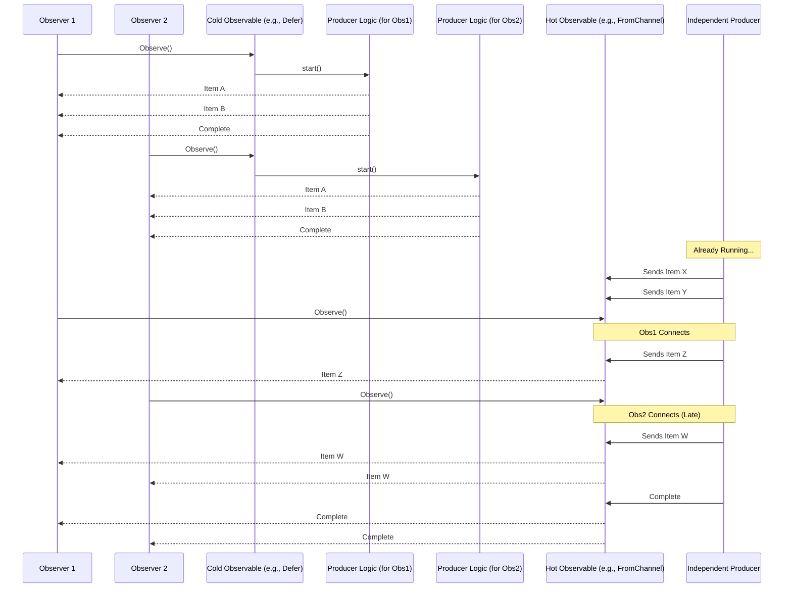

# Chapter 7: Hot vs. Cold Observables

Welcome back! In [Chapter 6: Options](06_options_.md), we learned how to configure the behavior of our factories and operators using Options like `WithPool` or `WithDuration`. Now, let's dive into a fundamental concept that describes *when* an [Observable](01_observable_.md) starts producing its data relative to who is watching: **Hot vs. Cold Observables**.

## What Problem Does This Concept Solve?

Imagine you want to get some data. There are two fundamentally different scenarios:

1. **Personal Delivery:** You order a pizza. The pizza place only starts making *your* specific pizza *after* you place the order. If your friend orders their own pizza later, the pizza place makes a completely separate, fresh pizza for them.
2. **Public Broadcast:** You tune into a live radio show. The show is broadcasting *regardless* of whether you are listening or not. If you tune in late, you miss the beginning of the show. Everyone listening at the same time hears the same part of the broadcast.

These two scenarios are analogous to Cold and Hot Observables. Sometimes you need data that's produced specifically *for you* when you ask for it (like the pizza). Other times, you need to tap into a data stream that's already running, shared by everyone (like the radio show). Understanding the difference helps you choose the right way to create and handle your [Observable](01_observable_.md) streams.

## What are Cold Observables?

> A **Cold** Observable starts producing its sequence of [Item](02_item_.md)s only when an observer subscribes (calls `Observe()` or `ForEach()`). Each observer typically gets its own **independent** sequence of items from the beginning.

Think of the **pizza delivery**:

* **Starts on Order:** The pizza making (`Observable`'s production logic) doesn't start until you call (`Observe()`).
* **Independent:** Each person ordering (`Observe()`) gets their own fresh pizza sequence. Your pizza order doesn't affect your friend's order.

**Common Cold Factories:**

Functions like `rxgo.Defer`, `rxgo.Create`, `rxgo.Just`, and `rxgo.Range` usually create Cold Observables. They contain the logic or data needed to produce the sequence, and they execute that logic *from scratch* every time someone subscribes.

**Example (using `Defer`):**

Let's revisit the `Defer` example from [Chapter 4: Observable Creation (Factories)](04_observable_creation__factories__.md). `Defer` is a classic way to create a Cold Observable. The producer function runs separately for each observer.

```go
package main

import (
 "context"
 "fmt"
 "github.com/reactivex/rxgo/v2"
 "sync"
 "time"
)

func main() {
 fmt.Println("Defining Cold Observable (using Defer)...")
 // The producer logic won't run until Observe() is called.
 coldObservable := rxgo.Defer([]rxgo.Producer{
  func(ctx context.Context, next chan<- rxgo.Item) {
   fmt.Println("--- Cold Producer: Starting a fresh sequence ---")
   next <- rxgo.Of("Pizza Slice 1")
   time.Sleep(5 * time.Millisecond) // Simulate work
   next <- rxgo.Of("Pizza Slice 2")
  },
 })

 var wg sync.WaitGroup

 // Observer 1 (Orders their pizza)
 wg.Add(1)
 go func() {
  defer wg.Done()
  fmt.Println("Observer 1: Subscribing...")
  for item := range coldObservable.Observe() {
   fmt.Println("Observer 1:", item.V)
  }
  fmt.Println("Observer 1: Finished pizza.")
 }()

 time.Sleep(10 * time.Millisecond) // Wait a bit

 // Observer 2 (Orders their pizza later)
 wg.Add(1)
 go func() {
  defer wg.Done()
  fmt.Println("Observer 2: Subscribing...")
  for item := range coldObservable.Observe() {
   fmt.Println("Observer 2:", item.V)
  }
  fmt.Println("Observer 2: Finished pizza.")
 }()

 wg.Wait()
}
```

**Explanation:**

1. `rxgo.Defer(...)`: Defines the "pizza recipe" (producer logic) but doesn't start cooking yet.
2. Observer 1 calls `Observe()`: The producer function executes *for Observer 1*, printing "--- Cold Producer: Starting..." and sending its two slices.
3. Observer 2 calls `Observe()`: The producer function executes *again, completely independently*, printing "--- Cold Producer: Starting..." and sending its *own* two slices.

**Output:**

```plaintext
Defining Cold Observable (using Defer)...
Observer 1: Subscribing...
--- Cold Producer: Starting a fresh sequence ---
Observer 1: Pizza Slice 1
Observer 1: Pizza Slice 2
Observer 1: Finished pizza.
Observer 2: Subscribing...
--- Cold Producer: Starting a fresh sequence ---
Observer 2: Pizza Slice 1
Observer 2: Pizza Slice 2
Observer 2: Finished pizza.
```

Notice how "--- Cold Producer: Starting..." appears twice? Each observer got their own, complete, independent sequence.

## What are Hot Observables?

> A **Hot** Observable produces [Item](02_item_.md)s regardless of whether any observers are subscribed. Observers subscribing later might miss items that were emitted earlier. All current observers share the **same** stream of items.

Think of the **live radio broadcast**:

* **Always On:** The radio show (`Observable`'s production logic) is happening whether you're listening or not.
* **Shared Stream:** Everyone tuned in hears the same thing at the same time.
* **Missed Items:** If you tune in halfway through a song, you missed the first half.

**Common Hot Scenarios:**

* **`rxgo.FromEventSource`:** This factory creates an Observable from a channel where items might already be flowing, representing external events (like sensor readings, UI clicks). It starts processing immediately.
* **`rxgo.FromChannel` (sometimes):** If the channel passed to `FromChannel` is being fed data by an *external, already running producer* (like a separate goroutine pushing data independent of observers), then the `Observable` behaves like a Hot one. Subscribers just tap into the existing flow from that channel.
* **Connectable Observables:** You can use [Options](06_options_.md) like `rxgo.WithPublishStrategy()` to explicitly make an Observable "hot" and share its execution among multiple subscribers (we won't dive deep into this here, but it's good to know it exists).

**Example (using `FromChannel` with an independent producer):**

Here, we create a single producer goroutine that sends items into a channel. The `Observable` created with `FromChannel` will just pass along whatever comes from that *one shared channel*.

```go
package main

import (
 "fmt"
 "github.com/reactivex/rxgo/v2"
 "sync"
 "time"
)

func main() {
 fmt.Println("Setting up Hot Observable producer...")
 // A single source channel
 sourceChannel := make(chan rxgo.Item, 3) // Buffer helps producer not block immediately

 // ONE producer, running independently (like the radio station)
 go func() {
  fmt.Println("--- Hot Producer: Broadcasting started ---")
  time.Sleep(5 * time.Millisecond) // Give observers time to connect? Maybe not...
  sourceChannel <- rxgo.Of("Song Part 1")
  fmt.Println("--- Hot Producer: Sent Part 1 ---")
  time.Sleep(15 * time.Millisecond)
  sourceChannel <- rxgo.Of("Song Part 2")
  fmt.Println("--- Hot Producer: Sent Part 2 ---")
  time.Sleep(15 * time.Millisecond)
  sourceChannel <- rxgo.Of("Song Part 3")
  fmt.Println("--- Hot Producer: Sent Part 3 ---")
  close(sourceChannel) // Signal end of broadcast
  fmt.Println("--- Hot Producer: Broadcast finished ---")
 }()

 // Create the Observable FROM the shared channel
 hotObservable := rxgo.FromChannel(sourceChannel)

 var wg sync.WaitGroup

 // Observer 1 (Tunes in early)
 wg.Add(1)
 go func() {
  defer wg.Done()
  fmt.Println("Observer 1: Tuning in...")
  for item := range hotObservable.Observe() {
   fmt.Println("Observer 1 HEARD:", item.V)
  }
  fmt.Println("Observer 1: Radio off.")
 }()

 // Observer 2 (Tunes in late)
 time.Sleep(25 * time.Millisecond) // Wait a bit, might miss Part 1 & 2
 wg.Add(1)
 go func() {
  defer wg.Done()
  fmt.Println("Observer 2: Tuning in LATE...")
  for item := range hotObservable.Observe() {
   fmt.Println("Observer 2 HEARD:", item.V)
  }
  fmt.Println("Observer 2: Radio off.")
 }()

 wg.Wait()
}
```

**Explanation:**

1. The single goroutine starts producing items ("Song Parts") and sending them into `sourceChannel` *immediately*, regardless of observers.
2. `rxgo.FromChannel(sourceChannel)` creates an Observable that simply reads from this single, shared channel.
3. Observer 1 subscribes early and likely gets all parts.
4. Observer 2 subscribes later (after 25ms). By this time, "Song Part 1" and maybe "Song Part 2" might have already been sent by the producer and potentially consumed by Observer 1 (or just passed through the channel if no one was listening yet). Observer 2 only gets the items emitted *after* it subscribes.

**Output (Timing dependent, Observer 2 likely misses items):**

```plaintext
Setting up Hot Observable producer...
--- Hot Producer: Broadcasting started ---
Observer 1: Tuning in...
--- Hot Producer: Sent Part 1 ---
Observer 1 HEARD: Song Part 1
--- Hot Producer: Sent Part 2 ---
Observer 1 HEARD: Song Part 2
Observer 2: Tuning in LATE...
--- Hot Producer: Sent Part 3 ---
Observer 1 HEARD: Song Part 3
Observer 2 HEARD: Song Part 3 // Tuned in just in time for Part 3
--- Hot Producer: Broadcast finished ---
Observer 1: Radio off.
Observer 2: Radio off.
```

Notice "--- Hot Producer..." lines appear only once. Both observers tap into the *same* broadcast, and Observer 2 missed the earlier parts.

## Summary of Factory Behavior

* **Usually Cold:** `Defer`, `Create`, `Just`, `Range`, `Timer`, `Interval`. They typically set up the *potential* to produce data, starting only when observed, and independently for each observer.
* **Usually Hot:** `FromEventSource`. Designed for external, ongoing event streams.
* **Depends on Source:** `FromChannel` inherits the behavior of its source channel. If the source produces items independently of observers (`Observe` calls), it's Hot. If the channel is fed *as a result* of an `Observe` call (e.g., inside a `Defer` or `Create`), it's part of a Cold observable structure.

## Under the Hood (Conceptual)

The core difference lies in **when and where** the data production logic is executed:

* **Cold:** The production logic (e.g., the function inside `Defer`, iterating items in `Just`, starting the timer in `Interval`) is tied *directly* to the `Observe()` call. Each `Observe()` triggers a *new, separate execution* of that logic.
* **Hot:** The production logic is happening *somewhere else*, independently (e.g., an external device feeding a channel, a background goroutine). The `Observable` (like `FromChannel` in the hot example) merely acts as a **conduit** or **listener** to this independent source. Multiple `Observe()` calls all connect to the *same* ongoing source via this conduit.



## Under the Hood (Code)

* **Cold (`Defer`)**: The `deferIterable` created by `rxgo.Defer` stores the producer function(s). Its `Observe` method (in `iterable_defer.go`) takes these functions and executes them *inside a new goroutine* every time `Observe` is called. This ensures each observer gets a fresh execution.

    ```go
    // From: iterable_defer.go (Conceptual)
    func (i *deferIterable) Observe(opts ...Option) <-chan Item {
        // ... setup channel, context ...
        next := option.buildChannel()
        ctx := option.buildContext(emptyContext)

        // *** Start a NEW goroutine FOR THIS OBSERVER ***
        go func() {
            defer close(next)
            // *** Execute the stored producer functions ***
            for _, f := range i.fs {
                f(ctx, next)
            }
        }()

        return next // Return the channel for this observer
    }
    ```

* **Hot (`FromChannel` with external producer)**: The `channelIterable` created by `rxgo.FromChannel` simply holds a reference to the *existing* input channel (`i.next`). Its `Observe` method (in `iterable_channel.go`, when *not* connectable) just returns this *same channel reference* to all observers. All observers end up reading from the single, shared channel that the external producer is writing to.

    ```go
    // From: iterable_channel.go (Conceptual, non-connectable case)
    type channelIterable struct {
        next <-chan Item // Reference to the ONE input channel
        // ... other fields ...
    }

    func (i *channelIterable) Observe(opts ...Option) <-chan Item {
        // ... parse options ...
        // if !option.isConnectable() { // Simplest case
           // *** Return the SAME channel reference to all observers ***
           return i.next
        // }
        // ... connectable logic handled separately ...
    }
    ```

## Conclusion

You've learned the crucial difference between **Hot** and **Cold** Observables:

* **Cold Observables** (like ordering a pizza) start producing items *when* you subscribe, and each subscription gets an independent sequence. Factories like `Defer`, `Create`, `Just` tend to be cold.
* **Hot Observables** (like a live radio show) produce items independently of subscribers. Subscribers tap into the *same* ongoing stream and might miss earlier items. `FromEventSource` is typically hot, and `FromChannel` can be hot if its source channel is fed independently.

Understanding this distinction helps you predict how your Observables will behave, especially when multiple observers are involved. Will they each get a private copy of the data sequence, or will they share a potentially live, ongoing stream?

Now that we've explored the core concepts of creating, observing, transforming, configuring, and classifying Observables, let's look at how RxGo handles concurrency and ensures order when needed.

**Next:** [Chapter 8: Concurrency Model (Pools & Serialization)](08_concurrency_model__pools___serialization__.md)

---

Generated by [AI Codebase Knowledge Builder](https://github.com/The-Pocket/Tutorial-Codebase-Knowledge)
