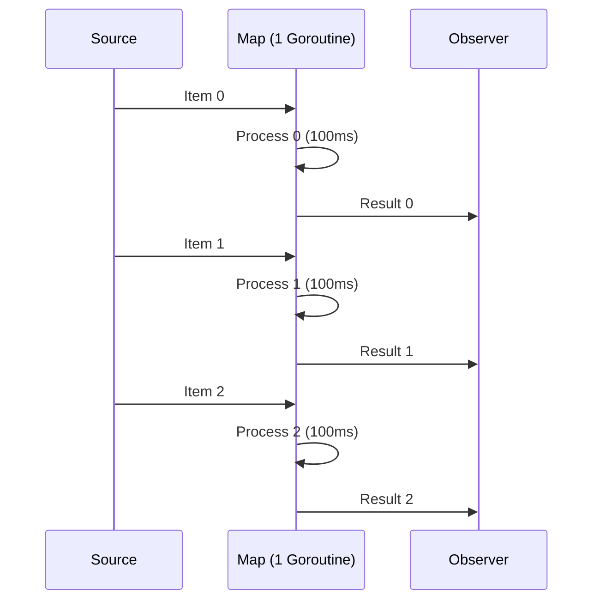
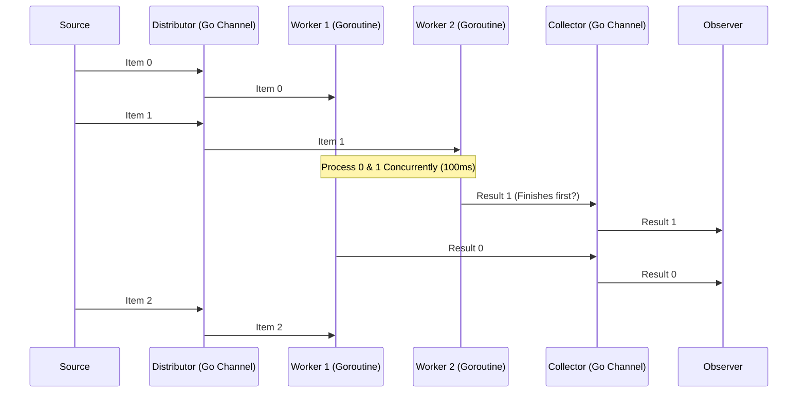
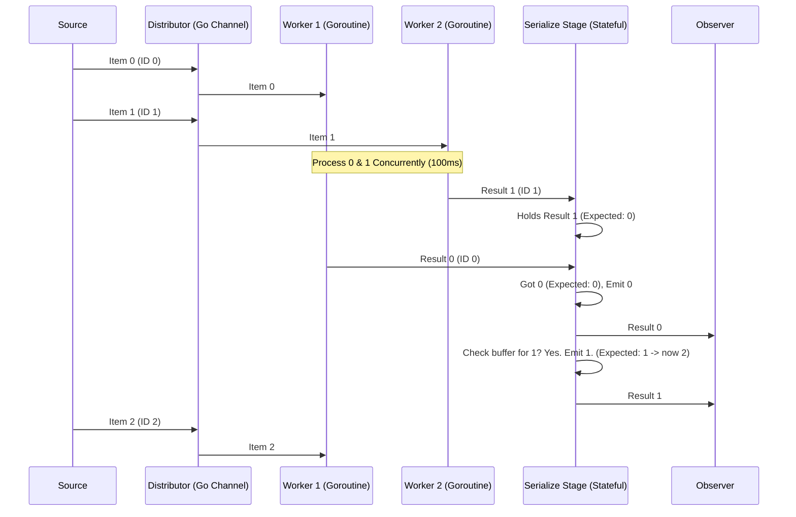

# Chapter 8: Concurrency Model (Pools & Serialization)

Welcome to the final chapter! In [Chapter 7: Hot vs. Cold Observables](07_hot_vs__cold_observables_.md), we explored when Observables start producing items. Now, let's look at *how* they process those items, specifically how RxGo handles concurrency.

## What Problem Does This Solve?

Imagine our conveyor belt ([Observable](01_observable_.md)) again. We have [Operators](05_operators_.md) acting as workstations along the belt (like `Map` or `Filter`). What if one workstation, say, painting widgets, is very slow? If we only have one painter (one goroutine), the whole production line gets bottlenecked.

Wouldn't it be great if we could hire multiple painters to work on different widgets *at the same time* at that single painting station? This is parallelism.

However, if multiple painters work simultaneously, the widgets might finish painting out of their original order. Sometimes, the order matters (e.g., processing steps that depend on sequence). So, we also need a mechanism to put the widgets back into their correct order after they've been painted in parallel.

RxGo's concurrency model, using Pools and Serialization, addresses exactly this: allowing parallel processing for speed while optionally maintaining the original item order.

## Default Behavior: Sequential Processing

By default, RxGo operators process items **sequentially**. When you chain operators like `source.Filter(...).Map(...)`, each item goes through the `Filter` workstation, then the `Map` workstation, one after another, usually within a **single goroutine** per operator stage.

```go
package main

import (
 "context"
 "fmt"
 "github.com/reactivex/rxgo/v2"
 "time"
)

func main() {
 start := time.Now()

 observable := rxgo.Range(0, 5) // Emits 0, 1, 2, 3, 4

 mapped := observable.Map(func(_ context.Context, item interface{}) (interface{}, error) {
  // Simulate slow work (e.g., painting)
  fmt.Printf("Starting job %d\n", item.(int))
  time.Sleep(100 * time.Millisecond)
  fmt.Printf("Finished job %d\n", item.(int))
  return fmt.Sprintf("Widget %d", item), nil
 }) // NO options = sequential

 // Observe results
 for item := range mapped.Observe() {
  fmt.Println("Collected:", item.V)
 }

 fmt.Printf("Sequential took: %s\n", time.Since(start))
}
```

**Explanation:**

* The `Map` function simulates 100ms of work for each item.
* Since it runs sequentially, item 1 must finish before item 2 starts, and so on.
* The total time will be roughly 5 items * 100ms/item = 500ms.

**Output (approximate):**

```plaintext
Starting job 0
Finished job 0
Collected: Widget 0
Starting job 1
Finished job 1
Collected: Widget 1
Starting job 2
Finished job 2
Collected: Widget 2
Starting job 3
Finished job 3
Collected: Widget 3
Starting job 4
Finished job 4
Collected: Widget 4
Sequential took: 504.12ms
```

This is simple and predictable, but slow if the processing function (`Map`'s function) takes significant time.

## Speeding Up with Parallel Pools (`WithPool`, `WithCPUPool`)

To address the bottleneck, we can tell an operator like `Map` to use multiple goroutines using [Options](06_options_.md).

* `rxgo.WithPool(N)`: Configures the operator to use a pool of `N` goroutines.
* `rxgo.WithCPUPool()`: A convenient shortcut for `rxgo.WithPool(runtime.NumCPU())`, using a number of goroutines equal to the available CPU cores.

Think of this as assigning multiple workers (goroutines) to the *same* workstation (the `Map` operator).

```go
package main

import (
 "context"
 "fmt"
 "github.com/reactivex/rxgo/v2"
 "runtime"
 "time"
)

func main() {
 start := time.Now()
 numWorkers := runtime.NumCPU() // e.g., 4

 observable := rxgo.Range(0, 5) // 0, 1, 2, 3, 4

 mapped := observable.Map(func(_ context.Context, item interface{}) (interface{}, error) {
  fmt.Printf("Starting job %d\n", item.(int))
  time.Sleep(100 * time.Millisecond) // Simulate work
  fmt.Printf("Finished job %d\n", item.(int))
  return fmt.Sprintf("Widget %d", item), nil
 }, rxgo.WithCPUPool()) // <-- USE A POOL!

 // Observe results
 for item := range mapped.Observe() {
  fmt.Println("Collected:", item.V)
 }

 fmt.Printf("Parallel (%d workers) took: %s\n", numWorkers, time.Since(start))
}
```

**Explanation:**

1. `rxgo.WithCPUPool()` is added as an [Option](06_options_.md) to `Map`.
2. RxGo now starts multiple worker goroutines (let's assume 4).
3. As items 0, 1, 2, 3 arrive at the `Map` operator, they are distributed to available workers. Jobs 0, 1, 2, 3 might start almost simultaneously.
4. Job 4 starts as soon as one worker finishes.
5. The total time should be much less (closer to 2 * 100ms, as 5 items are processed by 4 workers).
6. **Important:** Notice the output order! The "Finished job" and "Collected" messages might not be in the strict 0, 1, 2, 3, 4 sequence anymore, because jobs finish whenever their assigned worker is done.

**Output (approximate, order will vary):**

```plaintext
Starting job 0
Starting job 1
Starting job 2
Starting job 3
Finished job 1 // Job 1 might finish before Job 0
Collected: Widget 1
Starting job 4
Finished job 0
Collected: Widget 0
Finished job 3
Collected: Widget 3
Finished job 2
Collected: Widget 2
Finished job 4
Collected: Widget 4
Parallel (4 workers) took: 205.33ms
```

Great! We got a significant speedup. But the results are out of order.

## Restoring Order with `Serialize`

What if we *need* the output items to be in the original sequence (0, 1, 2, 3, 4), even though we processed them in parallel? This is where the `Serialize` option comes in.

> The `rxgo.Serialize(startID, idFunc)` option works in conjunction with pooling (`WithPool` or `WithCPUPool`). It ensures that items emitted by the parallel operator are **re-ordered** back into their original sequence before being passed downstream.

Think of `Serialize` as adding a dedicated "re-ordering station" *after* the parallel painting booths. Each widget gets a sequence number before painting. After painting (which happens in parallel and out of order), the widgets arrive at the re-ordering station. This station holds onto widgets until it receives the *next expected number* in the sequence, ensuring they leave the station in the correct order (0, 1, 2,...).

**How to Use `Serialize`:**

You need to provide two things:

1. `startID int`: The expected sequence ID of the very first item (often `0`).
2. `idFunc func(interface{}) int`: A function that takes an *output item* from the parallel operator (e.g., the `Map` result) and returns its original sequence ID.

```go
package main

import (
 "context"
 "fmt"
 "github.com/reactivex/rxgo/v2"
 "runtime"
 "strings"
 "strconv"
 "time"
)

// Helper to extract ID from "Widget X" string
func getWidgetID(widgetData interface{}) int {
 s := widgetData.(string) // e.g., "Widget 3"
 parts := strings.Split(s, " ")
 id, _ := strconv.Atoi(parts[1])
 return id
}


func main() {
 start := time.Now()
 numWorkers := runtime.NumCPU()

 observable := rxgo.Range(0, 5) // 0, 1, 2, 3, 4

 mapped := observable.Map(func(_ context.Context, item interface{}) (interface{}, error) {
  // Jobs run in parallel...
  fmt.Printf("Starting job %d\n", item.(int))
  time.Sleep(100 * time.Millisecond)
  fmt.Printf("Finished job %d\n", item.(int)) // ...and finish out of order
  return fmt.Sprintf("Widget %d", item), nil
 },
  rxgo.WithCPUPool(), // Use parallel workers...
  rxgo.Serialize(0, getWidgetID), // ...but re-order the output!
 )

 // Observe results
 for item := range mapped.Observe() {
  // Items arrive *sequentially* here thanks to Serialize
  fmt.Println("Collected:", item.V)
 }

 fmt.Printf("Parallel + Serialized (%d workers) took: %s\n", numWorkers, time.Since(start))
}
```

**Explanation:**

1. We still use `rxgo.WithCPUPool()` for parallel execution within `Map`.
2. We add `rxgo.Serialize(0, getWidgetID)`.
    * `0`: We tell `Serialize` the first expected item should have ID 0.
    * `getWidgetID`: We provide a function that can extract the original ID (0, 1, 2...) from the `Map` operator's *output* (the string "Widget X"). `Serialize` needs this to know the sequence number of each result it receives from the parallel workers.
3. Now, even though the "Finished job" logs show out-of-order execution, the "Collected" logs will always be in the correct 0, 1, 2, 3, 4 order.
4. The total time will still be faster than fully sequential, but potentially slightly slower than pure parallel execution due to the overhead of re-ordering.

**Output (approximate, internal "Finished" order varies, "Collected" is sequential):**

```plaintext
Starting job 0
Starting job 1
Starting job 2
Starting job 3
Finished job 1 // Internal parallel execution finishes out of order
Finished job 0
Collected: Widget 0 // But Serialize waits for 0 before emitting
Finished job 3
Collected: Widget 1 // Now emits 1
Starting job 4
Finished job 2
Collected: Widget 2 // Emits 2
Collected: Widget 3 // Emits 3
Finished job 4
Collected: Widget 4 // Emits 4
Parallel + Serialized (4 workers) took: 207.89ms
```

## Under the Hood (Conceptual)

Let's visualize the flow:

**1. Sequential (Default):**



**2. Parallel (`WithPool`):**



**3. Parallel + Serialize (`WithPool` + `Serialize`):**



## Under the Hood (Code)

* **Pool Option:** When you use `rxgo.WithPool(n)` or `rxgo.WithCPUPool()`, the `parseOptions` function (in `options.go`) stores the pool size `n` in the internal `funcOption` struct.

    ```go
    // From: options.go (Simplified)
    func WithPool(pool int) Option {
        return newFuncOption(func(options *funcOption) {
            options.pool = pool // Store pool size
        })
    }
    func WithCPUPool() Option {
        return WithPool(runtime.NumCPU())
    }
    ```

* **Parallel Execution:** The internal `observable` function checks if pooling is enabled. If yes, it calls `runParallel` (in `observable.go`). `runParallel` does roughly this:
    1. Creates an input channel (`observe`) from the upstream observable.
    2. Creates an intermediate output channel (`gather`).
    3. Starts `pool` number of worker goroutines (the "Scatter" part). Each worker reads from `observe`, applies the operator's function (e.g., the `Map` function), and sends the result to `gather`.
    4. Starts a single gathering goroutine (the "Gather" part) that reads results from `gather` and sends them to the final `next` channel that the downstream observer receives.
    5. Manages synchronization with `sync.WaitGroup`.

    ```go
    // From: observable.go (Conceptual 'runParallel')
    func runParallel(ctx context.Context, next chan Item, observe <-chan Item, /*... operator logic ...*/, pool int) {
        wg := sync.WaitGroup{}
        wg.Add(pool)
        gather := make(chan Item, 1) // Intermediate channel

        // Gather goroutine
        go func() {
            // Reads from 'gather' and sends to final 'next' channel
            // ... handle errors/completion ...
            for item := range gather {
                 item.SendContext(ctx, next)
            }
            close(next)
        }()

        // Scatter: Start worker goroutines
        for i := 0; i < pool; i++ {
            go func() {
                defer wg.Done()
                for item := range observe { // Read from upstream
                    // Apply operator logic (e.g., Map function)
                    result, err := applyOperatorLogic(item)
                    if err != nil {
                        // Send error Item
                    } else {
                         // Send result Item to gather channel
                         Of(result).SendContext(ctx, gather)
                    }
                }
            }()
        }

        // Wait for workers, then close gather channel
        go func() {
            wg.Wait()
            close(gather)
        }()
    }
    ```

* **Serialize Option:** The `Serialize` option (in `options.go`) stores the identifier function in the `funcOption` struct.

    ```go
    // From: options.go (Simplified)
    func Serialize(identifier func(interface{}) int) Option {
        return newFuncOption(func(options *funcOption) {
            options.serialized = identifier // Store the ID function
        })
    }
    ```

* **Serialization Logic:** When `Serialize` is used with pooling, the internal `observable` function detects this. It wraps the parallel execution (`runParallel` or similar) within the `serialize` method (from `observable.go`). This method:
    1. Runs the parallel processing as usual, but workers send results to an internal channel.
    2. Starts a dedicated serialization goroutine.
    3. This goroutine maintains state:
        * The `nextExpectedID` (initially the `startID` you provided).
        * A buffer (like a map and a min-heap) to store out-of-order results.
    4. When it receives a result from a worker:
        * It pushes the result's ID (obtained using your `idFunc`) onto the min-heap and stores the result value in the map, keyed by ID.
        * It then checks the heap: while the *minimum ID* in the heap matches the `nextExpectedID`, it removes that item from the buffer, sends it to the final output channel, and increments `nextExpectedID`.
    5. This ensures items only leave the `Serialize` stage in the correct order.

    ```go
    // From: observable.go (Conceptual 'serialize' method)
    func (o *ObservableImpl) serialize(/*... parent context, idFunc ...*/) Observable {
        // ... setup channels ...
        minHeap := binaryheap.NewWith(/* int comparator */)
        itemsBuffer := make(map[int]interface{})
        var nextExpectedID int64 = int64(startID) // From option

        parallelOutputCh := // Channel receiving results from parallel workers

        go func() { // Serialization Goroutine
            defer close(finalOutputCh)
            for item := range parallelOutputCh { // Receive items from workers (out of order)
                if item.Error() { /* handle error */ }

                itemID := idFunc(item.V) // Get sequence ID using user function
                itemsBuffer[itemID] = item.V
                minHeap.Push(itemID)

                // Check if we can emit items in sequence
                for !minHeap.Empty() {
                    minIDInHeap, _ := minHeap.Peek()
                    if atomic.LoadInt64(&nextExpectedID) == int64(minIDInHeap.(int)) {
                        // Found the next expected item!
                        minHeap.Pop()
                        valueToEmit := itemsBuffer[minIDInHeap.(int)]
                        delete(itemsBuffer, minIDInHeap.(int))
                        Of(valueToEmit).SendContext(ctx, finalOutputCh) // Emit in order
                        atomic.AddInt64(&nextExpectedID, 1) // Increment expectation
                    } else {
                        // Next expected item hasn't arrived yet
                        break
                    }
                }
            }
        }()

        return // Observable wrapping finalOutputCh
    }

    ```

## Conclusion

Congratulations on completing the RxGo tutorial! In this final chapter, you learned about RxGo's concurrency model:

* By default, operators run **sequentially**.
* You can enable **parallel processing** within operators like `Map` using `rxgo.WithPool` or `rxgo.WithCPUPool` for significant speedups, especially for CPU-bound or I/O-bound tasks.
* Parallel processing might result in **out-of-order** item emission.
* If order is important, you can use `rxgo.Serialize` along with pooling options to **re-establish the original sequence**, trading a small amount of performance for guaranteed order.

Understanding how to leverage pools for parallelism and `Serialize` for order gives you powerful tools to build efficient and correct reactive applications in Go.

We hope this tutorial has given you a solid foundation in RxGo. Happy reactive programming!

---

Generated by [AI Codebase Knowledge Builder](https://github.com/The-Pocket/Tutorial-Codebase-Knowledge)
