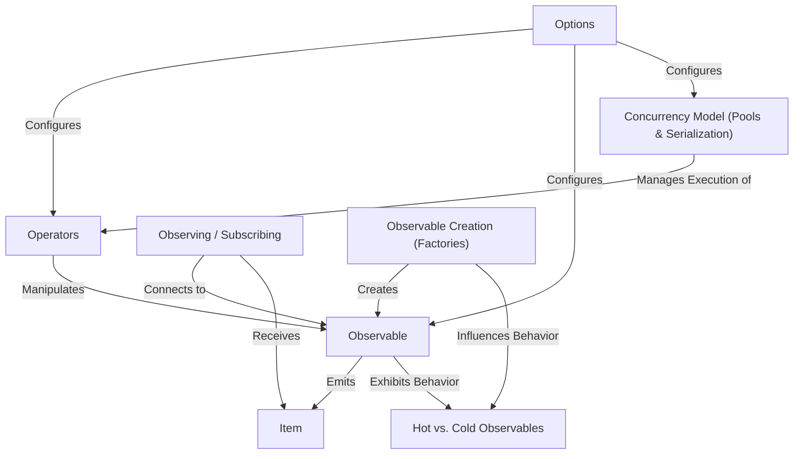

# Tutorial: RxGo

RxGo provides tools for *asynchronous programming* in Go using the ReactiveX pattern.
It revolves around the **Observable**, which represents a stream of data (*Items*) arriving over time.
You can create Observables using **Factory** functions and transform or filter them using **Operators**.
To get the data, you **Subscribe** to an Observable.
RxGo uses Go's channels and goroutines, allowing for configurable **Concurrency** and different **Observable behaviours** (Hot vs. Cold).

**Source Repository:** [https://github.com/ReactiveX/RxGo](https://github.com/ReactiveX/RxGo)

## Chapters

1. [Observable](01_observable_.md)
2. [Item](02_item_.md)
3. [Observing / Subscribing](03_observing___subscribing_.md)
4. [Observable Creation (Factories)](04_observable_creation__factories__.md)
5. [Operators](05_operators_.md)
6. [Options](06_options_.md)
7. [Hot vs. Cold Observables](07_hot_vs__cold_observables_.md)
8. [Concurrency Model (Pools & Serialization)](08_concurrency_model__pools___serialization__.md)

---

Generated by [AI Codebase Knowledge Builder](https://github.com/The-Pocket/Tutorial-Codebase-Knowledge)
