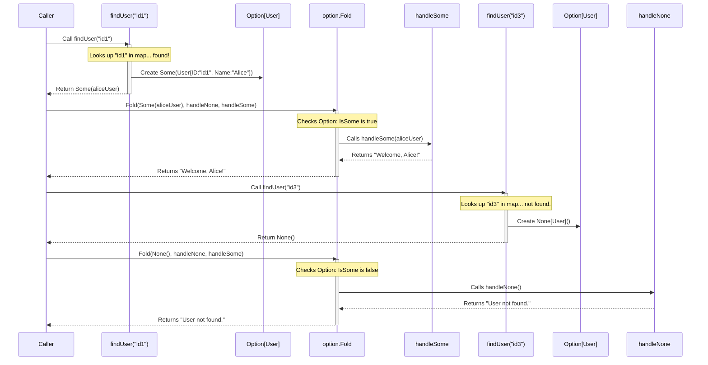

# Chapter 1: Option

Welcome to the `fp-go` tutorial! We're starting our journey into functional programming in Go with a fundamental concept: `Option`.

## What Problem Does `Option` Solve?

Imagine you're searching for a specific toy in a big box. You might find the toy, or you might find the box is empty, or maybe the toy you're looking for just isn't in *that* box.

In programming, especially in Go, we often deal with similar situations. We might look up something in a map, query a database for a record, or perform a calculation that might not have a valid result. Traditionally, Go uses `nil` pointers or a second boolean return value (`value, ok := ...`) to signal when something is missing.

While this works, it can be error-prone. Forgetting to check that `ok` boolean or dereferencing a `nil` pointer can lead to unexpected crashes (panics!) in your program. Wouldn't it be nice if the programming language *helped* us remember to handle the "not found" case?

That's exactly what `Option` does!

## The `Option` Concept: Some or None?

`Option` is like a special container, our "box" from the analogy. It represents a value that *might* be missing. An `Option` can be in one of two states:

1. **`Some(value)`**: The box *contains* an item. We found what we were looking for! The `value` is held inside the `Some`.
2. **`None`**: The box is *empty*. We didn't find the item.

Think of `Option[T]` (where `T` is any Go type, like `string`, `int`, or `User`) as a wrapper around a value of type `T`. It *forces* you to acknowledge that the value might be absent (`None`) before you can use it. This makes your code safer and clearer about handling potentially missing data. It's a **type-safe** way to deal with optionality, preventing those pesky `nil` pointer errors at compile time or runtime.

## Using `Option` in `fp-go`

Let's see how we create and use `Option` values.

### Creating `Option` Values

The `fp-go/option` package provides simple functions to create `Option`s:

```go
package main

import (
 "fmt"
 "github.com/IBM/fp-go/option"
)

func main() {
 // Create an Option containing a string
 nameOption := option.Some("Alice") // Like finding the "Alice" toy in the box
 fmt.Println(nameOption)

 // Create an Option representing a missing integer value
 ageOption := option.None[int]()     // Like finding the box empty when looking for age
 fmt.Println(ageOption)

 // You can also use 'Of' which is just an alias for 'Some'
 anotherName := option.Of("Bob")
 fmt.Println(anotherName)
}
```

**Output:**

```plaintext
Some[string](Alice)
None[int]
Some[string](Bob)
```

* `option.Some(value)` creates an `Option` that holds the `value`.
* `option.None[T]()` creates an empty `Option` for the specified type `T`. Note the type parameter `[int]` - `None` still needs to know what *type* of value is missing.
* `option.Of(value)` is just a shorter way to write `option.Some(value)`.

### A Practical Example: Finding a User

Let's revisit our "find a user" scenario. Instead of returning `(User, bool)`, we'll return an `option.Option[User]`.

```go
package main

import (
 "fmt"
 "github.com/IBM/fp-go/option"
)

type User struct {
 ID   string
 Name string
}

// A map representing our "database" of users
var users = map[string]User{
 "id1": {ID: "id1", Name: "Alice"},
 "id2": {ID: "id2", Name: "Bob"},
}

// findUser finds a user by ID and returns an Option
func findUser(id string) option.Option[User] {
 user, found := users[id]
 if found {
  return option.Some(user) // Found the user, wrap it in Some
 }
 return option.None[User]()   // User not found, return None
}

func main() {
 user1 := findUser("id1")     // Search for Alice
 user3 := findUser("id3")     // Search for someone who doesn't exist

 fmt.Println("Result for id1:", user1)
 fmt.Println("Result for id3:", user3)
}
```

**Output:**

```plaintext
Result for id1: Some[main.User]({id1 Alice})
Result for id3: None[main.User]
```

See? Our `findUser` function now clearly communicates through its return type (`option.Option[User]`) that a user might not be found.

### Working with `Option` Values

Okay, we have an `Option`. How do we safely get the value out or handle the `None` case? `fp-go` provides several ways.

**1. Checking with `IsSome` / `IsNone` (Less Common)**

You *can* check the state directly, similar to the `if ok` pattern, but this is often less idiomatic in functional programming.

```go
package main

import (
 "fmt"
 "github.com/IBM/fp-go/option"
 // ... (User struct and users map defined as before)
 // ... (findUser function defined as before)
)

func main() {
 userOption := findUser("id1")

 if option.IsSome(userOption) {
  // This is unsafe if we don't check IsSome first!
  // Generally prefer Fold or GetOrElse.
  user, _ := option.Unwrap(userOption)
  fmt.Printf("Found user directly: %s\n", user.Name)
 } else {
  fmt.Println("User not found.")
 }

    userNotFoundOption := findUser("id4")
    if option.IsNone(userNotFoundOption) {
        fmt.Println("Confirmed user id4 not found.")
    }
}
```

**Output:**

```plaintext
Found user directly: Alice
Confirmed user id4 not found.
```

* `option.IsSome(opt)` returns `true` if `opt` is `Some`, `false` otherwise.
* `option.IsNone(opt)` returns `true` if `opt` is `None`, `false` otherwise.
* `option.Unwrap(opt)` returns the underlying value and a boolean (like the map lookup). **Use with caution!** Prefer the methods below.

**2. `Fold`: Handling Both Cases Explicitly**

`Fold` is a powerful function. It takes two functions as arguments:

* `onNone`: A function to call if the `Option` is `None`.
* `onSome`: A function to call if the `Option` is `Some`. It receives the unwrapped value.

`Fold` forces you to provide logic for *both* possibilities.

```go
package main

import (
 "fmt"
 "github.com/IBM/fp-go/option"
 // ... (User struct and users map defined as before)
 // ... (findUser function defined as before)
)

func main() {
 // Function to call if user is found
 onUserFound := func(u User) string {
  return fmt.Sprintf("Via Fold: Welcome, %s!", u.Name)
 }

 // Function to call if user is not found
 onUserNotFound := func() string {
  return "Via Fold: User not found."
 }

 message1 := option.Fold(findUser("id2"), onUserNotFound, onUserFound)
 fmt.Println(message1)

 message2 := option.Fold(findUser("id3"), onUserNotFound, onUserFound)
 fmt.Println(message2)
}
```

**Output:**

```plaintext
Via Fold: Welcome, Bob!
Via Fold: User not found.
```

`Fold` is great because it makes the two paths (value present, value absent) very explicit in your code.

**3. `GetOrElse`: Providing a Default Value**

Sometimes, if a value is missing, you just want to use a default value. `GetOrElse` is perfect for this. It takes one function `onNone` which returns a default value of the same type.

```go
package main

import (
 "fmt"
 "github.com/IBM/fp-go/option"
 // ... (User struct and users map defined as before)
 // ... (findUser function defined as before)
)

func main() {
    defaultUser := User{ID: "default", Name: "Guest"}

    // Function that returns the default user if None is encountered
    getDefaultUser := func() User {
        fmt.Println("  (Default user function called)") // To show when it runs
        return defaultUser
    }

 user1 := option.GetOrElse(findUser("id1"), getDefaultUser)
 fmt.Printf("User 1: %s (ID: %s)\n", user1.Name, user1.ID)

 user3 := option.GetOrElse(findUser("id3"), getDefaultUser)
 fmt.Printf("User 3: %s (ID: %s)\n", user3.Name, user3.ID)
}
```

**Output:**

```plaintext
User 1: Alice (ID: id1)
  (Default user function called)
User 3: Guest (ID: default)
```

Notice how `getDefaultUser` was only called when `findUser("id3")` returned `None`. If the `Option` is `Some`, the default function is never executed.

## Under the Hood: How Does `Option` Work?

`Option` isn't magic! It's actually a very simple data structure.

## **The Structure**

Looking at the source code (in `option/core.go`), you'd find something like this (simplified):

```go
// Simplified representation from option/core.go

// Option defines a data structure that logically holds a value or not
type Option[A any] struct {
 isSome bool // A flag: true if value is present, false if not
 value  A    // The actual value, if isSome is true
}

// Some creates an Option with a value
func Some[T any](value T) Option[T] {
 return Option[T]{isSome: true, value: value}
}

// None creates an empty Option
func None[T any]() Option[T] {
 // Note: 'value' will be the zero value for type T (e.g., 0, "", nil)
 // but it's ignored because isSome is false.
 return Option[T]{isSome: false}
}

// IsSome checks the flag
func IsSome[T any](val Option[T]) bool {
 return val.isSome
}

// MonadFold checks the flag and calls the appropriate function
func MonadFold[A, B any](ma Option[A], onNone func() B, onSome func(A) B) B {
 if IsSome(ma) {
  // If it's Some, call onSome with the internal value
  return onSome(ma.value)
 }
 // If it's None, call onNone
 return onNone()
}
```

That's it! An `Option` is just a struct containing the potential value and a boolean `isSome` flag indicating whether that value is actually valid. Functions like `Fold` and `GetOrElse` simply check this flag to decide what to do.

**Sequence Diagram: `findUser` followed by `Fold`**

Here's a visual representation of calling `findUser` and then using `Fold` on the result:



This diagram shows how `Fold` internally checks the state of the `Option` (whether it's `Some` or `None`) and executes the corresponding function you provided.

## Conclusion

You've learned about `Option`, a fundamental tool in functional programming for representing values that might be absent.

* It replaces patterns like returning `(value, bool)` or `nil`.
* It exists in two forms: `Some(value)` when a value is present, and `None` when it's absent.
* It makes your code safer by forcing you to handle the "missing value" case using functions like `Fold` or `GetOrElse`.
* Under the hood, it's a simple struct with a value and a boolean flag.

By using `Option`, you make your code more explicit, readable, and less prone to runtime errors caused by unexpected `nil` values.

## Next Steps

`Option` helps us deal with the *possibility* of missing data. But what if an operation can fail for different reasons, and we want to know *why* it failed? Or what if we want to represent a value that can be one of two distinct types? For that, we need another powerful tool.

Let's move on to the next chapter: [Either](02_either_.md).

---

Generated by [AI Codebase Knowledge Builder](https://github.com/The-Pocket/Tutorial-Codebase-Knowledge)
