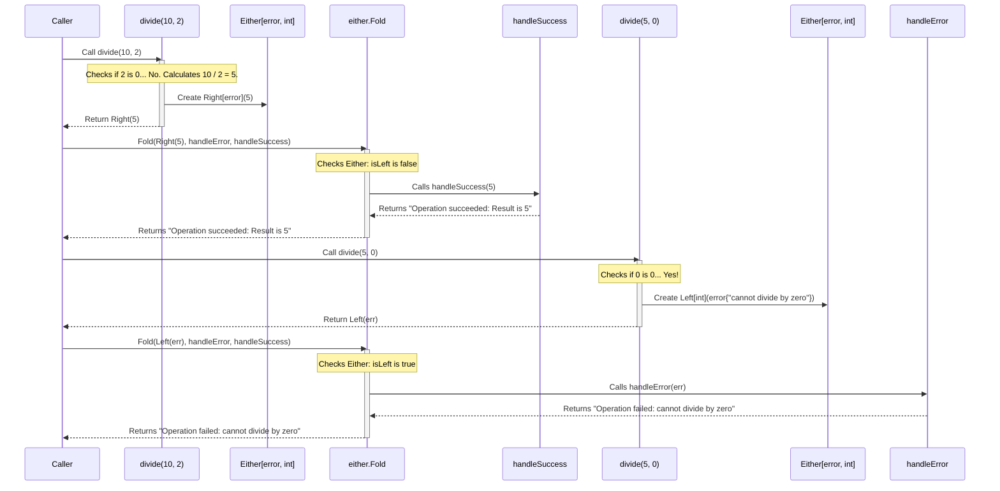

# Chapter 2: Either

In [Chapter 1: Option](01_option_.md), we learned how to handle values that might be *missing* using `Some` and `None`. That's super helpful! But what happens when an operation doesn't just produce *nothing*, but actually *fails* for a specific reason?

Think about dividing two numbers. If you try to divide by zero, it's not just that the answer is missing – it's an *error*. Or imagine trying to read a file: it might fail because the file doesn't exist, or because you don't have permission, or because the disk is corrupted. We often want to know *why* something went wrong. Standard Go often uses the `(value, error)` return pattern for this.

`Either` gives us a functional way to handle these situations explicitly.

## What Problem Does `Either` Solve?

Imagine again you're programming a simple calculator. Division is tricky.

```go
// Standard Go way
func divideGo(a, b int) (int, error) {
 if b == 0 {
  return 0, fmt.Errorf("cannot divide by zero")
 }
 return a / b, nil
}

// How do we use it?
result, err := divideGo(10, 2)
if err != nil {
    fmt.Println("Error:", err)
} else {
    fmt.Println("Result:", result)
}

result2, err2 := divideGo(5, 0)
if err2 != nil {
    fmt.Println("Error:", err2)
} else {
    fmt.Println("Result:", result2)
}
```

This `if err != nil` check is everywhere in Go. It's explicit, which is good, but chaining multiple operations that can fail like this can get messy with nested `if` statements or lots of temporary error variables.

`Either` provides a container, like `Option`, but instead of `Some` or `None`, it holds *either* a failure value (which includes *why* it failed) *or* a success value.

## The `Either` Concept: Left or Right?

`Either` represents a value that can be one of two possibilities. Think of it as a fork in the road:

1. **`Left(errorValue)`**: You took the left path. This usually represents an **error** or **failure**. The `errorValue` holds information about what went wrong. By convention, the "unhappy" path is `Left`.
2. **`Right(successValue)`**: You took the right path. This represents a **successful** result. The `successValue` holds the actual computed value. By convention, the "happy" path is `Right`.

So, `Either[E, A]` is a type that holds *either* a value of type `E` (often an `error` type) in its `Left` state, *or* a value of type `A` (the successful result type) in its `Right` state. It can never hold both at the same time.

Like `Option`, `Either` *forces* you to deal with the possibility of failure. You can't accidentally ignore an error because you have to explicitly handle both the `Left` and `Right` cases to get the value out. This leads to more robust and reliable code.

## Using `Either` in `fp-go`

Let's see how to create and work with `Either` values using the `fp-go/either` package.

### Creating `Either` Values

Creating `Either` values is straightforward:

```go
package main

import (
 "errors"
 "fmt"
 "github.com/IBM/fp-go/either"
)

func main() {
 // Create an Either representing a successful integer result
 successResult := either.Right[error](100) // Took the 'Right' path!
 fmt.Println(successResult)

 // Create an Either representing a failure with an error message
 failureResult := either.Left[int](errors.New("Something went wrong!")) // Took the 'Left' path...
 fmt.Println(failureResult)

 // 'Of' is a shortcut for 'Right'
 anotherSuccess := either.Of[error]("Success value")
 fmt.Println(anotherSuccess)
}
```

**Output:**

```plaintext
Right[int](100)
Left[string](Something went wrong!)
Right[string](Success value)
```

* `either.Right[E, A](value)` creates a successful `Either` holding `value` of type `A`. The `E` type parameter specifies what *kind* of error *could* have happened (here, `error`).
* `either.Left[A, E](errorValue)` creates a failure `Either` holding `errorValue` of type `E`. The `A` type parameter specifies what type the successful value *would* have been (here, `int`).
* `either.Of[E, A](value)` is just a convenient alias for `either.Right[E, A](value)`.

### A Practical Example: Safe Division

Let's rewrite our division function using `Either`.

```go
package main

import (
 "errors"
 "fmt"
 "github.com/IBM/fp-go/either"
)

// divide returns Either an error (Left) or an integer (Right)
func divide(a, b int) either.Either[error, int] {
 if b == 0 {
  // Failure case: return Left with the error
  return either.Left[int](errors.New("cannot divide by zero"))
 }
 // Success case: return Right with the result
 return either.Right[error](a / b)
}

func main() {
 result1 := divide(10, 2)
 fmt.Println("10 / 2 =", result1)

 result2 := divide(5, 0)
 fmt.Println("5 / 0 =", result2)
}
```

**Output:**

```plaintext
10 / 2 = Right[int](5)
5 / 0 = Left[string](cannot divide by zero)
```

Our function signature `either.Either[error, int]` now clearly tells anyone using it: "This function will *either* give you an `error` (if something goes wrong) *or* an `int` (if it succeeds)."

### Working with `Either` Values

How do we handle these `Either` results? Similar to `Option`, `fp-go` provides safe ways to work with them.

**1. `IsLeft` / `IsRight` (Less Common)**

Again, you *can* check the state directly, but it's often better to use the functional approaches below.

```go
package main

import (
 "fmt"
 "github.com/IBM/fp-go/either"
 // ... (divide function defined as before)
)

func main() {
 result1 := divide(10, 2)
 if either.IsRight(result1) {
  // Unsafe without check! Prefer Fold or GetOrElse.
  value, _ := either.Unwrap(result1)
  fmt.Printf("Direct check (Right): Result is %d\n", value)
 }

 result2 := divide(5, 0)
 if either.IsLeft(result2) {
  _, errValue := either.Unwrap(result2)
  fmt.Printf("Direct check (Left): Error is %v\n", errValue)
 }

 // UnwrapError is a convenience for Either[error, A]
    val, err := either.UnwrapError(result2)
    if err != nil {
        fmt.Printf("UnwrapError: Got error: %v (Value: %v)\n", err, val) // val will be zero value for int
    }
}
```

**Output:**

```plaintext
Direct check (Right): Result is 5
Direct check (Left): Error is cannot divide by zero
UnwrapError: Got error: cannot divide by zero (Value: 0)
```

* `either.IsRight(e)`: Returns `true` if `e` is `Right`.
* `either.IsLeft(e)`: Returns `true` if `e` is `Left`.
* `either.Unwrap(e)`: Returns `(value, errorValue)`. One of them will be the zero value for its type. **Use with caution!** Requires checking `IsLeft`/`IsRight` first.
* `either.UnwrapError(e)`: A specific version for `Either[error, A]` that returns the familiar `(A, error)` Go tuple. Still requires checking the error.

**2. `Fold`: Handling Both Cases Explicitly**

Just like with `Option`, `Fold` is the most explicit way an `Either`. It takes two functions:

* `onLeft`: A function to call if the `Either` is `Left`. It receives the error value (`E`).
* `onRight`: A function to call if the `Either` is `Right`. It receives the success value (`A`).

`Fold` forces you to think about and handle both outcomes.

```go
package main

import (
 "fmt"
 "github.com/IBM/fp-go/either"
 // ... (divide function defined as before)
)

func main() {
 // Function to handle the error case (Left)
 handleError := func(err error) string {
  return fmt.Sprintf("Operation failed: %v", err)
 }

 // Function to handle the success case (Right)
 handleSuccess := func(value int) string {
  return fmt.Sprintf("Operation succeeded: Result is %d", value)
 }

 message1 := either.Fold(divide(10, 2), handleError, handleSuccess)
 fmt.Println(message1)

 message2 := either.Fold(divide(5, 0), handleError, handleSuccess)
 fmt.Println(message2)
}
```

**Output:**

```plaintext
Operation succeeded: Result is 5
Operation failed: cannot divide by zero
```

`Fold` makes it crystal clear how you're handling success and failure.

**3. `GetOrElse`: Providing a Default on Failure**

If you have a sensible default value to use when an operation fails (returns `Left`), `GetOrElse` is your friend. It takes one function `onLeft` which receives the error and returns a default value of the *success* type (`A`).

```go
package main

import (
 "fmt"
 "github.com/IBM/fp-go/either"
 // ... (divide function defined as before)
)

func main() {
 // Function that returns a default value (e.g., -1) if division fails
 getDefaultOnError := func(err error) int {
        fmt.Printf("  (getDefaultOnError called with: %v)\n", err) // Show when it runs
  return -1 // Return a default int
 }

 value1 := either.GetOrElse(divide(10, 2), getDefaultOnError)
 fmt.Printf("Value for 10 / 2: %d\n", value1)

 value2 := either.GetOrElse(divide(5, 0), getDefaultOnError)
 fmt.Printf("Value for 5 / 0: %d\n", value2)
}
```

**Output:**

```plaintext
Value for 10 / 2: 5
  (getDefaultOnError called with: cannot divide by zero)
Value for 5 / 0: -1
```

Notice how `getDefaultOnError` was only executed when `divide(5, 0)` returned a `Left`. If the `Either` is `Right`, the `onLeft` function is never called, and the value inside the `Right` is returned directly.

**4. Transforming Success: `Map`**

What if you get a successful result (`Right`) and want to do something with it, like add 10? But if you got an error (`Left`), you want to keep the error? Use `Map`.

`either.Map` takes a function that transforms the `Right` value (`A -> B`) and applies it *only* if the `Either` is `Right`. If it's `Left`, `Map` does nothing and passes the `Left` along.

```go
package main

import (
 "fmt"
 "github.com/IBM/fp-go/either"
 // ... (divide function defined as before)
)

func addTen(n int) int {
    return n + 10
}

func main() {
    result1 := divide(100, 10) // This will be Right(10)
    mapped1 := either.Map[error](addTen)(result1)
    fmt.Printf("Map (Success): %v -> %v\n", result1, mapped1)

    result2 := divide(5, 0) // This will be Left(...)
    mapped2 := either.Map[error](addTen)(result2)
 fmt.Printf("Map (Failure): %v -> %v\n", result2, mapped2)
}
```

**Output:**

```plaintext
Map (Success): Right[int](10) -> Right[int](20)
Map (Failure): Left[string](cannot divide by zero) -> Left[string](cannot divide by zero)
```

See how `addTen` was only applied to the successful `Right(10)`, resulting in `Right(20)`? The `Left` value was untouched.

**5. Chaining Operations: `Chain` (flatMap)**

This is where `Either` really shines, especially compared to nested `if err != nil`. `Chain` (often called `flatMap` in other languages/libraries) lets you sequence multiple operations that might fail.

`either.Chain` takes a function that accepts the successful value (`A`) from the *previous* `Either` and returns a *new* `Either` (`Either[E, B]`).

* If the input `Either` is `Right(a)`, `Chain` calls your function `f(a)` and returns its result (which could be `Right(b)` or `Left(e)`).
* If the input `Either` is `Left(e)`, `Chain` **skips** your function entirely and just passes the original `Left(e)` along. This is called "short-circuiting".

```go
package main

import (
 "errors"
 "fmt"
 "github.com/IBM/fp-go/either"
 "strconv"
)

// Try parsing a string to int, return Either
func parseInt(s string) either.Either[error, int] {
 i, err := strconv.Atoi(s)
 if err != nil {
  // Use TryCatchError helper for idiomatic Go functions
  return either.Left[int](fmt.Errorf("'%s' is not a number", s))
 }
 return either.Right[error](i)
}

// Divide, returning Either
func divideE(a, b int) either.Either[error, int] {
 if b == 0 {
  return either.Left[int](errors.New("division by zero"))
 }
 return either.Right[error](a / b)
}

// A function that takes an int and returns an Either for chaining
func checkedDivideBy(divisor int) func(dividend int) either.Either[error, int] {
 return func(dividend int) either.Either[error, int] {
  fmt.Printf("  Attempting to divide %d by %d\n", dividend, divisor)
  return divideE(dividend, divisor)
 }
}

func main() {
 // Chain: parseInt -> divide by 2 -> divide by 5
 startValue := "100"
 fmt.Printf("Processing '%s':\n", startValue)

 result1 := either.Chain(checkedDivideBy(2))(parseInt(startValue)) // Right(100) -> checkedDivideBy(2)(100) -> Right(50)
 result2 := either.Chain(checkedDivideBy(5))(result1)              // Right(50) -> checkedDivideBy(5)(50) -> Right(10)

 fmt.Println("Final result:", result2) // Expected: Right(10)

 fmt.Println("\nProcessing 'abc':")
    // Chain with invalid input - short-circuits early
 failResult1 := either.Chain(checkedDivideBy(2))(parseInt("abc")) // Left(...) -> skips divide
 failResult2 := either.Chain(checkedDivideBy(5))(failResult1)     // Left(...) -> skips divide

 fmt.Println("Final result:", failResult2) // Expected: Left('abc' is not a number)

 fmt.Println("\nProcessing '10' with division by zero:")
    // Chain with division by zero - short-circuits on second step
    zeroResult1 := either.Chain(checkedDivideBy(0))(parseInt("10")) // Right(10) -> checkedDivideBy(0)(10) -> Left(...)
 zeroResult2 := either.Chain(checkedDivideBy(5))(zeroResult1)    // Left(...) -> skips divide

 fmt.Println("Final result:", zeroResult2) // Expected: Left(division by zero)
}
```

**Output:**

```plaintext
Processing '100':
  Attempting to divide 100 by 2
  Attempting to divide 50 by 5
Final result: Right[int](10)

Processing 'abc':
Final result: Left[string]('abc' is not a number)

Processing '10' with division by zero:
  Attempting to divide 10 by 0
Final result: Left[string](division by zero)
```

Look how clean that is! We chained three potentially failing operations. If any step returns a `Left`, all subsequent `Chain` steps are automatically skipped, and the first `Left` encountered is the final result. No nested `if`s needed!

**6. Helper: `TryCatchError`**

Often you have a standard Go function `func(...) (Value, error)`. The `either` package provides helpers like `TryCatchError` (and `EitherizeN` for functions with N arguments) to easily convert these into functions returning `Either[error, Value]`.

```go
package main

import (
    "fmt"
    "os"
    "github.com/IBM/fp-go/either"
)

// Idiomatic Go function that returns (data, error)
func readFileGo(filename string) ([]byte, error) {
    return os.ReadFile(filename)
}

func main() {
 // Using TryCatchError to wrap the call
 contentResult := either.TryCatchError(readFileGo("my_file.txt")) // (Assuming my_file.txt exists)
 fmt.Println("Read existing file:", contentResult) // Likely Right([...bytes...])

 nonExistentResult := either.TryCatchError(readFileGo("non_existent.txt"))
 fmt.Println("Read missing file:", nonExistentResult) // Likely Left(open non_existent.txt: no such file or directory)

    // You can also create an 'Eitherized' version of the function
    readFileEither := either.Eitherize1(readFileGo)

    contentResult2 := readFileEither("my_file.txt")
    fmt.Println("Via Eitherize1:", contentResult2)
}
```

(Output will vary based on file existence/content, but will show `Right([...])` or `Left(...)`)

`TryCatchError` takes the two return values from the standard Go function and bundles them neatly into an `Either`. `Eitherize1` converts a function `func(T1) (R, error)` into `func(T1) Either[error, R]`.

## Under the Hood: How Does `Either` Work?

Like `Option`, `Either` is not magic! It's a simple structure.

## **The Structure**

Looking inside `either/core.go`, you'll find something structurally similar to this (simplified):

```go
// Simplified representation inspired by either/core.go

// either struct holds the state
type either struct {
 isLeft bool // Flag: true if Left, false if Right
 value  any  // The actual value (either E or A)
}

// Either is the generic type built on the internal struct
type Either[E, A any] either

// Left creates a Left instance
func Left[A, E any](value E) Either[E, A] {
 return Either[E, A]{isLeft: true, value: value}
}

// Right creates a Right instance
func Right[E, A any](value A) Either[E, A] {
 return Either[E, A]{isLeft: false, value: value}
}

// IsLeft checks the flag
func IsLeft[E, A any](val Either[E, A]) bool {
 return val.isLeft
}

// MonadFold checks the flag and calls the appropriate function
func MonadFold[E, A, B any](ma Either[E, A], onLeft func(e E) B, onRight func(a A) B) B {
 if IsLeft(ma) {
  // If Left, cast value to E and call onLeft
  return onLeft(ma.value.(E))
 }
 // If Right, cast value to A and call onRight
 return onRight(ma.value.(A))
}
```

It's very similar to `Option`! An `Either` holds the value (`E` or `A`) and a boolean flag `isLeft` to tell us which path was taken (`Left` or `Right`). Functions like `Fold`, `Map`, and `Chain` use this flag to decide whether to process the value or pass the error along.

**Sequence Diagram: `divide` followed by `Fold`**

Let's visualize calling our `divide` function and then using `Fold`:



This diagram shows how `Fold` inspects the `Either` returned by `divide`. If it's `Right`, it calls the success handler; if it's `Left`, it calls the error handler.

## Conclusion

You've now learned about `Either`, a powerful tool for handling operations that can either succeed or fail with a specific error.

* It replaces the common Go `(value, error)` pattern in a functional context.
* It exists in two forms: `Left(errorValue)` for failures and `Right(successValue)` for successes.
* It forces explicit handling of both outcomes using functions like `Fold`.
* It makes chaining failable operations safe and elegant using `Chain`, automatically short-circuiting on the first `Left`.
* Helpers like `TryCatchError` and `EitherizeN` bridge the gap with idiomatic Go functions.
* Internally, it's a simple struct with a value and a flag (`isLeft`).

Using `Either` makes your code safer by ensuring errors aren't ignored and clarifies the possible outcomes of a function directly in its type signature.

## Next Steps

We've seen how `Option` handles missing values and `Either` handles success/failure. Both deal with the *results* of computations. But what about actions that interact with the outside world, like reading files, making network requests, or printing to the console? These are called "side effects". How do we manage them in a functional way?

Let's explore this in the next chapter: [IO](03_io_.md).

---

Generated by [AI Codebase Knowledge Builder](https://github.com/The-Pocket/Tutorial-Codebase-Knowledge)
