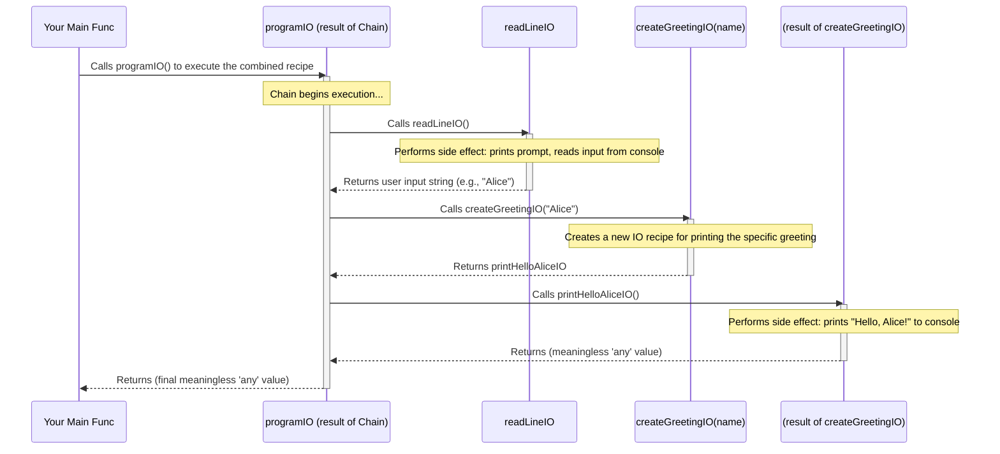

# Chapter 3: IO

In the previous chapters, we looked at [Option](01_option_.md) for values that might be missing and [Either](02_either_.md) for operations that can either succeed or fail. These are great for managing the *results* of computations *within* our program's logic.

But what about when our program needs to interact with the outside world? Things like:

* Printing a message to the console for the user to see.
* Reading input typed by the user.
* Writing data to a file.
* Making a request over the network.

These actions are called **side effects** because they affect (or are affected by) things outside the direct control of the function performing them. In standard Go, we often just call functions like `fmt.Println()` or `os.ReadFile()` directly whenever needed.

Functional programming values purity – functions that only depend on their inputs and always produce the same output for the same input, without causing side effects. How can we reconcile the need for side effects with the desire for purity? This is where `IO` comes in!

## What Problem Does `IO` Solve?

Imagine you want to write a tiny program that asks the user for their name and then prints a personalized greeting.

```go
package main

import (
 "bufio"
 "fmt"
 "os"
 "strings"
)

// Standard Go way - direct side effects
func greetUserDirectly() {
 reader := bufio.NewReader(os.Stdin)
 fmt.Print("What is your name? ") // Side effect 1: Printing
 name, _ := reader.ReadString('\n') // Side effect 2: Reading input
 name = strings.TrimSpace(name)
 fmt.Printf("Hello, %s!\n", name) // Side effect 3: Printing again
}

func main() {
 greetUserDirectly() // Executes the side effects immediately
}
```

This works, but the `greetUserDirectly` function is "impure". Every time you call it, it does different things depending on user input, and it interacts directly with the console. This can make testing harder and reasoning about the program flow more complex, especially as programs grow.

`IO` allows us to describe these interactions *without* executing them immediately.

## The `IO` Concept: A Recipe for Action

Think of `IO[A]` as a **recipe** or a **plan** for an action that, when finally performed, will produce a value of type `A`.

* **`IO[string]`**: A recipe describing an action that will eventually result in a `string` (like reading user input).
* **`IO[any]`**: A recipe describing an action that doesn't produce a meaningful value (like printing to the console). `fp-go` often uses `any` (or a placeholder like `struct{}`) for this. We often call this `IO[Unit]` or `IO[Void]` conceptually.

The crucial point is that **having the `IO` value doesn't run the action**. It just holds the *description* of the action. This separation allows us to:

1. **Build** descriptions of complex interactions by combining smaller `IO` recipes.
2. Keep the logic that *builds* the recipe **pure**.
3. **Execute** the final, combined recipe only once, usually at the very end of our program (often called "at the end of the world").

`IO[A]` in `fp-go` is actually just a function type: `type IO[A any] func() A`. It's a function that takes no arguments and, when *called*, performs the action and returns the result `A`.

## Using `IO` in `fp-go`

Let's see how to create and combine these `IO` recipes using the `fp-go/io` package.

### Creating `IO` Values

We need ways to wrap our potentially side-effecting actions into `IO` values.

**1. `io.MakeIO`: Wrapping a Function**

The most fundamental way is to wrap an existing function `func() A` that performs the desired action.

```go
package main

import (
 "fmt"
 "time"
 "github.com/IBM/fp-go/io"
)

// An action that gets the current time (has a slight side effect: depends on external state)
func getCurrentTime() time.Time {
 fmt.Println("   (Getting current time...)")
 return time.Now()
}

func main() {
 // Wrap the action in an IO recipe
 getTimeIO := io.MakeIO(getCurrentTime)

 // At this point, getCurrentTime() has NOT been called yet!
 fmt.Println("Created IO recipe, but haven't run it.")

 // Now, let's execute the recipe by calling the IO function
 fmt.Println("Running the IO recipe...")
 currentTime := getTimeIO() // This actually calls getCurrentTime()

 fmt.Printf("The time is: %s\n", currentTime)

 fmt.Println("Running it again...")
 currentTime2 := getTimeIO() // This calls getCurrentTime() again
 fmt.Printf("The time is now: %s\n", currentTime2)
}
```

**Output:**

```plaintext
Created IO recipe, but haven't run it.
Running the IO recipe...
   (Getting current time...)
The time is: 2023-10-27 10:30:00.123456 +0000 UTC ... (actual time will vary)
Running it again...
   (Getting current time...)
The time is now: 2023-10-27 10:30:00.123789 +0000 UTC ... (actual time will vary slightly)
```

* `io.MakeIO(func() A)` takes a function and turns it into an `IO[A]`.
* Crucially, the original function (`getCurrentTime`) is only executed when we *call* the resulting `IO` value (`getTimeIO()`).

**2. `io.FromImpure`: For Actions with No Return Value**

What about actions like `fmt.Println("Hello")` which don't return anything useful? We can use `io.FromImpure`. It wraps a `func()` and creates an `IO[any]` where the returned `any` value is meaningless but signifies the action completed.

```go
package main

import (
 "fmt"
 "github.com/IBM/fp-go/io"
)

// An action that prints a message
func printHello() {
 fmt.Println("   (Printing Hello!)")
}

func main() {
 // Wrap the printing action
 printHelloIO := io.FromImpure(printHello)

 fmt.Println("Created print IO recipe.")

 // Run the recipe
 fmt.Println("Running recipe...")
 _ = printHelloIO() // We ignore the meaningless 'any' return value

 fmt.Println("Recipe finished.")
}
```

**Output:**

```plaintext
Created print IO recipe.
Running recipe...
   (Printing Hello!)
Recipe finished.
```

**3. Helper `IO`s:**

The `io` package also provides some pre-made `IO` recipes for common tasks, like `io.Now` which is equivalent to `io.MakeIO(time.Now)`.

### Running an `IO`

As we saw, an `IO[A]` is just a `func() A`. To execute the described action and get the value (or perform the effect), you simply **call the `IO` value like a function**:

```go
myActionIO := io.MakeIO(func() string { return "Done!" })
result := myActionIO() // Executes the function, result is "Done!"
```

This act of calling the `IO` is the bridge between the pure world (where we describe actions) and the impure world (where actions actually happen).

### Combining `IO` Actions: `Chain`

This is where `IO` becomes powerful. How do we sequence actions, like reading input *then* printing a greeting? We use `io.Chain` (similar to `either.Chain`).

`io.Chain` takes:

1. A function `func(A) IO[B]` - this function takes the result (`A`) of the *first* action and returns the *recipe* (`IO[B]`) for the *next* action.
2. The first action `IO[A]`.

It returns a *new* recipe `IO[B]` that describes performing the first action, feeding its result into the function to get the second recipe, and then performing that second action.

Let's build our greeting program using `IO`:

```go
package main

import (
 "bufio"
 "fmt"
 "os"
 "strings"

 "github.com/IBM/fp-go/io"
 "github.com/IBM/fp-go/function" // for pipe
)

// IO Recipe: Read a line from the console
var readLineIO io.IO[string] = io.MakeIO(func() string {
 fmt.Print("   (Reading input...) What is your name? ")
 reader := bufio.NewReader(os.Stdin)
 name, _ := reader.ReadString('\n')
 return strings.TrimSpace(name)
})

// Function: Takes a name (string) and returns an IO Recipe for printing a greeting
func createGreetingIO(name string) io.IO[any] {
 return io.FromImpure(func() {
  fmt.Printf("   (Printing greeting...) Hello, %s!\n", name)
 })
}

func main() {
 // Chain the actions:
 // 1. Start with readLineIO (IO[string])
 // 2. Pass the result (name string) to createGreetingIO
 // 3. createGreetingIO returns the next action (IO[any])
 programIO := io.Chain(createGreetingIO)(readLineIO) // programIO is now IO[any]

 // --- Nothing has happened yet! ---
 fmt.Println("Built the combined IO program recipe.")
 fmt.Println("Now executing the program...")

 // Execute the entire sequence by calling the final IO function
 programIO()

 fmt.Println("Program finished.")
}

```

**Example Interaction:**

```plaintext
Built the combined IO program recipe.
Now executing the program...
   (Reading input...) What is your name? Alice  <-- User types Alice and hits Enter
   (Printing greeting...) Hello, Alice!
Program finished.
```

Look carefully:

* We defined `readLineIO` (a recipe to read) and `createGreetingIO` (a function that takes a name and *creates* a recipe to print).
* `io.Chain(createGreetingIO)(readLineIO)` *combines* these descriptions into a single, larger recipe `programIO`. **No reading or printing happens here.**
* Only when we call `programIO()` does the entire sequence execute: the read happens, its result ("Alice") is passed to `createGreetingIO`, which generates the print recipe, and *that* print recipe is immediately executed.

We can also use `function.Pipe` for more complex chains, which can sometimes be more readable:

```go
// Using function.Pipe for the same chain
programIO_Pipe := function.Pipe1(
 readLineIO,         // Start with IO[string]
 io.Chain(createGreetingIO), // Chain it using the function
)

programIO_Pipe() // Execute it
```

### Transforming IO Results: `Map`

Sometimes you have an `IO` action that produces a value, and you just want to transform that value *after* the action is done, without introducing another side effect. Use `io.Map`.

`io.Map` takes a function `func(A) B` and an `IO[A]`, returning an `IO[B]`. The new `IO` recipe, when run, will execute the original `IO[A]`, get the result `a`, apply the function `f(a)` to get `b`, and return `b`.

```go
package main

import (
 "fmt"
 "strings"
 "github.com/IBM/fp-go/io"
)

// IO Recipe to get a name (simulated)
var getNameIO io.IO[string] = io.MakeIO(func() string {
 fmt.Println("   (Getting name...)")
 return "  bob  "
})

func main() {
 // Function to clean up and capitalize the name
 processName := func(name string) string {
  fmt.Println("   (Processing name...)")
  return strings.ToUpper(strings.TrimSpace(name))
 }

 // Create a new IO that gets the name, then processes it
 getProcessedNameIO := io.Map(processName)(getNameIO)

 fmt.Println("Built the mapped IO recipe.")
 fmt.Println("Running mapped IO...")
 processedName := getProcessedNameIO() // Runs getNameIO, then processName

 fmt.Printf("Processed name: %s\n", processedName)
}
```

**Output:**

```plaintext
Built the mapped IO recipe.
Running mapped IO...
   (Getting name...)
   (Processing name...)
Processed name: BOB
```

## Under the Hood: How Does `IO` Work?

As mentioned, `IO` isn't complicated! It's fundamentally just a wrapper around a standard Go function.

## **The Structure**

Looking at the source (`io/io.go`, `io/generic/io.go`), you'll find:

```go
// From io/io.go - The core type definition
type IO[A any] func() A

// Simplified representation of MakeIO from io/generic/io.go
func MakeIO[GA ~func() A, A any](f func() A) GA {
 return f // It just returns the function!
}

// Simplified representation of MonadChain from io/generic/io.go
// MonadChain[IO[A], IO[B], A, B](ioA IO[A], f func(A) IO[B]) IO[B]
func MonadChain[GA ~func() A, GB ~func() B, A, B any](fa GA, f func(A) GB) GB {
 // Return a *new* function (the chained IO recipe)
 return MakeIO[GB](func() B {
  // 1. Execute the first IO action (recipe)
  a := fa()
  // 2. Use its result 'a' to get the second IO action (recipe)
  fb := f(a)
  // 3. Execute the second IO action
  return fb()
 })
}

// Simplified representation of MonadMap from io/generic/io.go
// MonadMap[IO[A], IO[B], A, B](ioA IO[A], f func(A) B) IO[B]
func MonadMap[GA ~func() A, GB ~func() B, A, B any](fa GA, f func(A) B) GB {
 // Return a *new* function (the mapped IO recipe)
 return MakeIO[GB](func() B {
  // 1. Execute the original IO action
  a := fa()
  // 2. Apply the mapping function to the result
  return f(a)
 })
}
```

That's the essence! `IO` is a `func() A`. `MakeIO` just returns the function you give it. `Chain` and `Map` create *new* functions that sequence or transform the execution of the original functions when they are eventually called.

## **Sequence Diagram: Chaining Read and Print**

Let's visualize our `io.Chain(createGreetingIO)(readLineIO)` example:



This shows how calling the final `programIO` orchestrates the execution: run the first `IO`, use its result to get the next `IO`, run that `IO`, and so on. The side effects only happen during this final execution step.

## Conclusion

You've learned about `IO`, a fundamental tool for managing side effects in functional programming.

* `IO[A]` represents a *description* or *recipe* for an action that might interact with the outside world and will eventually produce a value of type `A`.
* Creating an `IO` value **does not** perform the action.
* Actions are only performed when the `IO` value (which is a `func() A`) is finally called.
* `io.Chain` allows sequencing actions, where the result of one action determines the next action.
* `io.Map` allows transforming the result of an action without changing the action itself.
* This separates the *description* of impure actions from their *execution*, allowing us to build programs from pure composition logic and push the messy side effects to the "edge" of the program.

`IO` helps us write more predictable and testable code, even when dealing with necessary interactions with the real world. However, `IO` itself doesn't handle errors (notice the `_` when reading input in our example).

## Next Steps

We've seen `IO` for describing actions. But often, these actions need some kind of configuration or environment to run – think database connections, API keys, or user settings. How can we make our actions depend on such context in a clean, functional way?

Let's move on to the next chapter: [Reader](04_reader_.md).

---

Generated by [AI Codebase Knowledge Builder](https://github.com/The-Pocket/Tutorial-Codebase-Knowledge)
