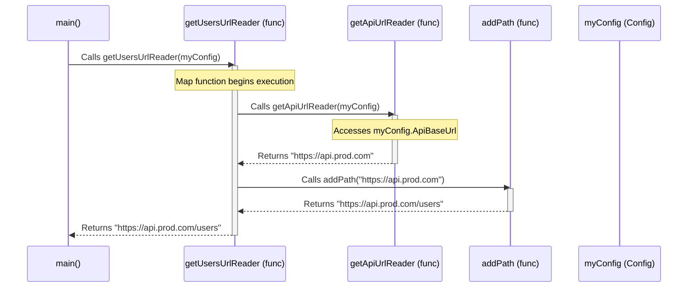

# Chapter 4: Reader

In [Chapter 3: IO](03_io_.md), we learned how to describe actions with side effects (like printing or reading files) as `IO` values, separating the description from the execution. This helps manage interactions with the outside world.

But what about computations that don't necessarily cause side effects, but *do* need access to some shared information or resources to do their job? Think about functions that need:

* Application-wide configuration settings (API keys, feature flags).
* A shared database connection pool.
* Information about the currently logged-in user.

Passing this "context" or "environment" down through many layers of functions can be cumbersome and make our code messy (sometimes called "prop drilling"). How can we make functions access this shared context without explicitly passing it everywhere?

This is the problem that `Reader` solves.

## What Problem Does `Reader` Solve?

Imagine you're building parts of a web application. Several different functions might need to know the base URL for making API calls or the default language for displaying messages.

```go
package main

import "fmt"

// Shared application configuration
type Config struct {
 ApiBaseUrl    string
 DefaultLang   string
 MaxRetries    int
}

// ----- The Problem: Prop Drilling -----

// Function A needs the base URL
func buildApiUrl(cfg Config, path string) string {
 return cfg.ApiBaseUrl + path
}

// Function B needs the default language AND calls Function A
func getLocalizedMessage(cfg Config, messageKey string) string {
 // ... logic to get message based on cfg.DefaultLang ...
 apiUrl := buildApiUrl(cfg, "/messages/"+messageKey) // Pass cfg down
 fmt.Printf("  (Fetching message from %s using lang %s)\n", apiUrl, cfg.DefaultLang)
 return fmt.Sprintf("Message for %s in %s", messageKey, cfg.DefaultLang)
}

// Function C needs max retries AND calls Function B
func processUserData(cfg Config, userID string) error {
 // ... maybe use cfg.MaxRetries here ...
 message := getLocalizedMessage(cfg, "welcome") // Pass cfg down again
 fmt.Printf("Processing user %s: %s\n", userID, message)
 return nil
}


func main() {
 myConfig := Config{
  ApiBaseUrl:  "https://api.example.com",
  DefaultLang: "en",
  MaxRetries:  3,
 }

 // We have to pass myConfig explicitly everywhere
 processUserData(myConfig, "user123")
}
```

**Output:**

```plaintext
  (Fetching message from https://api.example.com/messages/welcome using lang en)
Processing user user123: Message for welcome in en
```

See how `cfg` has to be passed down through `processUserData` and `getLocalizedMessage` just so `buildApiUrl` and the message fetching logic can use parts of it? If the call chain was deeper, we'd be passing `cfg` through even more functions that don't directly use it.

`Reader` provides a way to encapsulate this dependency on a shared environment `R`.

## The `Reader` Concept: Give Me the Tools Later

Think of `Reader[R, A]` as a computation that *needs* some context or environment of type `R` (like our `Config`) before it can produce a result of type `A`. It's like a recipe that says, "To bake this cake (`A`), I first need a fully equipped kitchen (`R`)."

* `Reader[Config, string]`: A computation that needs a `Config` object and will produce a `string`.
* `Reader[DatabasePool, User]`: A computation that needs a `DatabasePool` and will produce a `User`.

The key idea is that you define functions that declare their *need* for the context `R` and what they will do *once they get it*, but you don't actually provide the context `R` yet. You can compose these `Reader` computations together. Only when you're ready to run the *entire* composed computation do you provide the actual context (`Config` instance, `DatabasePool`, etc.) *once*.

This avoids passing the context `R` through intermediate functions that don't care about it.

Under the hood, `Reader[R, A]` in `fp-go` is just a simple function type:

```go
type Reader[R, A any] func(R) A
```

It's literally a function that takes the context `R` and returns the value `A`.

## Using `Reader` in `fp-go`

Let's rewrite our configuration example using `fp-go/reader`.

### Creating `Reader` Values

**1. `reader.MakeReader`: Wrapping `func(R) A`**

You often start by wrapping a function that takes the context and returns a value.

```go
package main

import (
 "fmt"
 "github.com/IBM/fp-go/reader"
)

// Shared application configuration
type Config struct {
 ApiBaseUrl    string
 DefaultLang   string
 MaxRetries    int
}

// Function that extracts the API URL from Config
func getApiUrlFunc(cfg Config) string {
 fmt.Println("   (Executing getApiUrlFunc)")
 return cfg.ApiBaseUrl
}

func main() {
 // Create a Reader that describes getting the API URL
 // It needs a Config (R) and will produce a string (A)
 getApiUrlReader := reader.MakeReader(getApiUrlFunc)

 // --- Nothing has executed yet! ---
 // getApiUrlReader is just a description: func(Config) string

 fmt.Println("Created the Reader, haven't run it.")
}
```

We've defined `getApiUrlReader`, which is a `Reader[Config, string]`, but `getApiUrlFunc` hasn't been called.

**2. `reader.Ask`: Accessing the Whole Context**

Sometimes a computation needs the entire context object. `reader.Ask[R]()` provides a `Reader[R, R]` that simply returns the context it receives.

```go
package main

import (
 "fmt"
 "github.com/IBM/fp-go/reader"
)

type Config struct { /* ... */ }

func main() {
 // A Reader that just returns the whole Config
 getConfigReader := reader.Ask[Config]() // Type: Reader[Config, Config]

 // --- Still nothing executed ---
 fmt.Println("Created Ask Reader.")
}
```

**3. `reader.Asks`: Accessing Part of the Context**

More commonly, you only need a specific piece of the context. `reader.Asks` takes a function `func(R) A` and creates a `Reader[R, A]` that applies this function to the context. This is often more direct than `MakeReader`.

```go
package main

import (
 "fmt"
 "github.com/IBM/fp-go/reader"
)

type Config struct {
 ApiBaseUrl    string
 DefaultLang   string
 MaxRetries    int
}

func main() {
 // Reader to get the DefaultLang string from Config
 getDefaultLangReader := reader.Asks(func(cfg Config) string {
  fmt.Println("   (Executing Asks for DefaultLang)")
  return cfg.DefaultLang
 }) // Type: Reader[Config, string]

 // Reader to get the MaxRetries int from Config
 getMaxRetriesReader := reader.Asks(func(cfg Config) int {
  fmt.Println("   (Executing Asks for MaxRetries)")
  return cfg.MaxRetries
 }) // Type: Reader[Config, int]

 // --- Still nothing executed ---
 fmt.Println("Created two Reader values using Asks.")
}

```

### Running a `Reader`

A `Reader[R, A]` is just `func(R) A`. To run the computation and get the result, you **call the `Reader` function with the actual context `R`**.

```go
package main

import (
 "fmt"
 "github.com/IBM/fp-go/reader"
)

type Config struct {
 ApiBaseUrl    string
 DefaultLang   string
 MaxRetries    int
}

func main() {
 // Reader to get the DefaultLang
 getDefaultLangReader := reader.Asks(func(cfg Config) string {
  fmt.Println("   (Accessing DefaultLang)")
  return cfg.DefaultLang
 })

 // The actual configuration
 myConfig := Config{ DefaultLang: "fr", /* ... */ }

 // Run the Reader by providing the context
 fmt.Println("Running the Reader...")
 lang := getDefaultLangReader(myConfig) // Execute reader func(myConfig)

 fmt.Printf("The language is: %s\n", lang)
}
```

**Output:**

```plaintext
Running the Reader...
   (Accessing DefaultLang)
The language is: fr
```

The `getDefaultLangReader` function was finally called when we provided `myConfig`.

### Combining Readers: `Map` and `Chain`

The real power comes from composing readers *before* providing the context.

**`Map`: Transforming the Result**

If you have a `Reader[R, A]` and a function `func(A) B`, `reader.Map` creates a new `Reader[R, B]`. The new reader, when run with context `R`, will first run the original reader to get `A`, then apply your function to get `B`.

```go
package main

import (
 "fmt"
 "github.com/IBM/fp-go/reader"
 "strings"
)

type Config struct { ApiBaseUrl string }

func main() {
 getApiUrlReader := reader.Asks(func(cfg Config) string {
  fmt.Println("   (Getting API URL)")
  return cfg.ApiBaseUrl
 }) // Reader[Config, string]

 // Function to add a path to a URL string
 addPath := func(base string) string {
  fmt.Println("   (Adding /users path)")
  return base + "/users"
 }

 // Create a Reader that gets the URL and then adds "/users"
 getUsersUrlReader := reader.Map(addPath)(getApiUrlReader) // Reader[Config, string]

 // --- Nothing executed yet ---
 fmt.Println("Built mapped Reader.")

 myConfig := Config{ ApiBaseUrl: "https://api.prod.com" }
 fmt.Println("Running mapped Reader...")
 usersUrl := getUsersUrlReader(myConfig) // Runs both steps

 fmt.Printf("Users URL: %s\n", usersUrl)
}
```

**Output:**

```plaintext
Built mapped Reader.
Running mapped Reader...
   (Getting API URL)
   (Adding /users path)
Users URL: https://api.prod.com/users
```

`reader.Map(addPath)` created a new reader recipe that combined getting the URL *and* adding the path.

**`Chain`: Sequencing Computations that Need Context**

`Chain` (or `flatMap`) is used when the *next* computation *also* needs the context `R`. It takes:

1. A function `func(A) Reader[R, B]` - takes the result `A` of the previous step and returns a *new reader* `Reader[R, B]`.
2. The first reader `Reader[R, A]`.

It returns a combined `Reader[R, B]`. When run with context `R`:

1. The first reader `Reader[R, A]` is run with `R` to get `A`.
2. The function `f(A)` is called, returning the *next* reader `Reader[R, B]`.
3. This *next* reader is run with the *same original context* `R` to get `B`.

Let's rebuild our initial complex example using `Reader`:

```go
package main

import (
 "fmt"
 "github.com/IBM/fp-go/reader"
 "github.com/IBM/fp-go/function" // For Pipe
)

type Config struct {
 ApiBaseUrl    string
 DefaultLang   string
 MaxRetries    int
}

// Reader: Get base API URL from config
var getApiUrl reader.Reader[Config, string] = reader.Asks(func(cfg Config) string {
 fmt.Println("   (Reader: Getting API URL)")
 return cfg.ApiBaseUrl
})

// Takes a path string, returns a READER that builds the full URL
// Needs Config indirectly via getApiUrl
func buildApiReader(path string) reader.Reader[Config, string] {
 addPathFunc := func(baseUrl string) string {
  fmt.Printf("   (Reader: Building URL for path '%s')\n", path)
  return baseUrl + path
 }
 // Map the result of getApiUrl
 return reader.Map(addPathFunc)(getApiUrl) // Returns Reader[Config, string]
}

// Reader: Get default language from config
var getDefaultLang reader.Reader[Config, string] = reader.Asks(func(cfg Config) string {
 fmt.Println("   (Reader: Getting Default Lang)")
 return cfg.DefaultLang
})

// Takes a message key, returns a READER that formats a message
// Needs Config indirectly via buildApiReader and getDefaultLang
func getLocalizedMessageReader(messageKey string) reader.Reader[Config, string] {
 // Define the function for Chain (takes lang, returns next Reader)
 createMessage := func(lang string) reader.Reader[Config, string] {
  // Now we use the lang. The next step is to get the API URL.
  apiUrlReader := buildApiReader("/messages/" + messageKey) // Reader[Config, string]

  // Map the API URL to create the final message string
  formatMessage := func(apiUrl string) string {
   fmt.Printf("   (Reader: Formatting message for key '%s' using lang '%s' from URL '%s')\n", messageKey, lang, apiUrl)
   return fmt.Sprintf("Message for %s in %s", messageKey, lang)
  }
  return reader.Map(formatMessage)(apiUrlReader) // Reader[Config, string]
 }

 // 1. Start with getDefaultLang (Reader[C, string])
 // 2. Chain it: pass the lang to createMessage, which returns the next Reader
 return reader.Chain(createMessage)(getDefaultLang) // Reader[Config, string]
}

// Takes userID, returns READER that processes data
// Needs Config indirectly via getLocalizedMessageReader
func processUserDataReader(userID string) reader.Reader[Config, string] {
 // Define function for Chain (takes message, returns next Reader)
 processMessage := func(message string) reader.Reader[Config, string] {
  // We got the message, now just create the final output string Reader
  // This step doesn't *need* config directly, so we use 'Of' (or Map)
  finalOutput := fmt.Sprintf("Processing user %s: %s", userID, message)
  fmt.Println("   (Reader: Formatting final output)")
  // reader.Of creates a reader that ignores the context and returns a value
  return reader.Of[Config](finalOutput) // Reader[Config, string]
 }

 // 1. Start with getting the localized message (depends on Config)
 // 2. Chain it: pass the message to processMessage to get the final reader
 return reader.Chain(processMessage)(getLocalizedMessageReader("welcome"))
}

func main() {
 // Build the entire computation as a single Reader
 programReader := processUserDataReader("user123") // Type: Reader[Config, string]

 // --- No functions have executed yet! ---
 fmt.Println("Built the complete program Reader.")

 // Define the actual configuration
 myConfig := Config{
  ApiBaseUrl:  "https://api.example.com",
  DefaultLang: "en",
  MaxRetries:  3,
 }

 // Run the entire composed Reader computation by providing the config ONCE
 fmt.Println("Running the program Reader...")
 finalResult := programReader(myConfig)

 fmt.Println("Final Result:", finalResult)
}
```

**Output:**

```plaintext
Built the complete program Reader.
Running the program Reader...
   (Reader: Getting Default Lang)
   (Reader: Getting API URL)
   (Reader: Building URL for path '/messages/welcome')
   (Reader: Formatting message for key 'welcome' using lang 'en' from URL 'https://api.example.com/messages/welcome')
   (Reader: Formatting final output)
Final Result: Processing user user123: Message for welcome in en
```

Notice how `myConfig` was only provided **once** at the very end when calling `programReader(myConfig)`. The `Reader` compositions (`Map`, `Chain`) handled passing the context implicitly where needed. Our functions `buildApiReader`, `getLocalizedMessageReader`, `processUserDataReader` now return `Reader` values, clearly declaring their dependency on `Config` without needing `cfg` as an explicit argument.

## Under the Hood: How Does `Reader` Work?

`Reader` is elegant because it's fundamentally so simple.

## **The Structure**

As shown before, `Reader[R, A]` is just defined as `func(R) A`.

```go
// From reader/reader.go
type Reader[R, A any] func(R) A

// Simplified from reader/generic/reader.go
func MakeReader[GA ~func(R) A, R, A any](r GA) GA {
 return r // Just returns the function itself
}

// Simplified MonadMap
func MonadMap[GA ~func(E) A, GB ~func(E) B, E, A, B any](fa GA, f func(A) B) GB {
 // Return a *new* function that, when called with context 'e':
 return func(e E) B {
  // 1. Calls the original reader 'fa' with 'e' to get 'a'
  a := fa(e)
  // 2. Applies the mapping function 'f' to 'a'
  return f(a)
 }
}

// Simplified MonadChain
func MonadChain[GA ~func(R) A, GB ~func(R) B, R, A, B any](ma GA, f func(A) GB) GB {
 // Return a *new* function that, when called with context 'r':
 return func(r R) B {
  // 1. Calls the first reader 'ma' with 'r' to get 'a'
  a := ma(r)
  // 2. Calls the function 'f' with 'a' to get the *next* reader 'f(a)'
  nextReader := f(a)
        // 3. Calls the *next* reader with the *same context* 'r'
  return nextReader(r)
 }
}

// Simplified Ask
func Ask[GR ~func(R) R, R any]() GR {
    return func(r R) R { return r } // Returns a func that returns its input
}

// Simplified Asks
func Asks[GA ~func(R) A, R, A any](f GA) GA {
    return f // Returns the provided extractor function directly
}
```

`Map` and `Chain` simply return *new functions* that encapsulate the logic of running the steps in sequence and passing the context `R` along when needed.

**Sequence Diagram: Running `getUsersUrlReader`**

Let's visualize the `Map` example: `getUsersUrlReader := reader.Map(addPath)(getApiUrlReader)`



This diagram shows that when the *mapped* reader (`getUsersUrlReader`) is called with the `myConfig`, it internally calls the original reader (`getApiUrlReader`) with that same config, gets the result, and then passes that result to the mapping function (`addPath`). The context `myConfig` is implicitly available where needed.

## Conclusion

You've learned about `Reader`, a useful pattern for managing dependencies on a shared environment or context (`R`).

* `Reader[R, A]` represents a computation that needs an `R` to produce an `A`, implemented as `func(R) A`.
* It solves the problem of "prop drilling" – passing configuration or resources through many function layers.
* You define computations (readers) that declare their dependency on `R`.
* You compose these readers using `Map` (transforming the result) and `Chain` (sequencing dependent computations).
* The actual context `R` is provided only *once* when the final composed reader is executed.
* Functions like `Ask` and `Asks` provide convenient ways to access the context within a reader computation.

Using `Reader` leads to cleaner, more modular code where dependencies are clearly defined but not explicitly passed everywhere. Components become easier to test in isolation by providing mock contexts.

## Next Steps

We've now seen `Option` for absence, `Either` for failure, `IO` for side effects, and `Reader` for context dependency. You might have noticed similarities in how we combine them, especially with functions like `Map` and `Chain`.

These common patterns (`Map`, `Chain`, `Of`, `Ap`) aren't accidental! They represent fundamental functional programming concepts or "design patterns" that apply across many different types. Understanding these core patterns will unlock a deeper understanding of `fp-go` and functional programming in general.

Let's explore these patterns in the next chapter: [Functor / Apply / Pointed / Chainable / Monad (Pattern)](05_functor___apply___pointed___chainable___monad__pattern__.md).

---

Generated by [AI Codebase Knowledge Builder](https://github.com/The-Pocket/Tutorial-Codebase-Knowledge)
