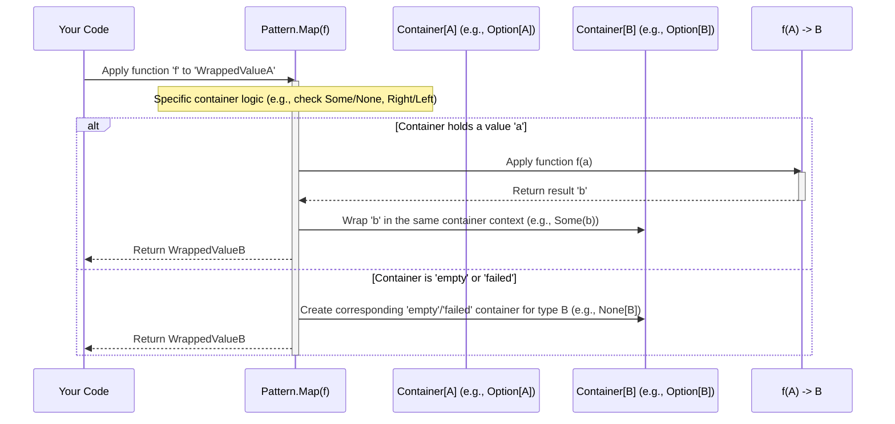

# Chapter 5: Functor / Apply / Pointed / Chainable / Monad (Pattern)

Welcome back! In the previous chapters, we explored several useful types in `fp-go`:

- [Option](01_option_.md) for handling potentially missing values.
- [Either](02_either_.md) for handling operations that can succeed or fail.
- [IO](03_io_.md) for describing actions with side effects.
- [Reader](04_reader_.md) for computations that depend on a shared context.

As you worked through these, you might have noticed something interesting: many of them have functions with the same names, like `Map`, `Chain`, and `Of`. Is this just a coincidence? Not at all! These names represent fundamental *patterns* for working with these "container-like" types. Understanding these patterns helps you learn new functional types faster and write more consistent code.

## What Problem Do These Patterns Solve?

Imagine learning to use different kitchen appliances. A blender, a mixer, and a food processor all have different specific purposes, but they probably all have an "On/Off" button and maybe speed controls. Learning the *pattern* of "On/Off" makes it easier to use the next appliance you encounter.

Similarly, in functional programming, we often work with types that "wrap" or "contain" other values (like `Option` containing a value or nothing, `Either` containing a success or failure, `IO` describing an action that yields a value, `Reader` describing a computation needing context).

Instead of learning a completely unique set of operations for *every single* container type, functional programming identifies common, reusable patterns:

- How do you apply a simple function to the value(s) *inside* the container? (**Functor** -> `Map`)
- How do you put a plain value *into* a default container context? (**Pointed** -> `Of`)
- How do you apply a function that's *also* inside a container? (**Apply** -> `Ap`)
- How do you sequence operations where the next step *depends* on the result of the previous step, staying inside the container? (**Chainable** -> `Chain`)

Learning these patterns (`Map`, `Of`, `Ap`, `Chain`) means you already know the basic "controls" for many different functional types you'll encounter in `fp-go` and other functional libraries. The **Monad** pattern is essentially a type that supports all of these core operations, making it a very powerful and common structure.

Let's look at each pattern.

## The Patterns Explained

Think of these patterns as capabilities or "interfaces" that a container type might have.

### 1. Pointed: Getting Values In (`Of`)

- **Concept**: The ability to take a normal value (like `5`, `"hello"`) and lift it into a default "successful" or "present" context within the container type.
- **Key Function**: `Of` (often aliased, like `option.Some`, `either.Right`, `io.Of`, `reader.Of`). `Of` always represents the "happy path" or "value is present" case.
- **Analogy**: Putting an item (`A`) into a standard shipping box (`Container[A]`).

```go
package main

import (
 "fmt"
 "github.com/IBM/fp-go/option"
 "github.com/IBM/fp-go/either"
 "github.com/IBM/fp-go/io"
 "github.com/IBM/fp-go/reader"
)

type Config struct{} // Dummy config for Reader example

func main() {
 // Lifting the integer 10 into different 'Pointed' containers

 optValue := option.Of(10) // Alias for option.Some(10)
 fmt.Printf("Option: %v\n", optValue) // Output: Option: Some[int](10)

 eitherValue := either.Of[error](10) // Alias for either.Right[error](10)
 fmt.Printf("Either: %v\n", eitherValue) // Output: Either: Right[int](10)

 ioValue := io.Of(10) // Creates an IO that, when run, just returns 10
 fmt.Printf("IO (value): %T\n", ioValue) // Output: IO (value): func() int
 fmt.Printf("IO (result): %v\n", ioValue()) // Output: IO (result): 10

 // reader.Of creates a Reader that ignores the context and returns the value
 readerValue := reader.Of[Config](10) // Needs context type, returns func(Config) int
 fmt.Printf("Reader (value): %T\n", readerValue) // Output: Reader (value): func(main.Config) int
 fmt.Printf("Reader (result): %v\n", readerValue(Config{})) // Output: Reader (result): 10
}
```

*Explanation*: The `Of` function provides a consistent way to wrap a plain value (`10`) into the default successful/present state of each container type (`Some`, `Right`, `IO returning 10`, `Reader returning 10`).

### 2. Functor: Transforming Values Inside (`Map`)

- **Concept**: The ability to apply a simple function `func(A) B` to the value(s) *inside* the container (`Container[A]`) to get a new container with the transformed value(s) (`Container[B]`), without needing to manually "unbox" and "rebox" the value. If the container is in a "failed" or "empty" state (like `None` or `Left`), `Map` typically does nothing and just passes that state along.
- **Key Function**: `Map`
- **Analogy**: A machine that takes a box (`Container[A]`), applies a modification function (`func(A) B`) to the item *inside* the box without you opening it, and gives you back the box with the modified item (`Container[B]`). If the input box was empty, it gives you back an empty box.

```go
package main

import (
 "fmt"
 "strings"
 "github.com/IBM/fp-go/option"
 "github.com/IBM/fp-go/either"
 "github.com/IBM/fp-go/io"
 "github.com/IBM/fp-go/reader"
)

// Simple function to transform: int to string
func formatInt(n int) string {
 return fmt.Sprintf("Number: %d", n)
}

type Config struct{} // Dummy config

func main() {
 // Create initial containers with int values
 opt := option.Of(123)
 ei := either.Of[error](123)
 ioVal := io.Of(123)
 rdr := reader.Of[Config](123)

 // Apply the 'formatInt' function using Map
 mappedOpt := option.Map(formatInt)(opt)
 fmt.Printf("Mapped Option: %v\n", mappedOpt) // Output: Mapped Option: Some[string](Number: 123)

 mappedEither := either.Map[error](formatInt)(ei) // Need to specify Error type param
 fmt.Printf("Mapped Either: %v\n", mappedEither) // Output: Mapped Either: Right[string](Number: 123)

 mappedIO := io.Map(formatInt)(ioVal)
 fmt.Printf("Mapped IO Result: %v\n", mappedIO()) // Output: Mapped IO Result: Number: 123

 mappedReader := reader.Map[Config](formatInt)(rdr)
 fmt.Printf("Mapped Reader Result: %v\n", mappedReader(Config{})) // Output: Mapped Reader Result: Number: 123

 // --- What if the container is 'empty' or 'failed'? ---
 optNone := option.None[int]()
 mappedOptNone := option.Map(formatInt)(optNone)
 fmt.Printf("Mapped None Option: %v\n", mappedOptNone) // Output: Mapped None Option: None[string]

 eiLeft := either.Left[int](fmt.Errorf("failure"))
 mappedEiLeft := either.Map[error](formatInt)(eiLeft)
 fmt.Printf("Mapped Left Either: %v\n", mappedEiLeft) // Output: Mapped Left Either: Left[string](failure)
}

```

*Explanation*: Notice how `Map` works similarly across all types. It applies `formatInt` only if the container holds a "good" value (`Some`, `Right`, etc.). If the container is `None` or `Left`, `Map` skips the function and preserves the original state.

### 3. Apply: Applying Wrapped Functions (`Ap`)

- **Concept**: The ability to take a function that is *itself* wrapped in the container (`Container[func(A) B]`) and apply it to a value that is *also* wrapped in the container (`Container[A]`), resulting in a wrapped result (`Container[B]`). This sounds complex but is useful for combining multiple wrapped values or results. Like `Map`, it typically short-circuits on failure/emptiness.
- **Key Function**: `Ap` (Apply)
- **Analogy**: You have a box containing a specific tool (`Container[func(A) B]`) and another box containing an item (`Container[A]`). `Ap` is like a special mechanism that uses the tool from the first box on the item in the second box *without taking either out of their boxes*, producing a new box containing the result (`Container[B]`). If either box is empty, the result is an empty box.

```go
package main

import (
 "fmt"
 "github.com/IBM/fp-go/option"
 "github.com/IBM/fp-go/either"
 // Ap examples for IO and Reader can get more complex, focusing on Option/Either
)

// Function wrapped in Option
var addOneOpt func(int) int = func(i int) int { return i + 1 }
var wrappedFuncOpt option.Option[func(int) int] = option.Of(addOneOpt)

// Value wrapped in Option
var valueOpt option.Option[int] = option.Of(5)
var noneOpt option.Option[int] = option.None[int]()

// Function wrapped in Either
var multiplyByTwo func(int) int = func(i int) int { return i * 2 }
var wrappedFuncEi either.Either[error, func(int) int] = either.Of[error](multiplyByTwo)
var leftFuncEi either.Either[error, func(int) int] = either.Left[func(int) int](fmt.Errorf("func error"))

// Value wrapped in Either
var valueEi either.Either[error, int] = either.Of[error](10)
var leftEi either.Either[error, int] = either.Left[int](fmt.Errorf("value error"))


func main() {
 // Option Example: Apply wrapped function to wrapped value
 resultOpt := option.Ap(valueOpt)(wrappedFuncOpt) // Ap[B, A](Container[A])(Container[func(A) B])
 fmt.Printf("Ap Option (Success): %v\n", resultOpt) // Output: Ap Option (Success): Some[int](6)

 resultOptNone1 := option.Ap(noneOpt)(wrappedFuncOpt)
 fmt.Printf("Ap Option (Value None): %v\n", resultOptNone1) // Output: Ap Option (Value None): None[int]

 // Either Example:
 resultEi := either.Ap[int, error](valueEi)(wrappedFuncEi) // Ap[B, E, A](Container[E, A])(Container[E, func(A) B])
 fmt.Printf("Ap Either (Success): %v\n", resultEi) // Output: Ap Either (Success): Right[int](20)

 resultEiLeft1 := either.Ap[int, error](valueEi)(leftFuncEi)
 fmt.Printf("Ap Either (Func Left): %v\n", resultEiLeft1) // Output: Ap Either (Func Left): Left[int](func error)

 resultEiLeft2 := either.Ap[int, error](leftEi)(wrappedFuncEi)
 fmt.Printf("Ap Either (Value Left): %v\n", resultEiLeft2) // Output: Ap Either (Value Left): Left[int](value error)
}
```

*Explanation*: `Ap` lets us combine computations within the container context. If *either* the function container or the value container represents a failure/absence (`None`, `Left`), the final result also represents that state. `fp-go`'s `Ap` has a somewhat reversed signature compared to some other libraries (`Ap(WrappedValue)(WrappedFunction)`), remember to check the docs!

### 4. Chainable: Sequencing Dependent Operations (`Chain`)

- **Concept**: The ability to sequence operations where the *next* operation depends on the result of the *previous* one. It takes a function `func(A) Container[B]` that receives the internal value `A` and returns a *new* container. If the initial container (`Container[A]`) is already in a failure/empty state, the function is skipped, and that state is passed along (short-circuiting). Sometimes called `flatMap` or `bind`.
- **Key Function**: `Chain`
- **Analogy**: Following a recipe (`Container[A]`). `Chain` takes a function that reads the result of the current step (`A`) and decides the *next* step, returning the instruction for it (`Container[B]`). If a step failed (e.g., burnt the food - `Left` or `None`), you don't proceed to the next step; you stop with the failure.

```go
package main

import (
 "fmt"
 "github.com/IBM/fp-go/option"
 "github.com/IBM/fp-go/either"
 // Chain examples for IO/Reader shown in previous chapters
)

// Function for Option Chain: Takes int, might return None
func halfIfEvenOpt(n int) option.Option[int] {
 if n%2 == 0 {
  return option.Of(n / 2)
 }
 return option.None[int]()
}

// Function for Either Chain: Takes int, might return Left
func validatePositive(n int) either.Either[error, int] {
 if n > 0 {
  return either.Of[error](n)
 }
 return either.Left[int](fmt.Errorf("%d is not positive", n))
}

func main() {
    // Option Chain
 opt1 := option.Of(10)
 chainedOpt1 := option.Chain(halfIfEvenOpt)(opt1) // Some(10) -> halfIfEvenOpt(10) -> Some(5)
 fmt.Printf("Chain Option (Success): %v\n", chainedOpt1) // Output: Chain Option (Success): Some[int](5)

 opt2 := option.Of(7)
 chainedOpt2 := option.Chain(halfIfEvenOpt)(opt2) // Some(7) -> halfIfEvenOpt(7) -> None
 fmt.Printf("Chain Option (Returns None): %v\n", chainedOpt2) // Output: Chain Option (Returns None): None[int]

 opt3 := option.None[int]()
 chainedOpt3 := option.Chain(halfIfEvenOpt)(opt3) // None -> skips function -> None
 fmt.Printf("Chain Option (Starts None): %v\n", chainedOpt3) // Output: Chain Option (Starts None): None[int]


    // Either Chain
    ei1 := either.Of[error](10)
    chainedEi1 := either.Chain(validatePositive)(ei1) // Right(10) -> validatePositive(10) -> Right(10)
    fmt.Printf("Chain Either (Success): %v\n", chainedEi1) // Output: Chain Either (Success): Right[int](10)

    ei2 := either.Of[error](-5)
    chainedEi2 := either.Chain(validatePositive)(ei2) // Right(-5) -> validatePositive(-5) -> Left(...)
    fmt.Printf("Chain Either (Returns Left): %v\n", chainedEi2) // Output: Chain Either (Returns Left): Left[int](-5 is not positive)

    ei3 := either.Left[int](fmt.Errorf("initial error"))
    chainedEi3 := either.Chain(validatePositive)(ei3) // Left(...) -> skips function -> Left(...)
    fmt.Printf("Chain Either (Starts Left): %v\n", chainedEi3) // Output: Chain Either (Starts Left): Left[int](initial error)
}

```

*Explanation*: `Chain` is crucial for building pipelines of operations that might fail or return optional values at any step. It cleanly handles the propagation of the failure/empty state without nested `if` checks.

### 5. Monad: The Combination

- **Concept**: A type that is **Pointed**, **Apply** (and thus **Functor**), and **Chainable**. It provides the full suite of `Of`, `Map`, `Ap`, and `Chain` (though `Map` can often be implemented using `Chain` and `Of`).
- **Why it matters**: Monads provide a powerful and consistent way to structure computations, especially those involving sequencing, context (like IO, Reader), or potential failures/absence (Option, Either).
- **In `fp-go`**: Types like `Option`, `Either`, `IO`, `Reader` are all Monads (or have monadic operations). The library often provides a `Monad` helper function (e.g., `option.Monad()`, `either.Monad()`, `io.Monad()`) that returns a struct satisfying a common Monad interface (defined in `internal/monad`).

```go
package main

import (
 "fmt"
 "github.com/IBM/fp-go/option"
 "github.com/IBM/fp-go/internal/monad" // The Monad interface definition
)

func main() {
 // Get the Monad operation set for Option
 optionMonad := option.Monad[int, string]() // Specify input A=int, output B=string (for Map/Ap)

 // Use the methods provided by the Monad interface implementation

 // Of
 opt1 := optionMonad.Of(10) // Same as option.Of(10)
 fmt.Printf("Monad Of: %v\n", opt1)

 // Map
 mapFunc := func(i int) string { return fmt.Sprintf("Val: %d", i) }
 mappedOpt := optionMonad.Map(mapFunc)(opt1) // Same as option.Map(mapFunc)(opt1)
 fmt.Printf("Monad Map: %v\n", mappedOpt)

 // Chain
 chainFunc := func(i int) option.Option[string] {
  if i > 5 { return option.Of("Big") }
  return option.None[string]()
 }
 chainedOpt := optionMonad.Chain(chainFunc)(opt1) // Same as option.Chain[int, string](chainFunc)(opt1)
 fmt.Printf("Monad Chain: %v\n", chainedOpt)

 // Ap
 wrappedFunc := option.Of(func(i int) string { return fmt.Sprintf("ApVal: %d", i)})
 apOpt := optionMonad.Ap(opt1)(wrappedFunc) // Same as option.Ap[string, int](opt1)(wrappedFunc)
 fmt.Printf("Monad Ap: %v\n", apOpt)
}

```

*Explanation*: While you usually use the direct package functions (`option.Map`, `either.Chain` etc.), understanding the Monad pattern highlights that these functions belong to a coherent set of operations defined by the `internal/monad.Monad` interface (and related interfaces like `Functor`, `Apply`, `Pointed`, `Chainable`). This interface consistency is a key benefit.

## Under the Hood: Interfaces and Implementations

These patterns aren't magic. In `fp-go`, they are typically formalized using Go interfaces, primarily residing in the `internal` package hierarchy.

**The Interfaces** (Simplified view based on `internal/.../types.go`)

```go
package internal

// Represents a container HKT[A] (Higher-Kinded Type placeholder)

// Can map f(A) -> B over the container
type Functor[A, B, HKTA, HKTB any] interface {
 Map(func(A) B) func(HKTA) HKTB
}

// Can lift a value A into the container
type Pointed[A, HKTA any] interface {
 Of(A) HKTA
}

// Can apply a wrapped function HKT[func(A) B] to a wrapped value HKT[A]
// Inherits Functor
type Apply[A, B, HKTA, HKTB, HKTFAB any] interface {
 Functor[A, B, HKTA, HKTB]
 Ap(HKTA) func(HKTFAB) HKTB // HKTFAB is HKT[func(A)B]
}

// Can sequence operations func(A) HKT[B]
// Inherits Apply
type Chainable[A, B, HKTA, HKTB, HKTFAB any] interface {
 Apply[A, B, HKTA, HKTB, HKTFAB]
 Chain(func(A) HKTB) func(HKTA) HKTB
}

// Combines Pointed and Chainable (and therefore Apply, Functor)
type Monad[A, B, HKTA, HKTB, HKTFAB any] interface {
 Pointed[A, HKTA]
 Chainable[A, B, HKTA, HKTB, HKTFAB]
}

```

*Explanation*: These interfaces define the *contracts* for each pattern. `HKTA`, `HKTB`, `HKTFAB` are generic placeholders for the container types (like `Option[A]`, `Option[B]`, `Option[func(A) B]`). (Note: Go doesn't have true Higher-Kinded Types, so `fp-go` uses these generic types and internal HKT representations, as mentioned in the README and previous chapters).

**The Implementation** (Example: `option/monad.go`)

Looking at `option/monad.go` (or `either/monad.go`, etc.), you'll see how `Option` provides the concrete implementation for these interfaces:

```go
// Simplified from option/monad.go

package option

import (
 "github.com/IBM/fp-go/internal/monad"
)

// optionMonad is a struct (could be empty) that will implement the monad interface
type optionMonad[A, B any] struct{}

// Of implements Pointed.Of by calling the package-level Of (which is Some)
func (o *optionMonad[A, B]) Of(a A) Option[A] {
 return Of[A](a) // Calls option.Of (aka option.Some)
}

// Map implements Functor.Map by calling the package-level Map
func (o *optionMonad[A, B]) Map(f func(A) B) func(Option[A]) Option[B] {
 return Map[A, B](f) // Returns a function that calls option.Map
}

// Chain implements Chainable.Chain by calling the package-level Chain
func (o *optionMonad[A, B]) Chain(f func(A) Option[B]) func(Option[A]) Option[B] {
 return Chain[A, B](f) // Returns a function that calls option.Chain
}

// Ap implements Apply.Ap by calling the package-level Ap
func (o *optionMonad[A, B]) Ap(fa Option[A]) func(Option[func(A) B]) Option[B] {
 return Ap[B, A](fa) // Returns a function that calls option.Ap
}

// Monad provides an instance of the implementation for the Monad interface
func Monad[A, B any]() monad.Monad[A, B, Option[A], Option[B], Option[func(A) B]] {
 // Returns a pointer to a struct that fulfills the interface requirements
 return &optionMonad[A, B]{}
}
```

*Explanation*: The `optionMonad` struct implements the `monad.Monad` interface. Its methods (`Of`, `Map`, `Chain`, `Ap`) simply delegate to the already existing, concrete functions defined in the `option` package (`option.Of`, `option.Map`, etc.). The `option.Monad()` function just returns an instance of this struct, providing a way to access these operations through the common interface if needed (though direct use of package functions is more common in Go).

**Sequence Diagram: A `Map` Operation**

Let's visualize the generic flow when `Map` is used, focusing on the pattern rather than a specific type's internal check.



*Explanation*: This diagram shows the core pattern of `Map`. It checks the state of the input container. If it contains a valid value (`a`), the provided function `f` is applied to get `b`, and `b` is wrapped back into the *same kind* of container. If the input container represents an empty or failed state, that state is propagated, creating a corresponding empty/failed container for the *output type* `B`.

## Conclusion

You've learned about the fundamental functional patterns (often called typeclasses or interfaces in other contexts) that `fp-go` types like `Option`, `Either`, `IO`, and `Reader` implement:

- **Pointed (`Of`)**: Lifts a value into the container.
- **Functor (`Map`)**: Transforms the value inside the container.
- **Apply (`Ap`)**: Applies a wrapped function to a wrapped value.
- **Chainable (`Chain`/`flatMap`)**: Sequences dependent operations within the container.
- **Monad**: A type combining all these capabilities, providing a consistent structure for computation.

Recognizing these patterns (`Of`, `Map`, `Ap`, `Chain`) makes it much easier to understand and use various functional types. You know the basic operations exist and roughly what they do, even for a type you haven't encountered before. This consistency is a major advantage of functional programming libraries.

## Next Steps

We've explored individual building blocks (`Option`, `Either`, `IO`, `Reader`) and the common patterns (`Functor`, `Monad`, etc.) that connect them. Now, how do we combine these? How do we build computations that involve reading context, performing side effects, *and* handling potential errors *all at the same time*? `fp-go` provides types specifically designed for such powerful compositions.

Let's combine `Reader`, `IO`, and `Either` in the next chapter: [ReaderIOEither](06_readerioeither_.md).

---

Generated by [AI Codebase Knowledge Builder](https://github.com/The-Pocket/Tutorial-Codebase-Knowledge)
