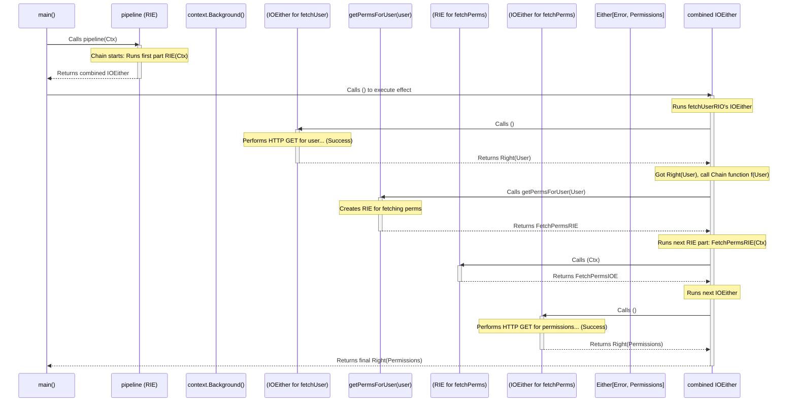

# Chapter 6: ReaderIOEither

Welcome back! In the previous chapters, we explored fundamental building blocks like [Option](01_option_.md) (missing values), [Either](02_either_.md) (success/failure), [IO](03_io_.md) (side effects), and [Reader](04_reader_.md) (context dependency). We also saw the common functional patterns like [Functor / Monad](05_functor___apply___pointed___chainable___monad__pattern__.md) that connect them.

Now, what if we need to combine several of these ideas? Many real-world operations in Go, especially when dealing with standard libraries, require exactly this combination. Think about functions that:

1. Need some configuration or context (like a `context.Context`).
2. Interact with the outside world (like database queries or network requests).
3. Can fail (returning an `error`).

Handling all three elegantly can be tricky. This is where `ReaderIOEither` shines!

## What Problem Does `ReaderIOEither` Solve?

Imagine you need to fetch user data from a remote API. A typical Go function for this might look like:

```go
package main

import (
 "context"
 "fmt"
 "net/http"
 // ... other imports like json
)

type User struct {
 ID   string `json:"id"`
 Name string `json:"name"`
}

// Hypothetical API base URL - often comes from config
var apiBaseURL = "https://api.users.com"

// Standard Go way: Needs context, performs IO, returns (value, error)
func fetchUserGo(ctx context.Context, userID string) (User, error) {
 // Build request URL (might need base URL from config/context)
 reqURL := fmt.Sprintf("%s/users/%s", apiBaseURL, userID)

 req, err := http.NewRequestWithContext(ctx, "GET", reqURL, nil)
 if err != nil {
  // Error handling for request creation
  return User{}, fmt.Errorf("failed to create request: %w", err)
 }

 // Perform the HTTP request (Side Effect + Potential Error)
 resp, err := http.DefaultClient.Do(req)
 if err != nil {
  // Error handling for network call
  return User{}, fmt.Errorf("api request failed: %w", err)
 }
 defer resp.Body.Close()

 if resp.StatusCode != http.StatusOK {
  // Error handling for non-200 status
  return User{}, fmt.Errorf("api returned status %d", resp.StatusCode)
 }

 // Decode JSON response (Potential Error)
 var user User
 // ... json.NewDecoder(resp.Body).Decode(&user) ... error handling ...

 return user, nil // Success
}

func main() {
 // Need to pass context, handle error explicitly
 user, err := fetchUserGo(context.Background(), "user123")
 if err != nil {
  fmt.Println("Error fetching user:", err)
 } else {
  fmt.Println("Fetched user:", user)
 }
}
```

This is standard Go, but notice:

* We need to pass `ctx` down.
* Multiple points of failure require `if err != nil` checks.
* The side effect (`http.DefaultClient.Do`) is mixed directly with logic.

`ReaderIOEither` provides a way to represent this entire operation *as a single value*, making it easier to compose and manage.

## The `ReaderIOEither` Concept: The All-in-One Action

`ReaderIOEither[R, E, A]` is a powerful type that combines the capabilities of three concepts we've already learned:

1. **`Reader`**: The operation **depends on** some read-only environment or context of type `R`. This is often `context.Context` in Go, but could be anything like a database connection pool (`*sql.DB`) or configuration struct. (See [Chapter 4: Reader](04_reader_.md))
2. **`IO`**: The operation describes an action that may **perform side effects** (interact with the outside world). (See [Chapter 3: IO](03_io_.md))
3. **`Either`**: The operation can **fail**, resulting in an error value of type `E` (typically `error`), or **succeed**, returning a value of type `A`. (See [Chapter 2: Either](02_either_.md))

Think of `ReaderIOEither[R, E, A]` as a meticulously planned recipe for a complex task:

* It requires specific **tools** (`R`).
* It involves steps that **interact with the world** (`IO`).
* It has a clear definition of **success** (`A`) or **failure** (`E`).

The true power lies in defining and composing these "recipes" *before* executing them.

## Using `ReaderIOEither` in `fp-go`

Let's see how to represent our `fetchUser` scenario using `ReaderIOEither`. The type will be `ReaderIOEither[context.Context, error, User]`:

* `R = context.Context`: Needs a Go context.
* `E = error`: Can fail with a standard Go error.
* `A = User`: If successful, produces a `User`.

### Creating `ReaderIOEither` Values

There are several ways to create `ReaderIOEither` values, often by "lifting" simpler types or wrapping existing Go functions.

**1. Wrapping Standard Go Functions (`EitherizeN`)**

This is the most common way to integrate with existing Go code or standard library functions. The `readerioeither.EitherizeN` functions (where `N` is the number of arguments *besides* the context) wrap a function like `func(ctx R, arg1 T1, ...) (A, error)` into a function `func(arg1 T1, ...) ReaderIOEither[R, error, A]`.

```go
package main

import (
 "context"
 "fmt"
 "github.com/IBM/fp-go/readerioeither"
 // ... User struct defined as before
 // ... fetchUserGo function defined roughly as before
)

// 'Eitherize' the standard Go function.
// fetchUserGo has 1 extra argument (userID string), so use Eitherize1.
// The context (R) is context.Context. The error (E) is error. The result (A) is User.
var fetchUserRIO = readerioeither.Eitherize1(fetchUserGo)
// fetchUserRIO now has the type: func(string) readerioeither.ReaderIOEither[context.Context, error, User]

func main() {
 // Create the ReaderIOEither recipe for a specific user ID
 getUser123 := fetchUserRIO("user123")

 // --- CRITICAL ---
 // At this point, fetchUserGo has NOT been called yet!
 // getUser123 is just the complete plan/description.
 fmt.Println("Created the ReaderIOEither recipe.")
}
```

*Explanation*: `Eitherize1` takes our standard `fetchUserGo` and converts it into `fetchUserRIO`. `fetchUserRIO` is now a function that, when you give it a `userID`, returns the *plan* (`ReaderIOEither`) to fetch that user, requiring a `context.Context` to run, involving IO, and potentially failing with an `error`.

## **2. Lifting Simpler Types**

You can also create `ReaderIOEither` values from simpler `fp-go` types:

* `readerioeither.FromEither[R, E, A](eith ET.Either[E, A])`: Creates a `ReaderIOEither` from a plain `Either`. Needs context `R` to run, but has no IO and the result is predetermined by `eith`.
* `readerioeither.FromIOEither[R, E, A](ioe IOE.IOEither[E, A])`: Takes an `IOEither` (IO + Failure) and makes it require context `R`.
* `readerioeither.RightReader[E, R, A](rdr R.Reader[R, A])`: Takes a `Reader` (Context + Pure Value) and lifts it into `ReaderIOEither`, assuming it always succeeds (it's a `Right`).
* `readerioeither.Of[R, E, A](value A)`: Creates a `ReaderIOEither` that ignores the context, performs no IO, and always successfully returns `value A`. (Equivalent to `Right`)
* `readerioeither.Left[R, A, E](err E)`: Creates a `ReaderIOEither` that ignores the context, performs no IO, and always fails with `err E`.

```go
package main

import (
 "context"
 "errors"
 "fmt"
 "github.com/IBM/fp-go/either"
 "github.com/IBM/fp-go/ioeither"
 "github.com/IBM/fp-go/reader"
 "github.com/IBM/fp-go/readerioeither"
)

func main() {
 // From Either (Success)
 rie1 := readerioeither.FromEither[context.Context, error, string](either.Right[error]("hello"))
 fmt.Printf("FromEither (Right): %T\n", rie1)

 // From Either (Failure)
 rie2 := readerioeither.FromEither[context.Context, error, string](either.Left[string](errors.New("failed")))
 fmt.Printf("FromEither (Left): %T\n", rie2)

 // From IOEither (e.g., an IO action that might fail)
 simulatedIOFailure := ioeither.Left[string](errors.New("io failed"))
 rie3 := readerioeither.FromIOEither[context.Context, error, string](simulatedIOFailure)
 fmt.Printf("FromIOEither: %T\n", rie3)

 // From Reader (pure function needing context)
 getConfigValue := reader.MakeReader(func(ctx context.Context) string { return "config-value" })
 rie4 := readerioeither.RightReader[error](getConfigValue) // Assumes success
 fmt.Printf("FromReader: %T\n", rie4)

    // Always success
    rie5 := readerioeither.Of[context.Context, error]("always good")
 fmt.Printf("Of: %T\n", rie5)

    // Always failure
    rie6 := readerioeither.Left[context.Context, int](errors.New("always bad"))
 fmt.Printf("Left: %T\n", rie6)
}
```

*Output*: The output shows the types, confirming they are all `readerioeither.ReaderIOEither[...]`. These functions are useful building blocks.

### Running a `ReaderIOEither`

Okay, we have our `ReaderIOEither` recipe (like `getUser123` from the `Eitherize1` example). How do we actually run it?

A `ReaderIOEither[R, E, A]` is fundamentally a function type: `func(R) IOEither[E, A]`.
So, to execute it:

1. Call the `ReaderIOEither` value with the required context (`R`). This returns an `IOEither[E, A]`.
2. Call the resulting `IOEither` function. This executes the side effect (if any) and returns the final `Either[E, A]`.

```go
package main

import (
 "context"
 "fmt"
 "github.com/IBM/fp-go/readerioeither"
 // ... User struct, fetchUserGo, fetchUserRIO defined as before
)

var fetchUserRIO = readerioeither.Eitherize1(fetchUserGo) // func(string) RIE[ctx, err, User]

func main() {
 // 1. Get the recipe for user "user123"
 getUser123 : = fetchUserRIO("user123") // RIE[ctx, err, User]

 // 2. Provide the context (R) to get the IOEither
 fmt.Println("Providing context...")
 ioeUser123 := getUser123(context.Background()) // IOEither[err, User]

 // --- Side effects still haven't happened ---
 fmt.Println("Executing IOEither...")

 // 3. Call the IOEither function to run the effect and get the result
 resultEither := ioeUser123() // Either[err, User]

 // 4. Handle the final Either result (e.g., using Fold)
 msg := readerioeither.Fold( /* Uses underlying IOEither's Fold logic implicitly */
  func(err error) string { return fmt.Sprintf("Failed: %v", err) },
  func(user User) string { return fmt.Sprintf("Success: User %s", user.Name) },
 )(getUser123)(context.Background())() // <= Run context, Run IOEither
 // Note: Folding over ReaderIOEither is a bit different, see below

 fmt.Println("Final Result:", msg)

    // Alternative handling using the function calls explicitly
    finalResult := ioeUser123() // Execute here
    fmt.Println("Explicit run result:", finalResult) // Prints Right(...) or Left(...)
}
```

*(Output will vary depending on whether `fetchUserGo` succeeds or fails in its HTTP call simulation)*

*Explanation*: This shows the two-step execution: provide context `R`, then run the resulting `IO` action. The final result is an `Either` which you can then handle using `Fold`, `GetOrElse`, etc. (from [Chapter 2: Either](02_either_.md)).

### Combining `ReaderIOEither` Operations

The real magic is composing these recipes *before* running them. We use the standard Monadic functions like `Map` and `Chain`, just like we saw in [Chapter 5: Functor / Monad](05_functor___apply___pointed___chainable___monad__pattern__.md).

**`Map`: Transforming the Success Value**

Use `Map` when you have a successful result `A` and want to apply a *pure* function `func(A) B` to transform it, without needing more context or causing more side effects/errors.

```go
package main

import (
 "context"
 "fmt"
 "strings"
 "github.com/IBM/fp-go/readerioeither"
 // ... User struct, fetchUserGo, fetchUserRIO
)

var fetchUserRIO = readerioeither.Eitherize1(fetchUserGo)

// Pure function to transform User -> string
func getUserName(u User) string {
 fmt.Println("   (Mapping: getting user name)")
 return u.Name
}

func main() {
 getUser123 := fetchUserRIO("user123") // RIE[ctx, err, User]

 // Create a new RIE that fetches the user THEN extracts the name
 getUserName123 := readerioeither.Map[context.Context, error, User, string](getUserName)(getUser123)
 // getUserName123 is RIE[ctx, err, string]

 fmt.Println("Created mapped RIE.")

 // Run the mapped RIE
 ioeResult := getUserName123(context.Background())
 fmt.Println("Running mapped RIE...")
 finalResult := ioeResult() // Either[error, string]

 fmt.Println("Mapped Result:", finalResult)
}
```

*(Output will show fetch happening, then the mapping message, then `Right(UserName)` or `Left(...)`)*

*Explanation*: `readerioeither.Map(getUserName)` creates a *new* plan. When *this* plan (`getUserName123`) is executed, it first executes the original `getUser123` plan. If that succeeds, it takes the resulting `User` and passes it to `getUserName`. The string returned by `getUserName` becomes the final `Right` value. If `getUser123` failed, the `Map` step is skipped, and the original `Left` is the result.

**`Chain`: Sequencing Dependent Actions**

Use `Chain` when the *next* step in your sequence *also* involves context, I/O, or potential failure. `Chain` takes a function `func(A) ReaderIOEither[R, E, B]` which uses the successful result `A` from the previous step to generate the *plan for the next step*.

```go
package main

import (
 "context"
 "fmt"
 "github.com/IBM/fp-go/readerioeither"
 // ... User struct, fetchUserGo, fetchUserRIO
)

type Permissions struct {
 CanEdit bool
}

// Mock function: Needs context, IO, can fail, returns Permissions
func fetchPermissionsGo(ctx context.Context, userID string) (Permissions, error) {
 fmt.Printf("   (fetching permissions for %s...)\n", userID)
 // Simulate network call... success or failure
 if userID == "user123" {
  return Permissions{CanEdit: true}, nil
 }
 return Permissions{}, fmt.Errorf("perms not found for %s", userID)
}

var fetchUserRIO = readerioeither.Eitherize1(fetchUserGo)
var fetchPermissionsRIO = readerioeither.Eitherize1(fetchPermissionsGo)

// Function for Chain: Takes User, returns plan to get Permissions
func getPermsForUser(user User) readerioeither.ReaderIOEither[context.Context, error, Permissions] {
 fmt.Printf("   (Chaining: Got user %s, now fetching perms...)\n", user.ID)
 return fetchPermissionsRIO(user.ID)
}

func main() {
 // The Plan: Fetch user "user123", then fetch their permissions
 pipeline := readerioeither.Chain[context.Context, error, User, Permissions](
  getPermsForUser, // func(User) RIE[ctx, err, Perms]
 )(fetchUserRIO("user123")) // Initial RIE[ctx, err, User]
 // pipeline is RIE[ctx, err, Permissions]

 fmt.Println("Built chained pipeline.")

 // Run the pipeline
 ioeResult := pipeline(context.Background())
 fmt.Println("Running pipeline...")
 finalResult := ioeResult() // Either[error, Permissions]

 fmt.Println("Pipeline Result:", finalResult)
}
```

*(Output will show user fetch, then the chaining message, then permissions fetch, then `Right(Permissions)` or `Left(...)` depending on mocks)*

*Explanation*: `readerioeither.Chain(getPermsForUser)` builds a sequential plan. When `pipeline` is run:

1. It runs `fetchUserRIO("user123")`.
2. If it returns `Left(err)`, the whole pipeline stops and returns that `Left(err)`.
3. If it returns `Right(user)`, the `user` is passed to `getPermsForUser`.
4. `getPermsForUser` uses the `user` to create the *next* plan (`fetchPermissionsRIO(...)`).
5. This *next* plan is then executed (using the same original context). Its result (`Right(perms)` or `Left(err)`) becomes the final result of the pipeline.

This chaining happens seamlessly without nested `if err != nil`.

**Handling the Final Result (`Fold`)**

To handle the `Either` result *after* executing the `ReaderIOEither`, you can use `Fold` (or `GetOrElse`, etc.). The `readerioeither` package provides its own `Fold` that handles the execution internally.

```go
package main

import (
 "context"
 "fmt"
 "github.com/IBM/fp-go/readerio" // Note: Fold returns ReaderIO
 "github.com/IBM/fp-go/readerioeither"
 // ... types, fetchUserRIO, getPermsForUser, pipeline defined ...
)

var fetchUserRIO = readerioeither.Eitherize1(fetchUserGo)
var fetchPermissionsRIO = readerioeither.Eitherize1(fetchPermissionsGo)
func getPermsForUser(user User) readerioeither.ReaderIOEither[context.Context, error, Permissions]{ /*...*/ }
var pipeline = /* ... chain from previous example ... */

func main() {

 // Define handlers for Fold
 handleFailure := func(err error) readerio.ReaderIO[context.Context, string] {
  msg := fmt.Sprintf("Pipeline Failed: %v", err)
  // Return a ReaderIO that prints the message (or does other context-aware IO)
  return readerio.FromIO[context.Context](func() string {
   // This IO runs *after* the RIE failed
   fmt.Println("   (Handling failure...)")
   return msg
  })
 }

 handleSuccess := func(perms Permissions) readerio.ReaderIO[context.Context, string] {
  msg := fmt.Sprintf("Pipeline Succeeded: Permissions = %+v", perms)
  return readerio.FromIO[context.Context](func() string {
   // This IO runs *after* the RIE succeeded
   fmt.Println("   (Handling success...)")
   return msg
  })
 }

 // Create the foldable operation. Note: Fold itself returns ReaderIO!
 finalOperation := readerioeither.Fold(handleFailure, handleSuccess)(pipeline)
 // finalOperation is ReaderIO[context.Context, string]

 fmt.Println("Built Fold operation.")

 // Run the Fold operation needs context, then run the IO
 ioResult := finalOperation(context.Background())
 fmt.Println("Running Fold operation...")
 finalMsg := ioResult() // Execute the ReaderIO -> IO -> string

 fmt.Println("Fold Result:", finalMsg)
}
```

### *(Output depends on pipeline result, but will show fetch messages, then handling message, then final string)*

*Explanation*: `readerioeither.Fold` is slightly different. It takes two functions (`onLeft`, `onRight`) that must themselves return a `ReaderIO[R, B]`. This means your success/failure handling logic can *also* depend on the context (`R`) and perform side effects (`IO`), but it's assumed the handling *itself* won't fail (hence `ReaderIO`, not `ReaderIOEither`). You provide the context and run the resulting `IO` to get the final value (`string` in this case).

## Under the Hood: How Does `ReaderIOEither` Work?

It's helpful to remember the types involved:
`ReaderIOEither[R, E, A]` is defined as `Reader[R, IOEither[E, A]]`.

## **The Structure**

Looking at `readerioeither/reader.go`:

```go
// From readerioeither/reader.go
type ReaderIOEither[R, E, A any] RD.Reader[R, IOE.IOEither[E, A]]

// Where RD.Reader[R, X] is func(R) X
// And   IOE.IOEither[E, A] is func() ET.Either[E, A]

// So, unfolded, ReaderIOEither[R, E, A] is equivalent to:
// func(R) func() Either[E, A]
```

It's literally a function that takes the context `R` and returns *another function* (`IOEither`). That second function takes no arguments, performs the side effect (using `R` if necessary via closure), and returns the final `Either[E, A]`.

**Simplified `Chain` Logic**

Let's peek at `readerioeither/generic/reader.go` for a simplified idea of `MonadChain`:

```go
// Simplified concept from readerioeither/generic/reader.go MonadChain

// `fa` is the first RIE: func(R) func() Either[E, A]
// `f` is the function: func(A) RIE[R, E, B] === func(A) func(R) func() Either[E, B]
// Returns the chained RIE: func(R) func() Either[E, B]
func MonadChain[R, E, A, B any](fa func(R) IOEither[E, A], f func(A) func(R) IOEither[E, B]) func(R) IOEither[E, B] {

 // Return the new Reader function
 return func(r R) IOEither[E, B] { // Takes context R

  // Run the first Reader part with context R to get the first IOEither
  ioeA := fa(r) // IOEither[E, A] === func() Either[E, A]

  // Return the new IOEither function
  return func() Either[E, B] { // Takes no args

   // Execute the first IOEither
   eitherA := ioeA() // Either[E, A]

   // Check the result of the first step
   if eitherA.IsLeft() {
    // If first step failed, return the Left immediately (short-circuit)
    errValue, _ := either.Unwrap(eitherA)
    return either.Left[B](errValue.(E)) // Cast and return
   } else {
    // If first step succeeded, get the value 'a'
                aValue, _ := either.Unwrap(eitherA)
                a := aValue.(A) // Cast the value

    // Apply the chaining function 'f' to 'a' to get the *next* RIE
    nextRIE := f(a) // func(R) func() Either[E, B]

    // Run the *next* RIE's Reader part with the *same context* R
    nextIOE := nextRIE(r) // IOEither[E, B] === func() Either[E, B]

    // Execute the *next* IOEither and return its result
    return nextIOE() // Either[E, B]
   }
  }
 }
}

```

*Explanation*: This simplified code shows how `Chain` works:

1. It creates a new `Reader` function that takes context `R`.
2. Inside, it runs the *first* `Reader` part (`fa(r)`) to get the first `IOEither`.
3. It creates a *new* `IOEither` function.
4. Inside *that* function, it executes the first `IOEither`.
5. If the first failed (`Left`), it immediately returns that `Left`.
6. If the first succeeded (`Right(a)`), it calls the user's function `f(a)` to get the *next* `ReaderIOEither`.
7. It runs the *next* `ReaderIOEither` (using the same context `r` and then running its `IOEither`) and returns its result.

The context `R` is passed down implicitly when needed. Side effects only happen when the final `IOEither` parts are executed. Error handling (short-circuiting) is built-in.

**Sequence Diagram: Running a Chained `ReaderIOEither`**

Let's visualize our `pipeline` execution from the `Chain` example:



*Explanation*: This diagram illustrates the flow. Calling the `ReaderIOEither` provides the context and returns the executable `IOEither`. Calling *that* triggers the first action. If successful, the chaining function provides the next `ReaderIOEither`, which is then executed using the same context, finally yielding the result. If any step had resulted in a `Left`, the process would have stopped there.

## Conclusion

You've now encountered `ReaderIOEither`, a very powerful and practical type in `fp-go` that elegantly combines three essential concerns:

* **Dependency on Context (`Reader`)**: Like `context.Context` or database connections.
* **Side Effects (`IO`)**: Interacting with the outside world.
* **Potential Failure (`Either`)**: Handling errors gracefully.

It directly models many common Go operations, especially those returning `(value, error)` and requiring a `context.Context`. By using `ReaderIOEither` and functions like `EitherizeN`, `Map`, and `Chain`, you can build complex, sequential operations as single, composable values, pushing the context provision and execution to the edges of your program, leading to cleaner and more testable code.

## Next Steps

We've seen how to represent single values (`Option`, `Either`) and complex, effectful computations (`IO`, `Reader`, `ReaderIOEither`). Another common functional programming concept deals with how to combine *multiple* values of the same type together. For example, how do you combine numbers (addition, multiplication), strings (concatenation), or even merge configuration maps?

Let's explore patterns for combining values in the next chapter: [Monoid & Semigroup](07_monoid___semigroup_.md).

---

Generated by [AI Codebase Knowledge Builder](https://github.com/The-Pocket/Tutorial-Codebase-Knowledge)
