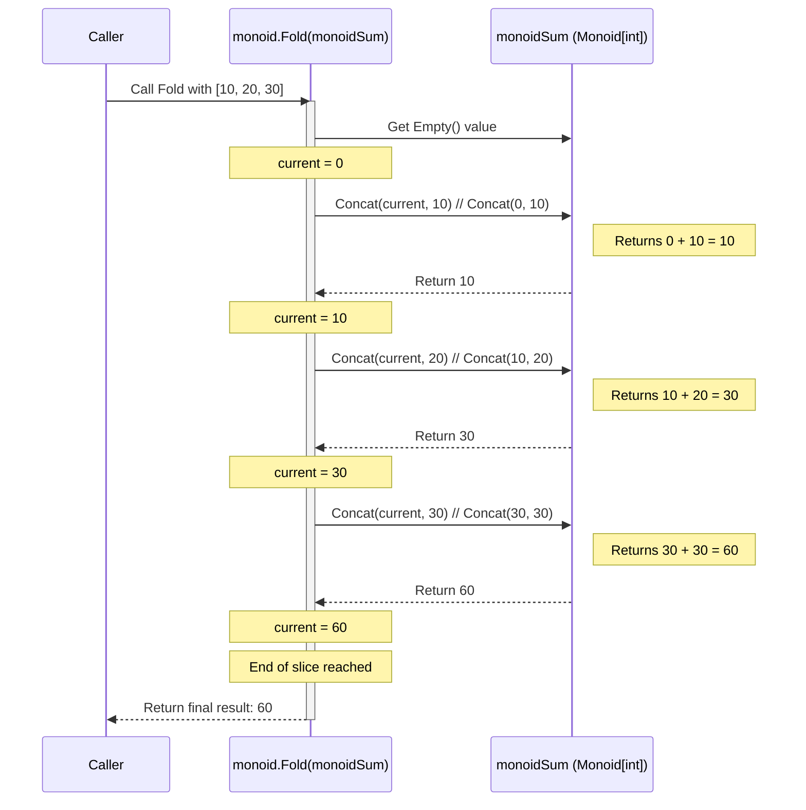

# Chapter 7: Monoid & Semigroup

Welcome to the final chapter of our introductory `fp-go` tutorial! In [Chapter 6: ReaderIOEither](06_readerioeither_.md), we saw how to combine `Reader`, `IO`, and `Either` to build powerful, composable actions that handle context, side effects, and failures all at once.

Now, let's shift our focus from building *actions* to combining *values*. Think about common operations like summing a list of numbers, concatenating a list of strings, or merging multiple configuration maps. Is there a general pattern for combining two things of the same type? Yes! That's where `Semigroup` and `Monoid` come in.

## What Problem Do They Solve?

Imagine you have a shopping cart represented as a list of items, and you want to calculate the total price. You'd start with zero and add the price of each item one by one.

```go
package main

import "fmt"

func calculateTotalPrice(prices []int) int {
 total := 0 // Start with the 'zero' or 'empty' value for addition
 for _, price := range prices {
  total = total + price // Combine the current total with the next price
 }
 return total
}

func main() {
 itemPrices := []int{10, 25, 5, 15}
 total := calculateTotalPrice(itemPrices)
 fmt.Printf("Total price: %d\n", total) // Output: Total price: 55
}
```

This pattern is very common:

1. Start with an "empty" or "identity" value (like `0` for addition).
2. Repeatedly combine the current accumulated value with the next value in a sequence using a specific operation (like `+`).

`Semigroup` and `Monoid` provide abstractions for this "combining" logic, allowing us to write generic functions that can aggregate different kinds of data (numbers, strings, lists, maps, etc.) using the same fundamental approach.

## The Concepts: Combining Things

### Semigroup: Just Combining

A `Semigroup` defines a way to combine two things of the *same type*.

* **Rule:** It must have a single operation, let's call it `Concat` (for concatenate/combine), that takes two values of type `A` and returns a single value of type `A`.
    `Concat(a1 A, a2 A) -> A`
* **Law (Associativity):** The grouping of operations doesn't matter. If you're combining three things `a`, `b`, and `c`, doing `Concat(Concat(a, b), c)` must give the *exact same result* as doing `Concat(a, Concat(b, c))`.

**Examples:**

* **Integer Addition:**
  * Type `A`: `int`
  * `Concat`: The `+` operator.
  * Associativity: `(1 + 2) + 3` is the same as `1 + (2 + 3)`. Integer addition is a Semigroup.
* **String Concatenation:**
  * Type `A`: `string`
  * `Concat`: The `+` operator for strings.
  * Associativity: `("a" + "b") + "c"` is the same as `"a" + ("b" + "c")`. String concatenation is a Semigroup.
* **Integer Multiplication:**
  * Type `A`: `int`
  * `Concat`: The `*` operator.
  * Associativity: `(2 * 3) * 4` is the same as `2 * (3 * 4)`. Integer multiplication is a Semigroup.
* **Boolean AND (`&&`):**
  * Type `A`: `bool`
  * `Concat`: The `&&` operator.
  * Associativity: `(true && false) && true` is the same as `true && (false && true)`. Boolean `&&` is a Semigroup.
* **Boolean OR (`||`):**
  * Type `A`: `bool`
  * `Concat`: The `||` operator.
  * Associativity: `(true || false) || false` is the same as `true || (false || false)`. Boolean `||` is a Semigroup.

A Semigroup just gives us a reliable way to combine two things.

### Monoid: Combining + An Empty Value

A `Monoid` is a `Semigroup` with one extra feature: an "identity" or "empty" element.

* **Rule 1:** It must satisfy all the rules of a Semigroup (have an associative `Concat` operation).
* **Rule 2:** It must have a special value called `Empty` (or `zero`, `identity`) of type `A`.
* **Law (Identity):** Combining any value `a` with the `Empty` value must result in `a`.
  * `Concat(Empty, a)` must equal `a`.
  * `Concat(a, Empty)` must equal `a`.

**Examples:**

* **Integer Addition:**
  * Semigroup: Yes (+)
  * `Empty`: `0`
  * Identity Law: `0 + 5 = 5` and `5 + 0 = 5`. Integer addition is a Monoid.
* **String Concatenation:**
  * Semigroup: Yes (+)
  * `Empty`: `""` (the empty string)
  * Identity Law: `"" + "hello" = "hello"` and `"hello" + "" = "hello"`. String concatenation is a Monoid.
* **Integer Multiplication:**
  * Semigroup: Yes (*)
  * `Empty`: `1`
  * Identity Law: `1 * 7 = 7` and `7 * 1 = 7`. Integer multiplication is a Monoid.
* **Boolean AND (`&&`):**
  * Semigroup: Yes (&&)
  * `Empty`: `true`
  * Identity Law: `true && false = false` and `false && true = false`, `true && true = true`. Boolean `&&` is a Monoid.
* **Boolean OR (`||`):**
  * Semigroup: Yes (||)
  * `Empty`: `false`
  * Identity Law: `false || true = true` and `true || false = true`, `false || false = false`. Boolean `||` is a Monoid.
* **Array/Slice Concatenation:**
  * Semigroup: Yes (appending slices)
  * `Empty`: `[]T{}` (an empty slice)
  * Identity Law: `[]T{} + [1, 2] = [1, 2]` and `[1, 2] + []T{} = [1, 2]`. Slice concatenation is a Monoid.

The `Empty` value gives us a starting point for combining a whole list of things, like we saw with `calculateTotalPrice`.

## Using Semigroup & Monoid in `fp-go`

The `fp-go/semigroup` and `fp-go/monoid` packages provide the interfaces and helper functions.

### Defining Semigroups and Monoids

You can define your own or use pre-defined ones.

```go
package main

import (
 "fmt"
 "strings"

 "github.com/IBM/fp-go/monoid"
 "github.com/IBM/fp-go/semigroup"
 A "github.com/IBM/fp-go/array" // Alias for array package
 R "github.com/IBM/fp-go/record" // Alias for record (map) package
)

// 1. Integer Addition Monoid
var monoidSum = monoid.MakeMonoid(func(x, y int) int { return x + y }, 0)

// 2. String Concatenation Monoid
var monoidString = monoid.MakeMonoid(func(x, y string) string { return x + y }, "")

// 3. Array Concatenation Monoid (from fp-go/array)
//    Need to specify the type, e.g., int
var monoidArrayInt = A.Monoid[int]()

// 4. Record (Map) Merge Monoid (from fp-go/record)
//    Merges maps, taking the value from the second map if keys conflict.
//    Need to specify key and value types, e.g., string -> string
var monoidMapMerge = R.MergeMonoid[string, string]()


func main() {
 // Using the Semigroup part (Concat)
 sum := monoidSum.Concat(5, 3)
 fmt.Printf("Sum Concat: %d\n", sum) // Output: Sum Concat: 8

 greeting := monoidString.Concat("Hello, ", "World!")
 fmt.Printf("String Concat: %s\n", greeting) // Output: String Concat: Hello, World!

 arr1 := []int{1, 2}
 arr2 := []int{3, 4}
 arrCombined := monoidArrayInt.Concat(arr1, arr2)
 fmt.Printf("Array Concat: %v\n", arrCombined) // Output: Array Concat: [1 2 3 4]

 map1 := map[string]string{"a": "apple", "b": "banana"}
 map2 := map[string]string{"b": "blueberry", "c": "cherry"}
 mapMerged := monoidMapMerge.Concat(map1, map2)
 fmt.Printf("Map Merge Concat: %v\n", mapMerged) // Output: Map Merge Concat: map[a:apple b:blueberry c:cherry]

 // Using the Monoid part (Empty)
 fmt.Printf("Sum Empty: %d\n", monoidSum.Empty()) // Output: Sum Empty: 0
 fmt.Printf("String Empty: '%s'\n", monoidString.Empty()) // Output: String Empty: ''
 fmt.Printf("Array Empty: %v (%T)\n", monoidArrayInt.Empty(), monoidArrayInt.Empty()) // Output: Array Empty: [] (main.[]int)
 fmt.Printf("Map Empty: %v (%T)\n", monoidMapMerge.Empty(), monoidMapMerge.Empty()) // Output: Map Empty: map[] (main.map[string]string)
}
```

*Explanation*:

* `semigroup.MakeSemigroup(concatFunc)` creates a Semigroup instance.
* `monoid.MakeMonoid(concatFunc, emptyValue)` creates a Monoid instance.
* `fp-go` provides helpers like `A.Monoid[T]()` for common types (arrays/slices) and `R.MergeMonoid[K, V]()` for maps. `MergeMonoid` (or `UnionLastMonoid`) combines two maps, where values from the second map override values from the first if the keys are the same.
* We can access the operations via `.Concat()` and `.Empty()`.

### Folding / Combining Lists

The primary use of a Monoid is to combine a collection of values into one. The `monoid` package provides `Fold`.

```go
package main

import (
 "fmt"

 "github.com/IBM/fp-go/monoid"
 A "github.com/IBM/fp-go/array"
 R "github.com/IBM/fp-go/record"
)

// Monoids from previous example
var monoidSum = monoid.MakeMonoid(func(x, y int) int { return x + y }, 0)
var monoidString = monoid.MakeMonoid(func(x, y string) string { return x + y }, "")
var monoidArrayInt = A.Monoid[int]()
var monoidMapMerge = R.MergeMonoid[string, string]()


func main() {
 ints := []int{1, 2, 3, 4, 5}
 strings := []string{"fp", "-", "go", " ", "rocks!"}
 arrays := [][]int{{1, 2}, {}, {3, 4}, {5}}
 maps := []map[string]string{
  {"a": "valA1", "b": "valB1"},
  {},
  {"b": "valB2"},
  {"c": "valC1", "a": "valA2"},
 }

 // Use monoid.Fold with the appropriate monoid for each type
 totalSum := monoid.Fold(monoidSum)(ints)
 fmt.Printf("Fold Sum: %d\n", totalSum) // Output: Fold Sum: 15

 combinedString := monoid.Fold(monoidString)(strings)
 fmt.Printf("Fold String: '%s'\n", combinedString) // Output: Fold String: 'fp-go rocks!'

 combinedArray := monoid.Fold(monoidArrayInt)(arrays)
 fmt.Printf("Fold Array: %v\n", combinedArray) // Output: Fold Array: [1 2 3 4 5]

 mergedMap := monoid.Fold(monoidMapMerge)(maps)
 fmt.Printf("Fold Map: %v\n", mergedMap) // Output: Fold Map: map[a:valA2 b:valB2 c:valC1]
}
```

*Explanation*:

* `monoid.Fold(m Monoid[A])` takes a Monoid `m` and returns a function that takes a slice `[]A`.
* This function iterates through the slice, starting with `m.Empty()` and repeatedly applying `m.Concat()` with the current accumulated value and the next element from the slice.
* See how we used the *exact same* `monoid.Fold` structure for completely different data types (ints, strings, arrays, maps)? We just plugged in the appropriate Monoid for each type. That's the power of this abstraction!

If you only have a Semigroup (no `Empty` value), you can use `semigroup.ConcatAll` which requires a starting value and a non-empty slice.

## Under the Hood: Simple Interfaces

Semigroup and Monoid are defined by simple interfaces.

### **The Interfaces**

Looking in `magma/magma.go`, `semigroup/semigroup.go`, and `monoid/monoid.go`:

```go
// Simplified from magma/magma.go
package magma

type Magma[A any] interface {
 Concat(x A, y A) A // The basic combination operation
}

// Simplified from semigroup/semigroup.go
package semigroup

import (
 M "github.com/IBM/fp-go/magma"
)

type Semigroup[A any] interface {
 M.Magma[A] // Inherits Concat
 // No new methods, just enforces associativity law conceptually
}

// Simplified from monoid/monoid.go
package monoid

import (
 S "github.com/IBM/fp-go/semigroup"
)

type Monoid[A any] interface {
 S.Semigroup[A] // Inherits associative Concat
 Empty() A      // The identity element
}
```

*Explanation*:

* `Magma`: The most basic, just has `Concat`. Doesn't require associativity.
* `Semigroup`: Inherits `Concat` from `Magma` and requires the `Concat` operation to be associative (this isn't enforced by the compiler, but by convention).
* `Monoid`: Inherits the associative `Concat` from `Semigroup` and adds the `Empty` method, requiring it to satisfy the identity laws.

### **The Implementation**

The `MakeSemigroup` and `MakeMonoid` helpers simply store the provided function and empty value in small private structs that implement these interfaces.

```go
// Simplified from semigroup/semigroup.go
type semigroup[A any] struct {
 c func(A, A) A // Stores the concat function
}
func (s semigroup[A]) Concat(x A, y A) A {
 return s.c(x, y) // Calls the stored function
}
func MakeSemigroup[A any](c func(A, A) A) Semigroup[A] {
 return semigroup[A]{c: c}
}

// Simplified from monoid/monoid.go
type monoid[A any] struct {
 c func(A, A) A // Stores the concat function
 e A            // Stores the empty value
}
func (m monoid[A]) Concat(x, y A) A {
 return m.c(x, y) // Calls the stored function
}
func (m monoid[A]) Empty() A {
 return m.e // Returns the stored empty value
}
func MakeMonoid[A any](c func(A, A) A, e A) Monoid[A] {
 return monoid[A]{c: c, e: e}
}
```

*Explanation*: The implementations are straightforward wrappers around the combining function (`c`) and the empty element (`e`) you provide.

**Sequence Diagram: `monoid.Fold`**

Let's visualize how `monoid.Fold(monoidSum)` works on `[]int{10, 20, 30}`:



*Explanation*: The diagram shows the step-by-step process. `Fold` gets the `Empty` value (`0`) from the `monoidSum`. Then, it iterates through the slice, calling `monoidSum.Concat` repeatedly to combine the current accumulated value with the next element until the whole slice is processed.

## Conclusion

You've learned about `Semigroup` and `Monoid`, fundamental algebraic structures useful for defining how values can be combined.

* **Semigroup**: Defines an *associative* way to combine two values of the same type (`Concat`).
* **Monoid**: Extends `Semigroup` by adding an *identity* element (`Empty`) that doesn't change other values when combined.
* These abstractions allow us to write generic code (like `monoid.Fold`) that aggregates collections of different data types (numbers, strings, arrays, maps, custom types) in a consistent manner, just by providing the appropriate `Monoid` definition.

These concepts are widely used in functional programming for tasks like reducing lists, merging configurations, combining results, and more.

This chapter concludes our initial journey through the core concepts of `fp-go`. We started with ways to handle context and potential absence or failure ([Option](01_option_.md), [Either](02_either_.md)), moved to managing side effects and dependencies ([IO](03_io_.md), [Reader](04_reader_.md)), saw how these types share common patterns ([Functor / Monad](05_functor___apply___pointed___chainable___monad__pattern__.md)), combined them into powerful tools ([ReaderIOEither](06_readerioeither_.md)), and finally looked at how to combine values themselves ([Monoid & Semigroup](07_monoid___semigroup_.md)).

We hope this tutorial has given you a solid foundation for exploring and using functional programming techniques in Go with the `fp-go` library. Happy coding!

---

Generated by [AI Codebase Knowledge Builder](https://github.com/The-Pocket/Tutorial-Codebase-Knowledge)
