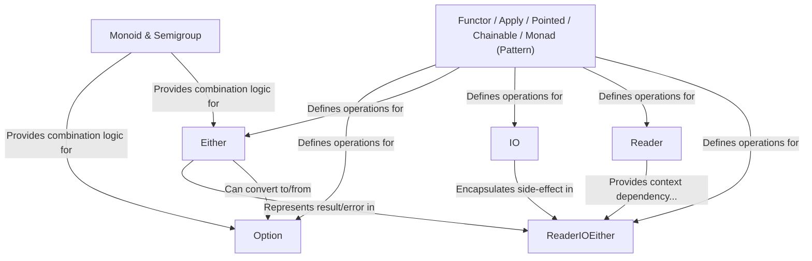

# Tutorial: fp-go

`fp-go` is a library bringing **functional programming** concepts to Go.
It provides helpful data types like *Option* (for possibly missing values), *Either* (for success or error), and *IO* (for managing side effects).
The goal is to make Go code safer, more predictable, and easier to compose by promoting *pure functions* and *explicit handling* of effects and errors, using consistent patterns across its types.

**Source Repository:** [https://github.com/IBM/fp-go](https://github.com/IBM/fp-go)

## Chapters

1. [Option](01_option_.md)
2. [Either](02_either_.md)
3. [IO](03_io_.md)
4. [Reader](04_reader_.md)
5. [Functor / Apply / Pointed / Chainable / Monad (Pattern)](05_functor___apply___pointed___chainable___monad__pattern__.md)
6. [ReaderIOEither](06_readerioeither_.md)
7. [Monoid & Semigroup](07_monoid___semigroup_.md)

---

Generated by [AI Codebase Knowledge Builder](https://github.com/The-Pocket/Tutorial-Codebase-Knowledge)
