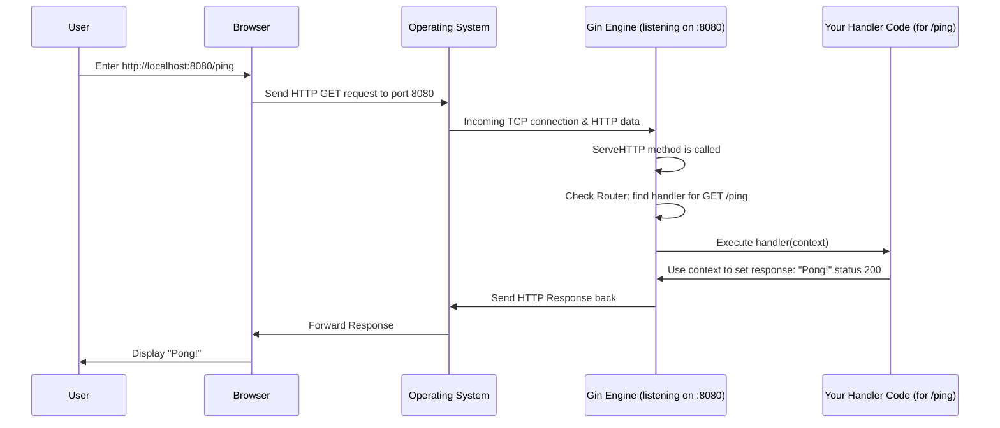

# Chapter 1: Engine - The Heart of Your Gin Application

Welcome to your first step into the Gin framework! If you want to build web applications or APIs (services that programs talk to over the internet) using the Go language, Gin can make your life much easier.

Think about building a car. You need lots of parts, but the most crucial one is the **engine**. It's the central piece that connects everything and makes the car actually *go*.

In Gin, the `Engine` is exactly that: it's the core component, the heart of your web application.

## Why Do We Need an Engine?

Imagine you want to create a simple website. When someone types your website's address into their browser, their browser sends a request over the internet to your computer (where your web application is running). Your application needs something that can:

1. **Listen** for these incoming requests.
2. **Understand** what the browser is asking for (e.g., "show me the homepage" or "show me the user's profile").
3. **Decide** what code to run based on the request.
4. **Run** that code (which might involve getting data from a database, doing calculations, etc.).
5. **Send back** a response (like an HTML page or some data) to the browser.

That "something" is the Gin `Engine`. It orchestrates this whole process.

## Creating Your First Engine

Getting started with Gin usually involves creating an `Engine` instance. There are two main ways to do this:

1. `gin.New()`: This creates a "bare-bones" engine. It has the essential machinery but doesn't come with any extra features pre-installed. Think of it like getting a basic car engine block – powerful, but you might need to add some parts yourself.

    ```go
    // main.go
    package main

    import "github.com/gin-gonic/gin"

    func main() {
        // Create a minimal engine
        router := gin.New()

        // ... we'll add more here later ...

        // router.Run(":8080") // We'll uncomment this soon
    }
    ```

    This code imports the Gin package and creates a new, clean `Engine` instance, assigning it to the variable `router`. (We often call the engine instance `router` or `r` because one of its main jobs is routing requests).

2. `gin.Default()`: This is the most common way to start. It creates an engine just like `gin.New()`, but it also automatically includes two helpful pieces of "middleware":
    * **Logger:** Prints information about each incoming request to your console (useful for seeing what's happening).
    * **Recovery:** If your code accidentally "panics" (crashes) while handling a request, this middleware catches the panic, prevents the whole server from stopping, and sends a "Server Error" response back to the browser instead.

    ```go
    // main.go
    package main

    import "github.com/gin-gonic/gin"

    func main() {
        // Create an engine with default middleware (Logger, Recovery)
        router := gin.Default()

        // ... we'll add more here later ...

        // router.Run(":8080") // We'll uncomment this soon
    }
    ```

    Using `gin.Default()` is often recommended for beginners as it provides helpful defaults right away. Middleware are like helpers that can process requests before or after your main code runs – we'll learn more about them in the [Handlers / Middleware Chain](03_handlers___middleware_chain.md) chapter.

## Making Your Engine Run - A Simple Example

Okay, we have an engine. Now let's make it do something! We need to tell it:

1. What *path* (like `/hello` or `/users/123`) it should respond to.
2. What *code* (called a "handler") to run when it receives a request for that path.
3. To actually *start listening* for requests on a specific network address and port (like `localhost:8080`).

Let's build a tiny web server that replies with "Pong!" when someone visits `/ping`.

```go
// main.go
package main

import (
 "net/http" // Import Go's standard HTTP library

 "github.com/gin-gonic/gin" // Import Gin
)

func main() {
 // 1. Create a default engine (includes Logger and Recovery)
 router := gin.Default()

 // 2. Define a route: Handle GET requests to "/ping"
 //    When a request comes for /ping, run the function provided.
 router.GET("/ping", func(c *gin.Context) {
  // 3. Inside the handler function:
  //    'c' is the Context, holding request/response info.
  //    Send back the text "Pong!" with an HTTP status OK (200).
  c.String(http.StatusOK, "Pong!")
 })

 // 4. Start the engine: Listen for HTTP requests on port 8080
 //    This line will block, keeping the server running.
 router.Run(":8080")
}

```

Let's break down this code:

1. **`router := gin.Default()`**: Creates our engine instance with the default Logger and Recovery middleware.
2. **`router.GET("/ping", ...)`**: This tells the engine: "If you receive an HTTP `GET` request for the path `/ping`, execute the function that follows." This process of matching paths to code is called **routing**, which we'll explore in [Chapter 2: Router / Routing Tree](02_router___routing_tree.md).
3. **`func(c *gin.Context) { ... }`**: This is our **handler function**. It's the code that actually handles the request. It receives a special `gin.Context` object (`c`) which holds all information about the incoming request (like headers, URL details) and provides methods to send back a response (like `c.String`). We'll learn all about the [Context](04_context.md) in a later chapter. `c.String(http.StatusOK, "Pong!")` sends a plain text response "Pong!" with a status code 200 (which means "OK").
4. **`router.Run(":8080")`**: This fires up the engine! It tells Gin to start a web server that listens on port `8080` on your computer. Any HTTP requests sent to `http://localhost:8080` (or `http://<your-computer-ip>:8080`) will now be handled by your Gin engine. This function usually runs forever (or until you stop the program, e.g., with Ctrl+C in the terminal).

**To Run This Code:**

1. Save it as `main.go`.
2. Open your terminal or command prompt.
3. Make sure you have Go installed and Gin added to your project (`go get github.com/gin-gonic/gin`).
4. Navigate to the directory where you saved `main.go`.
5. Run the command: `go run main.go`
6. Open your web browser and go to `http://localhost:8080/ping`.
7. You should see the text "Pong!" appear. You'll also see log output in your terminal from the Logger middleware!

## Under the Hood: How Does the Engine Work?

It's helpful to have a mental model of what's happening inside. Think of the Gin Engine like the manager of a busy restaurant kitchen:

1. **Waiter (Browser/Internet):** Takes an order (HTTP Request) from the customer (User).
2. **Kitchen Door (Network Port :8080):** The waiter brings the order to the kitchen door.
3. **Manager (Gin Engine):** The manager is waiting just inside the door (`router.Run(":8080")`). They receive the order (`ServeHTTP`).
4. **Order Ticket (URL Path & Method):** The manager looks at the order ticket (e.g., "GET /ping").
5. **Recipe Book (Routing Table):** The manager consults their recipe book ([Router](02_router___routing_tree.md)) to see which chef (handler function) is responsible for this dish (`/ping`).
6. **Chef (Your Handler Code):** The manager gives the order details ([Context](04_context.md)) to the assigned chef (`func(c *gin.Context){...}`).
7. **Cooking (Handler Logic):** The chef prepares the dish (`c.String(http.StatusOK, "Pong!")`).
8. **Serving:** The chef gives the finished dish back to the manager.
9. **Delivery:** The manager ensures the dish (HTTP Response) is sent back through the kitchen door to the waiter, who delivers it to the customer.

Here's a simplified view of the request flow:



### A Peek at the Code (`gin.go`)

You don't need to memorize this, but seeing the structure helps understanding:

* **`Engine` Struct:** This is the blueprint for our engine. It contains things like routing information (`RouterGroup`), settings (`RedirectTrailingSlash`, etc.), and a pool for reusing `Context` objects (`pool`).

    ```go
    // From gin.go (simplified)
    type Engine struct {
     RouterGroup // Holds routing methods like GET, POST, Use

     // Various configuration flags...
     RedirectTrailingSlash bool
     ForwardedByClientIP   bool
     // ... many others

     pool sync.Pool // For efficient Context object reuse
     trees methodTrees // The actual routing data structure

     // ... other fields
    }
    ```

* **`New()`:** Creates a basic `Engine` struct with default settings.

    ```go
    // From gin.go (simplified concept)
    func New() *Engine {
     engine := &Engine{
      // ... set default configuration values ...
      RedirectTrailingSlash: true,
      ForwardedByClientIP:   true,
      // ...
     }
     // Setup the context pool
     engine.pool.New = func() any { /* creates a new Context */ }
     return engine
    }
    ```

* **`Default()`:** Calls `New()` and then adds the Logger and Recovery [middleware](03_handlers___middleware_chain.md).

    ```go
    // From gin.go (simplified concept)
    func Default() *Engine {
     engine := New()
     // Use() adds middleware that runs on every request
     engine.Use(Logger(), Recovery())
     return engine
    }
    ```

* **`Run()`:** This is surprisingly simple! It mainly uses Go's built-in `net/http` package to start a server, telling it to use the Gin `Engine` itself as the handler for all incoming requests.

    ```go
    // From gin.go (simplified concept)
    func (engine *Engine) Run(addr ...string) error {
     address := resolveAddress(addr) // Figures out the address like ":8080"
     // The core part: Start Go's standard HTTP server.
     // 'engine' itself satisfies the http.Handler interface
     // because it has the ServeHTTP method (see below).
     err := http.ListenAndServe(address, engine)
     return err
    }
    ```

* **`ServeHTTP()`:** This is the crucial method that makes Gin compatible with Go's standard `http.Server`. When `http.ListenAndServe` receives a request, it calls this method on the `Engine`. `ServeHTTP` grabs a `Context` object, finds the correct route and handler using the [Router](02_router___routing_tree.md), executes the [Middleware Chain and Handler](03_handlers___middleware_chain.md), and finally sends the response.

    ```go
    // From gin.go (simplified concept)
    func (engine *Engine) ServeHTTP(w http.ResponseWriter, req *http.Request) {
     // 1. Get a Context object from the pool
     c := engine.pool.Get().(*Context)
     c.reset() // Clear it from previous use
     c.writermem.reset(w) // Link to the response writer
     c.Request = req      // Attach the incoming request

     // 2. Find the route and handlers, execute them
     engine.handleHTTPRequest(c)

     // 3. Put the Context object back in the pool for reuse
     engine.pool.Put(c)
    }
    ```

## Conclusion

You've learned about the absolute core of the Gin framework: the `Engine`.

* It's the central orchestrator for handling web requests.
* You create one using `gin.New()` (basic) or `gin.Default()` (common, includes Logger and Recovery middleware).
* You define what code runs for specific URL paths using methods like `router.GET()`.
* You start the server using `router.Run()`.

The Engine acts as the main entry point, but how does it know *exactly* which of your functions (like the one for `/ping`) to call when a request arrives for a specific URL? That's the job of the routing system.

In the next chapter, we'll dive into how Gin manages all the paths you define and efficiently matches them to incoming requests: [Chapter 2: Router / Routing Tree](02_router___routing_tree.md).

---

Generated by [AI Codebase Knowledge Builder](https://github.com/The-Pocket/Tutorial-Codebase-Knowledge)
