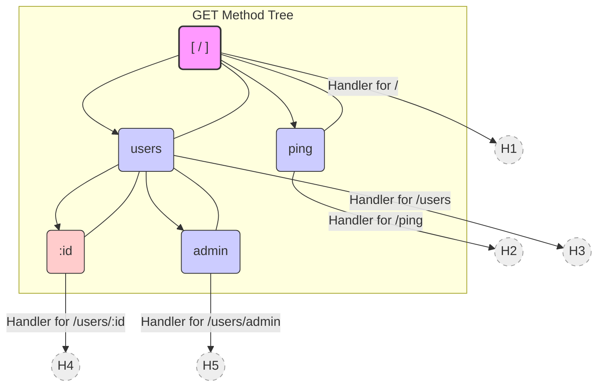
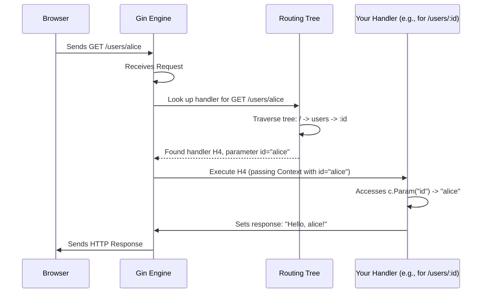

# Chapter 2: Router / Routing Tree

In [Chapter 1: Engine](01_engine.md), we learned how to create the Gin `Engine`, the heart of our application, and how to start it listening for requests. We even made a simple `/ping` route!

But what if our application needs to do more than just respond to `/ping`? Maybe we need a homepage (`/`), a page to show user profiles (`/users/some-username`), and a way to submit new data (`POST /submit-form`). How does the Gin Engine know which piece of our code to run for each specific request URL and HTTP method (like GET, POST, etc.)?

This is where the **Router** comes in.

## What is a Router? The Application's Switchboard

Imagine your web application is like a company's phone system. When someone calls the main number (your server's address), you need a switchboard operator (the Router) to connect the call to the right department or person (your handler code) based on what the caller is asking for (the URL path and HTTP method).

The Gin Router is responsible for:

1. **Receiving** the incoming request details (specifically the HTTP method and the URL path) from the [Engine](01_engine.md).
2. **Looking up** a table (the "Routing Table" or "Routing Tree") to see if you have defined a specific handler function for that exact combination of method and path.
3. **Directing** the request to the correct handler function if a match is found.

Without a router, your application wouldn't know how to respond differently to `/home` versus `/profile`.

## Defining Routes: Telling the Router Where to Go

In Gin, you define routes using methods on your `Engine` instance (which we usually call `router` or `r`). These methods typically match the HTTP method names: `GET`, `POST`, `PUT`, `DELETE`, `PATCH`, `OPTIONS`, `HEAD`.

Let's expand our example from Chapter 1:

```go
// main.go
package main

import (
 "net/http"

 "github.com/gin-gonic/gin"
)

func main() {
 router := gin.Default() // Our engine with default middleware

 // Route for GET requests to the root path "/"
 router.GET("/", func(c *gin.Context) {
  c.String(http.StatusOK, "This is the homepage!")
 })

 // Route for GET requests to "/ping"
 router.GET("/ping", func(c *gin.Context) {
  c.String(http.StatusOK, "Pong!")
 })

 // Route for POST requests to "/submit"
 router.POST("/submit", func(c *gin.Context) {
  c.String(http.StatusOK, "Received your submission!")
 })

 router.Run(":8080") // Start the server
}
```

In this code:

* `router.GET("/", ...)` tells Gin: "If a `GET` request comes for the path `/`, run this specific function."
* `router.GET("/ping", ...)` does the same for `GET /ping`.
* `router.POST("/submit", ...)` tells Gin: "If a `POST` request comes for the path `/submit`, run *this other* function."

Now, if you run this code (`go run main.go`):

* Visiting `http://localhost:8080/` in your browser (which sends a GET request) will show "This is the homepage!".
* Visiting `http://localhost:8080/ping` will show "Pong!".
* Sending a POST request to `http://localhost:8080/submit` (you might need a tool like `curl` or Postman for this) will get the response "Received your submission!".
* Visiting `http://localhost:8080/submit` in your browser (a GET request) will result in a "404 page not found" error, because we only defined a `POST` handler for `/submit`, not a `GET` handler.

## Handling Dynamic Data in Paths: Parameters

What if you want a route that can handle many similar paths, like showing different user profiles? You don't want to write `router.GET("/users/alice", ...)` and `router.GET("/users/bob", ...)` for every single user!

This is where **path parameters** come in. You can define placeholders in your path string using a colon `:` followed by a parameter name.

```go
// ... inside func main() ...

router.GET("/users/:name", func(c *gin.Context) {
 // Get the value of the 'name' parameter from the URL
 userName := c.Param("name")

 // Send a personalized greeting
 c.String(http.StatusOK, "Hello, "+userName+"!")
})

// ... router.Run(":8080") ...
```

Let's break this down:

* `router.GET("/users/:name", ...)`: Defines a route that matches any `GET` request starting with `/users/` followed by *something*. That "something" will be captured in a parameter named `name`.
* `c.Param("name")`: Inside the handler, we use the `Param` method on the [Context](04_context.md) (`c`) to retrieve the actual value that was captured for the `:name` part of the URL.

If you run this code:

* Visiting `http://localhost:8080/users/Alice` will show "Hello, Alice!".
* Visiting `http://localhost:8080/users/Bob` will show "Hello, Bob!".
* Visiting `http://localhost:8080/users/123` will show "Hello, 123!".

The router matches the pattern, extracts the value, and makes it available to your handler.

## Catch-All Routes: Matching Anything

Sometimes you need a route that matches *anything* after a certain prefix. For example, maybe you want to serve files from a directory. Gin allows "catch-all" parameters using an asterisk `*`.

```go
// ... inside func main() ...

// Example: Handle any GET request under /files/
// e.g., /files/report.txt, /files/images/logo.png
router.GET("/files/*filepath", func(c *gin.Context) {
 // Get the part of the path matched by *filepath
 matchedPath := c.Param("filepath")

 c.String(http.StatusOK, "You requested the file path: "+matchedPath)
 // In a real app, you'd use matchedPath to read and serve the file
})

// ... router.Run(":8080") ...
```

* `router.GET("/files/*filepath", ...)`: Matches any `GET` request starting with `/files/`. The rest of the path, including any further slashes, is captured in the `filepath` parameter.
* `c.Param("filepath")`: Retrieves the matched sub-path.

If you run this:

* Visiting `http://localhost:8080/files/documents/contract.pdf` will show "You requested the file path: /documents/contract.pdf".
* Visiting `http://localhost:8080/files/image.jpg` will show "You requested the file path: /image.jpg".

**Note:** Gin has dedicated methods like `router.Static()` and `router.StaticFS()` for easily serving static files, which are usually preferred over manual catch-all routes for that specific purpose. We cover serving static files more in later examples, but this shows the power of catch-all routes.

## Organizing Routes: Router Groups

As your application grows, you might have many routes related to a specific feature, like an API. Maybe all your API routes should start with `/api/v1` and potentially share some common setup code (like authentication checks, which we'll learn about as [Middleware](03_handlers___middleware_chain.md)).

Gin provides **Router Groups** to help organize this.

```go
// ... inside func main() ...

// Create a group for routes starting with /api/v1
apiV1 := router.Group("/api/v1")
{ // Using curly braces {} here is just for visual grouping, not required by Go

 // Route for GET /api/v1/users
 apiV1.GET("/users", func(c *gin.Context) {
  c.JSON(http.StatusOK, gin.H{"message": "List of users v1"})
 })

 // Route for GET /api/v1/products
 apiV1.GET("/products", func(c *gin.Context) {
  c.JSON(http.StatusOK, gin.H{"message": "List of products v1"})
 })

 // You can even nest groups!
 // adminGroup := apiV1.Group("/admin")
 // adminGroup.GET("/dashboard", ...) // Would be /api/v1/admin/dashboard
}

// ... router.Run(":8080") ...
```

* `router.Group("/api/v1")`: Creates a new `RouterGroup` associated with the base path `/api/v1`.
* `apiV1.GET("/users", ...)`: Defines a `GET` route. Because it's defined on the `apiV1` group, its full path becomes `/api/v1` (from the group) + `/users` (from the GET call) = `/api/v1/users`.
* Similarly, `apiV1.GET("/products", ...)` corresponds to the path `/api/v1/products`.

Groups make your code cleaner by factoring out common path prefixes and providing a place to attach middleware specific to that group of routes.

## Under the Hood: The Routing Tree (Radix Tree)

How does Gin find the correct handler so quickly, even with potentially thousands of routes? It doesn't just scan a simple list one by one. Instead, Gin uses a very efficient data structure called a **Radix Tree** (also known as a Patricia Trie or compressed trie) for each HTTP method.

Think of it like a highly optimized dictionary specifically designed for URL paths.

Imagine you have these routes:

* `GET /`
* `GET /ping`
* `GET /users`
* `GET /users/:id`
* `GET /users/admin`

The Radix Tree might look something like this (simplified):



* Each node represents a path segment.
* When a request like `GET /users/alice` comes in, the router starts at the root (`/`).
* It matches the `users` part and moves to the `users` node.
* It sees that `/alice` doesn't match the literal `admin`.
* It finds the parameterized child `:id` and knows this matches. It extracts "alice" as the value for the `id` parameter.
* It retrieves the handler associated with the `/users/:id` node.

This tree structure allows Gin to find the matching route very quickly by walking down the tree based on the segments of the requested URL path. It doesn't need to compare the incoming path against every single route you've defined. Static paths, parameters, and catch-alls are all efficiently handled by this structure.

### Request Flow with Routing

Here's how the router fits into the request handling process we saw in Chapter 1:



### Relevant Code Files

While you don't need to understand every line, the core logic resides in:

* `gin.go`: The `Engine` struct contains the `trees` field (a `methodTrees` slice, defined in `tree.go`), which holds the root node for each HTTP method. The `addRoute` method adds new routes to the appropriate tree, and `handleHTTPRequest` performs the lookup using the tree's `getValue` method.
* `tree.go`: Defines the `node` struct, which represents a node in the radix tree. It contains the logic for adding routes (`addRoute`) and searching the tree (`getValue`, `findCaseInsensitivePath`). It also handles parameter extraction.
* `routergroup.go`: Defines the `RouterGroup` struct and its methods (`GET`, `POST`, `Group`, etc.). These methods calculate the absolute path based on the group's prefix and then call the `engine.addRoute` method.

Don't worry about the details now! The key takeaway is that Gin uses an efficient tree structure internally to manage and look up routes quickly.

## Conclusion

You now understand how Gin's Router works like a switchboard, directing incoming requests to the correct handler based on the HTTP method and URL path.

You've learned how to:

* Define simple **static routes** (e.g., `/about`).
* Use **path parameters** to handle dynamic data (e.g., `/users/:id`).
* Use **catch-all routes** to match arbitrary paths (e.g., `/files/*filepath`).
* Organize related routes using **Router Groups** (e.g., `router.Group("/api")`).
* Appreciate that Gin uses an efficient **Radix Tree** structure for fast lookups.

With the router directing traffic, the next question is: what exactly happens *inside* those handler functions we provide? How can we structure our code to handle tasks like logging, authentication, data processing, and sending responses in a clean and reusable way?

That brings us to the concepts of Handlers and Middleware. Let's dive into them in the next chapter: [Chapter 3: Handlers / Middleware Chain](03_handlers___middleware_chain.md).

---

Generated by [AI Codebase Knowledge Builder](https://github.com/The-Pocket/Tutorial-Codebase-Knowledge)
