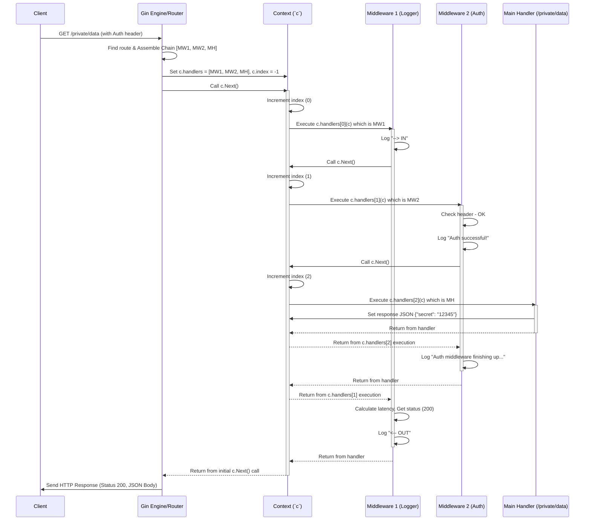

# Chapter 3: Handlers / Middleware Chain

In [Chapter 2: Router / Routing Tree](02_router___routing_tree.md), we learned how the Gin router acts like a switchboard, directing incoming requests to the correct function based on the URL path and HTTP method. But what *are* these functions? And can we make requests go through multiple processing steps, like checking if a user is logged in *before* running the main logic?

This is where Handlers and the Middleware Chain come in.

## The Assembly Line: Processing Requests Step-by-Step

Imagine an assembly line in a factory. A product (an incoming HTTP request) moves along a conveyor belt. At each station, a worker (a **Handler function**) performs a specific task: checks quality, adds a part, logs information, etc.

In Gin, each route you define has its own assembly line.

* **Handler (`gin.HandlerFunc`)**: This is the fundamental unit of work, a function that receives the request details (via the `gin.Context`) and can act on it. It's the "worker" at a station. The functions we defined in Chapter 2 for routes like `/ping` or `/users/:name` were handler functions.

    ```go
    // This is the type definition for any Gin handler function
    type HandlerFunc func(*Context)
    ```

* **Middleware**: These are special handler functions designed to be "stations" *before* or *after* the main station (your final handler). Think of tasks like:
  * Logging the request details.
  * Checking if the user is authorized (Authentication/Authorization).
  * Validating incoming data.
  * Recovering from unexpected errors (like the Recovery middleware in `gin.Default()`).
  * Adding common headers to the response.
* **Middleware Chain**: For each route, Gin arranges all the relevant handler functions (global middleware, group-specific middleware, route-specific middleware, and the final handler) into an ordered list, a **chain**. The request passes through this chain sequentially.

Let's look at a handler function signature again:

```go
func myHandler(c *gin.Context) {
 // 'c' gives access to request and response info
 // We can do things here...
 c.String(http.StatusOK, "Hello from the handler!")
}
```

Any function matching `func(c *gin.Context)` can be a handler or middleware.

## Use Case: Logging Every Request

Let's say we want to log the HTTP method and path for every request that comes into our server. We *could* add logging code to every single route handler, but that's repetitive and error-prone. A much better way is to use **middleware**.

We can create a single logging handler and tell Gin to run it for *every* request before it reaches the final route handler.

```go
package main

import (
 "log"
 "net/http"
 "time"

 "github.com/gin-gonic/gin"
)

// LoggerMiddleware is our custom logging middleware
func LoggerMiddleware() gin.HandlerFunc {
 return func(c *gin.Context) {
  // --- Code BEFORE calling the next handler ---
  startTime := time.Now()
  log.Printf("--> IN: %s %s", c.Request.Method, c.Request.URL.Path)

  // --- Pass control to the next handler in the chain ---
  // This is crucial! Without Next(), the request stops here.
  c.Next()

  // --- Code AFTER the next handler has finished ---
  // (This runs after the main route handler completes)
  endTime := time.Now()
  latency := endTime.Sub(startTime)
  statusCode := c.Writer.Status() // Get the status code set by the main handler

  log.Printf("<-- OUT: %s %s | Status: %d | Latency: %v",
   c.Request.Method,
   c.Request.URL.Path,
   statusCode,
   latency,
  )
 }
}

func main() {
 // Use gin.New() for a bare engine (no default middleware)
 router := gin.New()

 // --- Apply the LoggerMiddleware GLOBALLY ---
 // router.Use() adds middleware to ALL routes.
 router.Use(LoggerMiddleware())

 // --- Define some routes ---
 router.GET("/ping", func(c *gin.Context) {
  c.String(http.StatusOK, "pong")
 })

 router.GET("/hello", func(c *gin.Context) {
  c.String(http.StatusOK, "world")
 })

 router.Run(":8080")
}
```

**Explanation:**

1. **`LoggerMiddleware()`**: This function *returns* a `gin.HandlerFunc`. This pattern is common for middleware that might need configuration later, although this one doesn't.
2. **Inside the Handler**:
    * It first logs the incoming request method and path (`--> IN`).
    * **`c.Next()`**: This is the magic part! It tells Gin: "Pause this handler and execute the *next* handler in the chain." If there are more middleware, the next middleware runs. If this is the last middleware, the main route handler (e.g., the one for `/ping`) runs.
    * After `c.Next()` returns (meaning all subsequent handlers in the chain have finished), our logger code resumes.
    * It calculates the time taken (`latency`), gets the final HTTP status code, and logs the outgoing information (`<-- OUT`).
3. **`router := gin.New()`**: We use `gin.New()` to create an engine *without* the default logger and recovery middleware, so we can see *only* our custom logger in action. (If we used `gin.Default()`, we'd have *two* loggers and the recovery middleware running).
4. **`router.Use(LoggerMiddleware())`**: This is how we apply the middleware globally. `Use()` adds the provided handler(s) to the *beginning* of the handler chain for *every single route* registered *after* this point.
5. **Routes**: We define our `/ping` and `/hello` routes as usual.

**Running this code:**

When you run `go run main.go` and visit `http://localhost:8080/ping` in your browser, you'll see output like this in your terminal:

```plaintext
2023/10/27 10:30:00 --> IN: GET /ping
2023/10/27 10:30:00 <-- OUT: GET /ping | Status: 200 | Latency: 150µs
```

And if you visit `http://localhost:8080/hello`:

```plaintext
2023/10/27 10:30:05 --> IN: GET /hello
2023/10/27 10:30:05 <-- OUT: GET /hello | Status: 200 | Latency: 90µs
```

Notice how our logger ran for both requests, both before and after the respective route handlers executed.

## Controlling the Flow: `c.Next()` vs `c.Abort()`

Middleware has power over the request flow:

* **`c.Next()`**: Passes control to the *next* handler in the chain. If a middleware *doesn't* call `c.Next()`, the chain effectively stops there, and the main handler (and any subsequent middleware) might not run. Middleware can perform actions before and/or after calling `c.Next()`.
* **`c.Abort()`**: Immediately stops the processing of the handler chain for the current request. No further handlers (middleware or the main handler) down the chain will be called. The current handler *will* finish executing its remaining code after calling `Abort()`, but `c.Next()` will have no effect if called after `Abort()`.

### Example: Simple Authentication Middleware

Let's create a middleware that checks for a specific `Authorization` header. If it's not present or incorrect, it stops the request processing; otherwise, it lets the request proceed.

```go
package main

import (
 "log"
 "net/http"
 "time" // Added for LoggerMiddleware if used

 "github.com/gin-gonic/gin"
)

// SimpleAuthMiddleware checks for a hardcoded token
func SimpleAuthMiddleware() gin.HandlerFunc {
 // In a real app, check a proper token/session
 const hardcodedToken = "supersecret"

 return func(c *gin.Context) {
  token := c.GetHeader("Authorization")

  if token != hardcodedToken {
   log.Printf("Auth failed: Incorrect token '%s'", token)
   // Abort the request: Send 401 Unauthorized
   // c.AbortWithStatusJSON stops chaîne and sends response
   c.AbortWithStatusJSON(http.StatusUnauthorized, gin.H{"error": "Unauthorized"})
   return // Stop executing this middleware function
  }

  log.Println("Auth successful!")
  // Authentication passed, continue to the next handler
  c.Next()

  // Code here would run *after* the main handler,
  // only if authentication was successful.
  log.Println("Auth middleware finishing up after Next().")
 }
}

// LoggerMiddleware (same as before)
func LoggerMiddleware() gin.HandlerFunc {
 return func(c *gin.Context) {
  startTime := time.Now()
  log.Printf("--> IN: %s %s", c.Request.Method, c.Request.URL.Path)
  c.Next() // Call next regardless of auth result
  endTime := time.Now()
  latency := endTime.Sub(startTime)
  statusCode := c.Writer.Status()
  log.Printf("<-- OUT: %s %s | Status: %d | Latency: %v",
   c.Request.Method, c.Request.URL.Path, statusCode, latency,
  )
 }
}


func main() {
 router := gin.New()
 router.Use(LoggerMiddleware()) // Global logger

 // Public route - No authentication needed
 router.GET("/public", func(c *gin.Context) {
  c.String(http.StatusOK, "This is public information.")
 })

 // Group for routes that require authentication
 // Middleware applied here only affects routes within this group
 private := router.Group("/private")
 private.Use(SimpleAuthMiddleware()) // Apply auth only to /private routes
 {
  private.GET("/data", func(c *gin.Context) {
   // This handler only runs if SimpleAuthMiddleware calls c.Next()
   c.JSON(http.StatusOK, gin.H{"secret": "12345"})
  })
 }

 router.Run(":8080")
}
```

**Explanation:**

1. **`SimpleAuthMiddleware`**:
    * It checks the `Authorization` request header.
    * If the token is missing Psor incorrect, it logs the failure, **calls `c.AbortWithStatusJSON(http.StatusUnauthorized, ...)`**, and then `return`s. `AbortWithStatusJSON` both calls `c.Abort()` (stopping the chain) and sends a JSON response with a 401 status code back to the client immediately.
    * If the token is correct, it logs success and **calls `c.Next()`**, allowing the chain to proceed to the next handler (in this case, the `/private/data` handler).
    * The final log line only prints if auth succeeded and the main handler finished.
2. **`router.Group("/private")`**: We create a [Router Group](02_router___routing_tree.md) for paths starting with `/private`.
3. **`private.Use(SimpleAuthMiddleware())`**: We apply our auth middleware *only* to this group. It won't affect the `/public` route.
4. **`/private/data`**: This route is defined *within* the `private` group, so its handler chain will be: `LoggerMiddleware` -> `SimpleAuthMiddleware` -> final handler.

**Running this code:**

* **Visit `http://localhost:8080/public`**:
  * Terminal Logs:

      ```plaintext
      2023/10/27 10:40:00 --> IN: GET /public
      2023/10/27 10:40:00 <-- OUT: GET /public | Status: 200 | Latency: 50µs
      ```

  * Browser shows: `This is public information.` (Auth middleware wasn't applied).
* **Try accessing `/private/data` without the correct header** (e.g., using curl `curl http://localhost:8080/private/data`):
  * Terminal Logs:

      ```plaintext
      2023/10/27 10:41:00 --> IN: GET /private/data
      2023/10/27 10:41:00 Auth failed: Incorrect token ''
      2023/10/27 10:41:00 <-- OUT: GET /private/data | Status: 401 | Latency: 75µs
        ```

  * `curl` output (or browser) shows: `{"error":"Unauthorized"}`. The main handler for `/private/data` never ran because `c.Abort()` was called. Notice the status code is 401.

* **Access `/private/data` *with* the correct header** (e.g., `curl -H "Authorization: supersecret" http://localhost:8080/private/data`):
  * Terminal Logs:

      ```plaintext
      2023/10/27 10:42:00 --> IN: GET /private/data
      2023/10/27 10:42:00 Auth successful!
      2023/10/27 10:42:00 Auth middleware finishing up after Next().
      2023/10/27 10:42:00 <-- OUT: GET /private/data | Status: 200 | Latency: 180µs
      ```

  * `curl` output shows: `{"secret":"12345"}`. Authentication passed, `c.Next()` was called, the main handler ran, returned its JSON, and then the auth middleware finished its post-`Next()` code. Logger shows status 200.

## How the Chain Works Internally

Gin manages the handler chain elegantly using the [Context](04_context.md).

1. **Request Arrives**: The [Engine](01_engine.md) receives the request.
2. **Routing**: The [Router](02_router___routing_tree.md) finds the matching route.
3. **Chain Assembly**: The Engine gathers all applicable `HandlerFunc`s:
    * Global middleware (from `engine.Use()`).
    * Router Group middleware (from `group.Use()`).
    * Route-specific middleware and the final handler (from `router.GET()`, `POST()`, etc.).
    It combines these into a single slice (`HandlersChain`) and stores it in `c.handlers`.
4. **Execution Start**: The Engine also sets an index `c.index` to -1 and calls `c.Next()` for the first time.
5. **`c.Next()` Logic**:
    * Increments `c.index`.
    * Loops from the current `c.index` until it finds the next non-nil handler in the `c.handlers` slice.
    * If a handler is found, it calls that handler function `c.handlers[c.index](c)`.
    * **Crucially**, the *called* handler is now responsible for calling `c.Next()` again if it wants the chain to continue.
6. **`c.Abort()` Logic**:
    * Sets `c.index` to a very large value (`abortIndex`).
    * This effectively prevents any subsequent calls to `c.Next()` within this request's context from finding and executing further handlers in the loop.



**Relevant Code Snippets (Conceptual):**

* **`type HandlersChain []HandlerFunc`** (in `gin.go`): The chain is simply a slice of handler functions.
* **`Context` struct** (in `context.go`):

    ```go
    type Context struct {
        // ... other fields ...
        handlers HandlersChain // The assembled chain for this request
        index    int8          // Current position in the handlers chain
        // ... other fields ...
    }
    ```

* **`Context.Next()`** (in `context.go`):

    ```go
    func (c *Context) Next() {
        c.index++ // Move to the next potential handler index
        // Loop while index is valid AND request not aborted
        for c.index < int8(len(c.handlers)) {
            if c.handlers[c.index] != nil {
                c.handlers[c.index](c) // Execute the handler
            }
            c.index++ // Increment index after handler finishes or if it was nil
        }
    }
    ```

* **`Context.Abort()`** (in `context.go`):

    ```go
    const abortIndex int8 = math.MaxInt8 / 2 // A large number

    func (c *Context) Abort() {
        c.index = abortIndex // Set index so high the Next() loop condition fails
    }
    ```

* **Chain Assembly** (in `routergroup.go`'s `combineHandlers` and `gin.go`'s `handleHTTPRequest`): The engine calculates the final absolute path and combines the handlers from the engine, group, and specific route definition into the `c.handlers` slice before calling `c.Next()` the first time.

## Conclusion

You've learned about the powerful Handler/Middleware Chain concept in Gin!

* Handlers (`gin.HandlerFunc`) are functions that process requests using the `gin.Context`.
* Middleware are handlers used for common tasks (logging, auth, recovery) before or after the main route handler.
* Gin creates a Handler Chain (an ordered list) for each request.
* `c.Next()` passes control down the chain. Middleware can execute code before and after calling `c.Next()`.
* `c.Abort()` stops the chain execution, preventing subsequent handlers from running.
* Middleware can be applied globally (`router.Use()`) or to specific groups (`group.Use()`).

The Handler Chain is fundamental to structuring reusable logic in your Gin applications. The core element passed between all these handlers, carrying request and response state, is the `gin.Context`.

In the next chapter, we'll take a much closer look at this crucial object: [Chapter 4: Context](04_context.md).

---

Generated by [AI Codebase Knowledge Builder](https://github.com/The-Pocket/Tutorial-Codebase-Knowledge)
