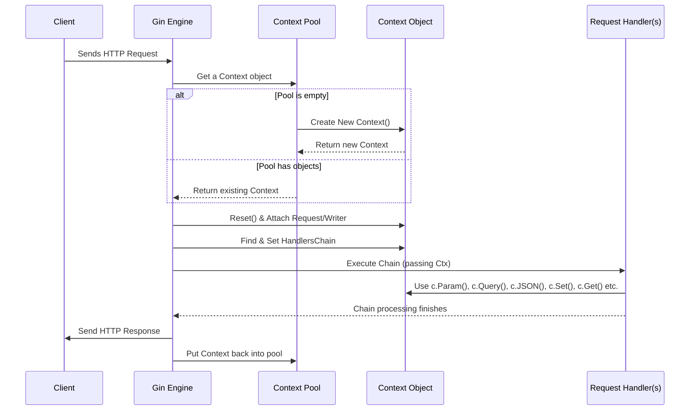

# Chapter 4: Context - Your Request's Personal Assistant

In [Chapter 3: Handlers / Middleware Chain](03_handlers___middleware_chain.md), we saw how incoming requests travel through a chain of handlers (middleware and the final route handler). But how do these different functions communicate? How does the final handler know details about the original request, like URL parameters or query strings? And how does it send a response back?

Meet the **`gin.Context`**, or simply **Context**.

## What is the Context? - The Waiter for Each Request

Imagine you're at a restaurant. Each time a customer places an order, a **waiter** is assigned to handle that specific order. This waiter:

1. Carries the customer's **request** details (what they want to eat and drink).
2. Takes the order through various **steps** (maybe checking with the bar for drinks, sending the food order to the kitchen). They might even pass notes between stations (e.g., "allergy alert!").
3. Finally, delivers the **response** (the food and drinks) back to the customer.

The `gin.Context` (usually represented by the variable `c` in handler functions) acts exactly like this waiter, but for a single HTTP request hitting your server. It's a temporary object created for *one* specific request-response cycle.

It holds everything needed for that cycle:

* **Request Details:** Information about the incoming request (like URL path, query parameters, headers, request body).
* **Response Writer:** A way to build and send the response back to the client.
* **Middleware Data:** A place to store custom data that needs to be passed between different handlers in the [Middleware Chain](03_handlers___middleware_chain.md).
* **Execution Control:** Information about the handler chain itself (like which handler is currently running, using `c.Next()` and `c.Abort()`).

This `Context` object is passed to every single handler function (`gin.HandlerFunc`) in the chain for a given request.

## Why Do We Need It? A Central Hub

Without the Context, how would your route handler for `/users/:id` know what the `id` was? How would an authentication middleware tell the final handler *which* user was authenticated? How would you send back a JSON response instead of just plain text?

The `Context` provides a standardized, central place to:

* **Access request data easily:** No need to manually parse the raw HTTP request every time.
* **Pass data between middleware:** Middleware can set information (like a user ID) that later handlers can retrieve.
* **Manage the response:** Simple methods to send different types of responses (HTML, JSON, String, etc.).
* **Control the handler chain:** As we saw in Chapter 3, `c.Next()` and `c.Abort()` control the flow.

## Using the Context: Common Tasks

Let's see how to use the `Context` (`c`) inside a handler function for common tasks.

### Accessing Request Information

* **URL Parameters:** Retrieve values from placeholders in the route path (defined using `:` or `*` as seen in [Chapter 2: Router / Routing Tree](02_router___routing_tree.md)).

    ```go
    // Route: router.GET("/users/:userID", ...)
    func GetUser(c *gin.Context) {
     // Get the value captured for ':userID'
     userID := c.Param("userID") // If URL was /users/123, userID is "123"

     c.String(http.StatusOK, "Fetching data for user: "+userID)
    }
    ```

    **Explanation:** `c.Param("userID")` looks up the value associated with the `:userID` parameter in the matched route definition.

* **Query String Parameters:** Get values from the part of the URL after the `?` (e.g., `/search?query=gin&page=1`).

    ```go
    // Route: router.GET("/search", ...)
    func SearchHandler(c *gin.Context) {
     // Get the value of the 'query' parameter
     // If URL was /search?query=golang, query is "golang"
     query := c.Query("query")

     // Get 'page', provide a default value if it's missing
     // If URL was /search?query=golang, page is "1" (the default)
     // If URL was /search?query=golang&page=2, page is "2"
     page := c.DefaultQuery("page", "1")

     c.String(http.StatusOK, "Searching for '"+query+"' on page "+page)
    }
    ```

    **Explanation:** `c.Query("key")` retrieves the value for a specific key in the query string. `c.DefaultQuery("key", "default")` does the same but returns the default value if the key isn't present.

* **Request Headers:** Access header values like `Content-Type` or `Authorization`.

    ```go
    // Route: router.POST("/submit", ...)
    func SubmitHandler(c *gin.Context) {
     // Get the Content-Type header
     contentType := c.GetHeader("Content-Type")
     // Get the Authorization header (used in Chapter 3 example)
     authToken := c.GetHeader("Authorization")

     c.String(http.StatusOK, "Received content type: "+contentType+" with token: "+authToken)
    }
    ```

    **Explanation:** `c.GetHeader("Header-Name")` returns the value associated with the specified HTTP request header.

* **Request Body:** Binding the request body (like JSON or form data) into a Go struct. This is a big topic, so we have dedicated chapters for it! See [Chapter 5: Binding](05_binding.md).

    ```go
    // (Simplified - More details in Chapter 5: Binding)
    type UserInput struct {
     Username string `json:"username"`
     Password string `json:"password"`
    }

    func LoginHandler(c *gin.Context) {
     var input UserInput
     // Try to bind the incoming JSON body to the 'input' struct
     if err := c.ShouldBindJSON(&input); err != nil {
      c.JSON(http.StatusBadRequest, gin.H{"error": "Invalid input"})
      return
     }
     // Use input.Username and input.Password...
     c.JSON(http.StatusOK, gin.H{"message": "Login attempt for " + input.Username})
    }
    ```

    **Explanation:** Methods like `c.ShouldBindJSON()` use information from the request (like headers and the body) to parse data into Go structs.

### Passing Data Between Handlers

Middleware often need to pass information to later handlers in the chain. For example, an authentication middleware might validate a token and then pass the authenticated User ID to the main handler. The `Context` provides a simple key-value store (`Keys` map) for this.

```go
// --- Middleware ---
func AuthMiddleware() gin.HandlerFunc {
 return func(c *gin.Context) {
  // ... authentication logic ...
  // Assume authentication succeeds and we get a userID
  userID := "user_12345" // Example User ID

  // Store the userID in the context for later handlers
  c.Set("authenticatedUserID", userID)

  // Continue to the next handler
  c.Next()
 }
}

// --- Main Handler ---
// Route: router.GET("/profile", AuthMiddleware(), GetProfileHandler)
func GetProfileHandler(c *gin.Context) {
 // Retrieve the value set by the middleware
 // We use MustGet here, assuming the middleware *must* set it
 userID := c.MustGet("authenticatedUserID").(string) // Type assertion needed

 // Alternative: Use Get if the key might be optional
 // userID, exists := c.Get("authenticatedUserID")
 // if !exists { /* handle error */ }

 c.JSON(http.StatusOK, gin.H{
  "message": "Profile data for user",
  "user_id": userID,
 })
}
```

**Explanation:**

1. `c.Set("key", value)`: Stores any kind of value (`any` interface) associated with a string key within the current request's `Context`.
2. `c.Get("key")`: Retrieves the value and a boolean indicating if the key exists. Returns `(any, bool)`. You usually need a type assertion (like `.(string)`) to use the value.
3. `c.MustGet("key")`: Retrieves the value but **panics** if the key doesn't exist. Use this only when you are certain the key must have been set earlier in the chain. Returns `any`.

### Sending Responses

The `Context` provides convenient methods to send responses back to the client. We've already seen `c.String()` and `c.JSON()`.

```go
func ResponseExamples(c *gin.Context) {
 choice := c.Query("format")

 if choice == "json" {
  // Send JSON response with status 200 OK
  c.JSON(http.StatusOK, gin.H{ // gin.H is shortcut for map[string]any
   "message": "Here is some JSON",
   "status":  "success",
  })
 } else if choice == "plain" {
  // Send plain text response with status 200 OK
  c.String(http.StatusOK, "Hello, this is plain text!")
 } else if choice == "error" {
  // Abort the chain and send a JSON error with status 400
  c.AbortWithStatusJSON(http.StatusBadRequest, gin.H{"error": "Invalid format specified"})
  // No code after this will run for this handler
 } else {
  // Redirect the user to another URL with status 302 Found
  c.Redirect(http.StatusFound, "/search?query=default")
 }
}
```

**Explanation:** Methods like `c.JSON()`, `c.String()`, `c.XML()`, `c.HTML()`, `c.Redirect()` handle setting the correct `Content-Type` header, status code, and writing the response body. This is covered in more detail in [Chapter 6: Rendering](06_rendering.md).

## Under the Hood: Context Lifecycle and Pooling

Creating a new `Context` object for every single request might seem wasteful. Gin is smart about this! It uses a **sync.Pool** to reuse `Context` objects.

Here's the simplified lifecycle:

1. **Request Arrives:** The [Engine](01_engine.md) receives an HTTP request.
2. **Get Context from Pool:** The Engine asks the pool for an available `Context` object. If none is available, a new one is created.
3. **Reset and Prepare:** The obtained `Context` object is reset (clearing data like `Keys`, `Errors`, `index` from its previous use). The current request (`*http.Request`) and response writer (`http.ResponseWriter`) are attached to it. The [Router](02_router___routing_tree.md) finds the correct handlers, and they are stored in the `Context`'s `handlers` slice.
4. **Execute Handler Chain:** The `Context` is passed through the [Middleware Chain](03_handlers___middleware_chain.md) (`c.Next()`). Handlers use `c` to get request data, pass information (`c.Set/Get`), and write the response.
5. **Request Finishes:** Once the last handler finishes (or the chain is aborted), the response is sent.
6. **Return Context to Pool:** The Engine puts the `Context` object back into the pool, making it available for a future request.

This pooling mechanism significantly reduces memory allocations and garbage collection overhead, contributing to Gin's high performance.



### Relevant Code Files (Conceptual)

* **`context.go`**: Defines the `Context` struct itself. You'll find fields for `Request`, `Writer`, `Params`, `handlers`, `index`, `Keys`, `Errors`, etc. It also contains all the methods we discussed (`Param`, `Query`, `Get`, `Set`, `JSON`, `String`, `Next`, `Abort`, `reset`, etc.).
* **`gin.go`**: The `Engine` struct contains the `pool sync.Pool` for managing `Context` objects. The `serveHTTPRequest` method handles getting a context from the pool, preparing it, running the handlers, and putting it back.

```go
// --- From context.go (Simplified) ---
type Context struct {
 writermem responseWriter // Wraps the http.ResponseWriter
 Request   *http.Request  // The incoming request
 Writer    ResponseWriter // Interface for writing the response

 Params   Params          // URL Parameters (/users/:id)
 handlers HandlersChain // Slice of handlers for this request
 index    int8          // Current position in the handlers chain

 mu   sync.RWMutex    // Protects access to Keys
 Keys map[string]any  // Key/value store for middleware data

 Errors errorMsgs     // Collects errors during the request

 // ... other fields like queryCache, formCache ...
 engine *Engine       // Reference to the Gin engine
}

func (c *Context) reset() {
 // Clear fields back to default state for reuse
 c.Writer = &c.writermem
 c.Params = c.Params[:0]
 c.handlers = nil
 c.index = -1
 c.Keys = nil
 c.Errors = c.Errors[:0]
 // ... reset other fields ...
}

// --- From gin.go (Simplified) ---
type Engine struct {
 // ... other fields ...
 pool sync.Pool // Pool for reusing Context objects
}

func (engine *Engine) ServeHTTP(w http.ResponseWriter, req *http.Request) {
 // Get a Context from the pool
 c := engine.pool.Get().(*Context)
 // Reset it and set up Request and Writer
 c.reset()
 c.writermem.reset(w)
 c.Request = req
 c.engine = engine // Link back to the engine

 // Find handlers and execute the chain
 engine.handleHTTPRequest(c)

 // Put the Context back in the pool
 engine.pool.Put(c)
}

func (engine *Engine) allocateContext() *Context {
 // Initial allocation logic for the pool
 // ...
}
```

## Conclusion

The `gin.Context` is the central nervous system for handling a single request in Gin. It acts as your personal assistant, carrying all the necessary information and tools throughout the request's journey.

You've learned that the `Context`:

* Represents the state of **one** HTTP request-response cycle.
* Provides methods to access **request details** (params, query, headers, body).
* Offers a mechanism (`Keys`) to pass **data between middleware**.
* Provides helpers to **send responses** in various formats (JSON, string, etc.).
* Is efficiently **reused** using a pool to boost performance.

Understanding the `Context` is crucial because you'll interact with it in almost every handler you write. It connects the incoming request, your processing logic, and the outgoing response.

Now that we know how to access request data *from* the `Context`, let's dive deeper into one specific, powerful way of getting data: automatically parsing the request body or query parameters into your Go structs. This process is called **Binding**.

Let's explore this in the next chapter: [Chapter 5: Binding](05_binding.md).

---

Generated by [AI Codebase Knowledge Builder](https://github.com/The-Pocket/Tutorial-Codebase-Knowledge)
