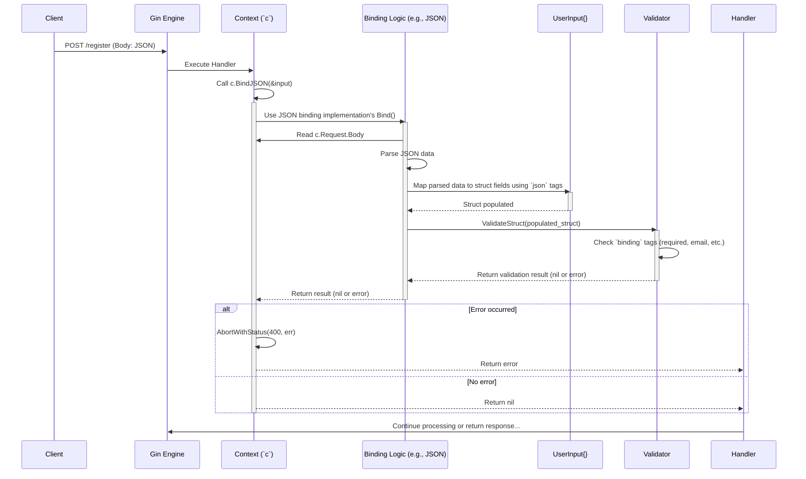

# Chapter 5: Binding - Automatically Filling Your Forms

In [Chapter 4: Context](04_context.md), we learned how the indispensable `gin.Context` carries all the information about a request and provides tools to send a response. We saw how to access individual pieces of data like URL parameters (`c.Param`) or query strings (`c.Query`).

But imagine your user sends a complex signup request with lots of information (username, email, password, maybe more) inside a JSON object in the request body. Extracting each field manually and checking if it exists would be tedious and error-prone. Wouldn't it be great if Gin could automatically read this data and fill in a corresponding Go struct for you?

That's exactly what **Binding** does!

## What Problem Does Binding Solve? From Raw Data to Go Structs

Think about receiving a filled-out paper application form in the mail. You *could* read each line manually and type it into your computer system. Or, you could have a scanner that automatically reads the form and fills in the digital fields for you.

Binding is like that scanner for your web application. It takes data from various parts of an incoming HTTP request (like the JSON body, query parameters, URL segments, form data, or even headers) and automatically "binds" or maps it into the fields of a Go struct you define.

This makes handling incoming data much cleaner, faster, and less error-prone. It also often includes data validation features right out of the box!

**Our Use Case:** Let's say we're building a user registration endpoint. Users will send a `POST` request to `/register` with a JSON body like this:

```json
{
  "username": "cool_user_99",
  "email": "user@example.com",
  "password": "supersecurepassword"
}
```

We want to easily get this data into a Go struct in our handler.

## How Binding Works: Go Structs and Magic Tags

The core idea is simple:

1. **Define a Go struct:** Create a struct that matches the structure of the data you expect to receive.
2. **Add "tags":** Use special `struct tags` next to each field to tell Gin where to find the corresponding data in the request.

Let's define a struct for our registration use case:

```go
package main

// UserRegistrationInput defines the expected structure for registration data
type UserRegistrationInput struct {
 // Use `json:"..."` tag to map the 'username' field from JSON
 Username string `json:"username"`
 // Map the 'email' field from JSON
 Email    string `json:"email"`
 // Map the 'password' field from JSON
 Password string `json:"password"`
}
```

* **`UserRegistrationInput`**: Our struct blueprint.
* **`json:"username"`**: This is a struct tag. It tells Gin: "When you are trying to bind JSON data to this struct, look for a key named `username` in the JSON object and put its value into this `Username` field."

These tags act as mapping instructions. Gin supports various tags for different data sources:

* `json:"..."`: For data from the JSON request body.
* `form:"..."`: For data from URL query parameters OR `application/x-www-form-urlencoded` / `multipart/form-data` request bodies.
* `uri:"..."`: For data from URL path parameters (like `/users/:id`). The tag value should match the parameter name (e.g., `uri:"id"`).
* `header:"..."`: For data from request headers.
* `binding:"..."`: Used for validation rules (we'll see this soon!).

## Binding Data from Different Sources

Gin's `Context` provides specific methods to bind data from common sources. The most frequently used are for JSON, query parameters, and URI parameters.

### 1. Binding JSON Request Body (`BindJSON`)

This is perfect for our `/register` use case where the data comes in the request body as JSON.

```go
package main

import (
 "net/http"

 "github.com/gin-gonic/gin"
)

// UserRegistrationInput struct (defined as before)
type UserRegistrationInput struct {
 Username string `json:"username"`
 Email    string `json:"email"`
 Password string `json:"password"`
}

func main() {
 router := gin.Default()

 router.POST("/register", func(c *gin.Context) {
  // 1. Create an instance of our target struct
  var input UserRegistrationInput

  // 2. Try to bind the request body JSON to the struct
  //    (&input passes the memory address so BindJSON can fill it)
  if err := c.BindJSON(&input); err != nil {
   // If binding fails (e.g., bad JSON format, type mismatch),
   // send a 400 Bad Request error response.
   c.JSON(http.StatusBadRequest, gin.H{"error": err.Error()})
   return // Stop processing
  }

  // 3. If binding succeeded, 'input' is now filled!
  //    We can access the data like input.Username, input.Email
  c.JSON(http.StatusOK, gin.H{
   "message":  "Registration successful",
   "username": input.Username,
   "email":    input.Email,
   // NEVER return the password in a real app!
  })
 })

 router.Run(":8080")
}
```

**Explanation:**

1. We define the `UserRegistrationInput` struct with `json` tags.
2. Inside the handler, we create a variable `input` of this struct type.
3. **`c.BindJSON(&input)`**: This is the key! Gin reads the request's `Content-Type` header. If it's `application/json`, it reads the request body, parses the JSON, and uses the `json` tags in `UserRegistrationInput` to populate the `input` variable.
4. **Error Handling:** If `BindJSON` encounters an error (e.g., the request body isn't valid JSON, or a required field is missing a value that can't be mapped properly), it returns an error. We check for `err != nil` and, if there's an error, we typically send a `400 Bad Request` response back to the client and stop further processing using `return`.
5. **Success:** If `err` is `nil`, the `input` struct now holds the data from the request, ready for us to use.

**Input:** `POST /register` with `Content-Type: application/json` and body:

```json
{ "username": "testuser", "email": "test@test.com", "password": "pw" }
```

**Output:** HTTP `200 OK` with JSON body:

```json
{ "message": "Registration successful", "username": "testuser", "email": "test@test.com" }
```

### 2. Binding Query Parameters (`BindQuery`)

What if the data comes in the URL's query string, like `/search?q=gin&page=2`?

```go
package main

import (
 "net/http"

 "github.com/gin-gonic/gin"
)

// SearchInput defines expected query parameters
type SearchInput struct {
 // Use `form:"..."` for query parameters
 Query string `form:"q"`
 // `form` tag works for query params too
 Page  int    `form:"page" default:"1"` // Can set defaults if needed
}

func main() {
 router := gin.Default()

 router.GET("/search", func(c *gin.Context) {
  var input SearchInput

  // Try to bind query parameters to the struct
  if err := c.BindQuery(&input); err != nil {
   c.JSON(http.StatusBadRequest, gin.H{"error": err.Error()})
   return
  }

  c.JSON(http.StatusOK, gin.H{
   "query": input.Query,
   "page":  input.Page,
  })
 })

 router.Run(":8080")
}
```

**Explanation:**

* We use the `form:"..."` tag even for query parameters. Gin's `queryBinding` (used by `BindQuery`) looks for this tag.
* `c.BindQuery(&input)` parses the request's URL query string (`c.Request.URL.Query()`) and maps the values to the `input` struct based on the `form` tags.
* Error handling is similar.

**Input:** `GET /search?q=gin-binding&page=3`
**Output:** HTTP `200 OK` with JSON body:

```json
{ "query": "gin-binding", "page": 3 }
```

**Input:** `GET /search?q=just-query` (page defaults to 1 if not provided, though `BindQuery` itself doesn't handle defaults directly like `DefaultQuery`; validation/defaults often happen together or require specific binding tags)
**Output:** HTTP `200 OK` with JSON body:

```json
{ "query": "just-query", "page": 0 } // Note: Default value handling needs validator or specific tags. BindQuery maps existing values.
```

### 3. Binding URI Parameters (`BindUri`)

Sometimes data is part of the URL path itself, like `/users/123/posts/45`.

```go
package main

import (
 "net/http"

 "github.com/gin-gonic/gin"
)

// UserPostURI defines expected URI parameters
type UserPostURI struct {
 UserID string `uri:"userId"` // Tag matches ':userId'
 PostID string `uri:"postId"` // Tag matches ':postId'
}

func main() {
 router := gin.Default()

 // Route with two URI parameters
 router.GET("/users/:userId/posts/:postId", func(c *gin.Context) {
  var uriData UserPostURI

  // Try to bind URI parameters to the struct
  if err := c.BindUri(&uriData); err != nil {
   // Usually means a mismatch between route & struct/tags
   c.JSON(http.StatusBadRequest, gin.H{"error": err.Error()})
   return
  }

  c.JSON(http.StatusOK, gin.H{
   "user_id": uriData.UserID,
   "post_id": uriData.PostID,
  })
 })

 router.Run(":8080")
}
```

**Explanation:**

* We use the `uri:"..."` tag, and the tag value **must match** the parameter name used in the route definition (`:userId`, `:postId`).
* `c.BindUri(&uriData)` uses the `Params` stored in the [Context](04_context.md) (which were extracted by the [Router](02_router___routing_tree.md)) and maps them to the `uriData` struct based on the `uri` tags.

**Input:** `GET /users/alice/posts/987`
**Output:** HTTP `200 OK` with JSON body:

```json
{ "user_id": "alice", "post_id": "987" }
```

### 4. General Binding (`Bind`)

Gin also provides a general `c.Bind(&input)` method. This method intelligently checks the request's `Content-Type` header and the HTTP method to choose the appropriate binding strategy automatically (e.g., `JSON` for JSON content type, `Form` for form data or GET requests).

* For `GET` requests, it primarily binds query parameters (like `BindQuery`).
* For `POST`, `PUT` etc. with `Content-Type: application/json`, it binds the body (like `BindJSON`).
* For `POST`, `PUT` etc. with `Content-Type: application/x-www-form-urlencoded` or `multipart/form-data`, it binds form data.

It usually requires `form` tags for query/form data and `json` tags for JSON data.

```go
// Example struct for general binding
type GenericInput struct {
 QueryParam string `form:"query"` // From query string
 FormData   string `form:"data"`  // From form post
 JsonField  string `json:"field"` // From JSON body
}

// ... in handler ...
var input GenericInput
if err := c.Bind(&input); err != nil {
    // Handle error
    c.JSON(http.StatusBadRequest, gin.H{"error": err.Error()})
    return
}
// Use input...
```

## Adding Validation with `binding` Tags

Just getting the data isn't always enough. What if the `email` field in our registration needs to be a *valid* email address format? Or what if the `username` cannot be empty?

Gin integrates with the excellent [go-playground/validator](https://github.com/go-playground/validator) library. You can add validation rules directly to your struct tags using `binding:"..."`.

```go
package main

import (
 "net/http"

 "github.com/gin-gonic/gin"
 "github.com/go-playground/validator/v10" // Import validator
)

// UserRegistrationInput with validation
type UserRegistrationInput struct {
 // Username is required, min 3 chars, max 20 chars
 Username string `json:"username" binding:"required,min=3,max=20"`
 // Email is required and must be in email format
 Email    string `json:"email"    binding:"required,email"`
 // Password is required, min 8 chars
 Password string `json:"password" binding:"required,min=8"`
}

func main() {
 router := gin.Default()

 router.POST("/register-validated", func(c *gin.Context) {
  var input UserRegistrationInput

  // Use BindJSON (or Bind, BindQuery, etc.)
  // Validation happens automatically during binding!
  if err := c.BindJSON(&input); err != nil {
   // Error can be a binding error OR a validation error
   validationErrs, ok := err.(validator.ValidationErrors)
   if ok {
    // Nicer error message for validation failures
    c.JSON(http.StatusBadRequest, gin.H{
     "error": "Validation failed",
     "details": validationErrs.Error(), // Provides field-specific errors
    })
   } else {
    // Generic binding error
    c.JSON(http.StatusBadRequest, gin.H{"error": err.Error()})
   }
   return
  }

  c.JSON(http.StatusOK, gin.H{"message": "Validation OK!"})
 })

 router.Run(":8080")
}
```

**Explanation:**

* **`binding:"required"`**: This field must be present and not empty/zero.
* **`binding:"email"`**: The value must be a valid email address format.
* **`binding:"min=3,max=20"`**: String length must be between 3 and 20 characters (inclusive). Multiple rules are separated by commas.
* **Validation During Binding:** When you call `BindJSON`, `BindQuery`, `BindUri`, `Bind`, etc., Gin *automatically* runs the validator on the populated struct *after* mapping the data.
* **Error Handling:** If validation fails, the `err` returned by the `Bind*` methods will be of type `validator.ValidationErrors`. You can check this using a type assertion (`err.(validator.ValidationErrors)`) to provide more specific feedback to the client about which fields failed validation.

**Input:** `POST /register-validated` with body:

```json
{ "username": "us", "email": "not-an-email", "password": "short" }
```

**Output:** HTTP `400 Bad Request` with JSON body similar to this (details may vary slightly):

```json
{
  "error": "Validation failed",
  "details": "Key: 'UserRegistrationInput.Username' Error:Field validation for 'Username' failed on the 'min' tag\nKey: 'UserRegistrationInput.Email' Error:Field validation for 'Email' failed on the 'email' tag\nKey: 'UserRegistrationInput.Password' Error:Field validation for 'Password' failed on the 'min' tag"
}
```

## `Bind...` vs `ShouldBind...` - Control Over Error Handling

You might have noticed methods like `ShouldBindJSON`, `ShouldBindQuery`, etc. What's the difference?

* **`Bind...` Methods** (e.g., `c.BindJSON`): These are convenient "must bind" methods. If binding *or* validation fails, they automatically call `c.AbortWithError(http.StatusBadRequest, err)`. This stops the [Handler Chain](03_handlers___middleware_chain.md) and sends a `400 Bad Request` response. You often just need to check `if err := c.BindJSON(&input); err != nil { return }`.
* **`ShouldBind...` Methods** (e.g., `c.ShouldBindJSON`): These methods attempt binding and validation but **do not** automatically abort the request or set the response status on error. They simply *return* the error if one occurred. This gives you more control over how you handle the error (e.g., return a custom error code, log differently, try binding to a different format).

Generally, use `Bind...` for simplicity when a standard `400 Bad Request` is acceptable for binding/validation errors. Use `ShouldBind...` when you need finer-grained control over the error handling process.

```go
// Using ShouldBind for custom error handling
if err := c.ShouldBindJSON(&input); err != nil {
    // Log the specific error, maybe return a 500 for unexpected issues
    log.Printf("Binding failed: %v", err)
    // Check if it's validation error vs something else
    if _, ok := err.(validator.ValidationErrors); ok {
         c.JSON(http.StatusUnprocessableEntity, gin.H{"error": "Invalid input provided"}) // 422 code maybe?
    } else {
         c.JSON(http.StatusInternalServerError, gin.H{"error": "Could not process request"})
    }
    return // Manually return
}
// Binding succeeded...
```

## Under the Hood: How Binding Happens

Let's peek behind the curtain when you call `c.BindJSON(&input)`:

1. **Call `BindJSON`:** Your handler calls `c.BindJSON(&input)` on the [Context](04_context.md).
2. **Select Binding:** `BindJSON` specifically selects the `jsonBinding` implementation. (If you used `c.Bind()`, Gin would look at `Content-Type` and method to choose the right binding - JSON, Form, Query, etc.).
3. **Get Request Data:** The `jsonBinding` implementation reads the request body (`c.Request.Body`).
4. **Parse Data:** It uses Go's standard `encoding/json` package (or a compatible one) to parse the byte stream from the body into a temporary representation.
5. **Map to Struct:** This is where the magic happens. The binding component iterates through the fields of your target struct (`input`). For each field:
    * It looks at the `json:"..."` tag (or `form`, `uri`, etc. depending on the binding).
    * It finds the corresponding key (e.g., `"username"`) in the parsed data.
    * It attempts to convert the value from the parsed data to the type of the struct field (e.g., JSON string "testuser" to Go `string`).
    * It assigns the converted value to the struct field.
6. **Validate Struct:** After mapping all possible fields, the binding calls the configured validator (`binding.Validator.ValidateStruct(obj)`), passing the populated struct.
7. **Validator Action:** The validator (`go-playground/validator` by default) inspects the `binding:"..."` tags on the struct fields and checks if all rules pass.
8. **Return Result:**
    * If parsing, mapping, or validation fails, an error is returned.
    * If everything succeeds, `nil` is returned.
9. **Handle Error (for `BindJSON`):** Since `BindJSON` is a "must bind" method, if an error was returned in step 8, Gin automatically calls `c.AbortWithError(http.StatusBadRequest, err)` before returning the error to your handler code.



### Relevant Code Files

* **`context.go`**: Contains the user-facing `Bind()`, `BindJSON()`, `BindQuery()`, `BindUri()`, `ShouldBind...()`, `MustBindWith()` methods. These methods select the appropriate binding implementation and call it. `MustBindWith` handles the automatic `AbortWithError`.
* **`binding/binding.go`**: Defines the `Binding` interface and instances for different types (JSON, XML, Form, Query, Uri, Header, etc.). The `Default()` function here helps `c.Bind()` choose the right implementation based on method and Content-Type. It also holds the global `Validator` instance.
* **`binding/json.go`, `binding/form.go`, `binding/query.go`, `binding/uri.go`, etc.**: Each file implements the `Binding` interface for a specific data source. They contain the logic for parsing the relevant part of the request and mapping it to the struct using reflection and tags. `json.go` uses `json.NewDecoder().Decode()`. `form.go` uses `req.ParseForm()` or `req.ParseMultipartForm()` and the `mapForm` utility. `uri.go` uses the `mapURI` utility.
* **`binding/default_validator.go`**: Contains the default implementation of the `StructValidator` interface using `go-playground/validator/v10`. The `ValidateStruct` method here is called by the binding implementations after mapping.

You don't need to memorize the internal code, but knowing that there are specific binding implementations for each format and a separate validation step helps understand how it works and how flexible it is.

## Conclusion

Binding is a powerful and essential feature in Gin that saves you from writing tedious boilerplate code for extracting and validating request data.

You've learned that:

* Binding automatically maps request data (JSON, query, URI, form, headers) into Go structs.
* It uses **struct tags** (`json`, `form`, `uri`, `header`) to know how to map fields.
* Gin provides specific methods like `c.BindJSON`, `c.BindQuery`, `c.BindUri` for common sources, and a general `c.Bind`.
* Built-in **validation** is supported using `binding:"..."` tags (e.g., `required`, `email`, `min`, `max`).
* `Bind...` methods automatically handle errors by sending a `400 Bad Request`, while `ShouldBind...` methods return the error, giving you more control.
* Internally, Gin selects a binding implementation, parses the data, maps it to the struct fields, and then validates the result.

With binding handling the input, the next logical step is often preparing and sending a response back to the client. How do you send HTML pages, more complex JSON structures, XML, or even serve files?

That's what we'll cover in the next chapter: [Chapter 6: Rendering](06_rendering.md).

---

Generated by [AI Codebase Knowledge Builder](https://github.com/The-Pocket/Tutorial-Codebase-Knowledge)
