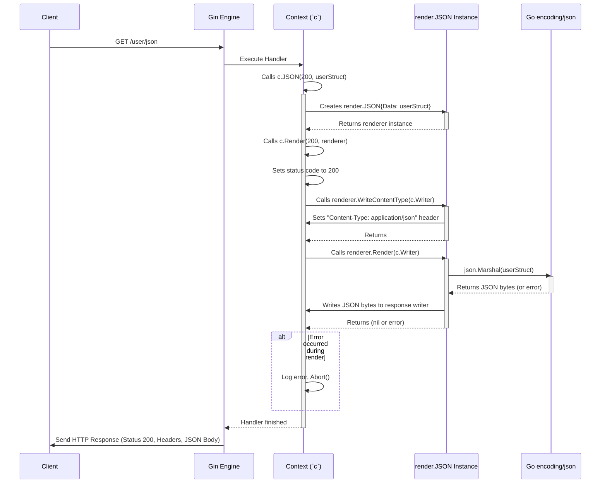

# Chapter 6: Rendering - Presenting Your Data

In the previous chapter, [Chapter 5: Binding](05_binding.md), we learned how Gin makes it easy to get data *into* our application by automatically parsing request details into Go structs. That's half the story! Once your handler has processed the request and prepared some data, how do you send that data back to the client (like a web browser or a mobile app) in the right format?

This process is called **Rendering**.

## What Problem Does Rendering Solve? Plating the Meal

Imagine you're a chef. You've taken the customer's order (the Request), maybe looked up a recipe ([Routing](02_router___routing_tree.md)), gathered ingredients (Data), and cooked the meal (Handler Logic). Now, you need to present the finished dish beautifully on a plate before the waiter ([Context](04_context.md)) takes it back to the customer.

**Rendering** in Gin is exactly like plating that meal. It's the process of taking your Go data (like structs, maps, strings) and formatting it into a specific HTTP response format that the client understands. Common formats include:

* **JSON:** Very common for APIs talking to JavaScript frontends or mobile apps.
* **HTML:** For sending web pages to be displayed in browsers.
* **XML:** Another structured data format, often used in enterprise systems.
* **Plain Text:** Simple text responses.
* **Protocol Buffers (Protobuf):** A binary format popular for performance.

Gin needs to not only format the data correctly but also tell the client *what* format it's sending by setting the `Content-Type` HTTP header (e.g., `Content-Type: application/json`).

**Our Use Case:** Let's say after processing a request, we have a simple Go map representing user information:

```go
userData := gin.H{ // gin.H is a shortcut for map[string]any
    "id":   123,
    "name": "Alice",
    "isActive": true,
}
```

How can we send this `userData` back to the client as a JSON response?

## Gin's Rendering Helpers: One-Liners for Responses

Just like binding had helper methods on the `Context`, rendering does too! The `gin.Context` (`c`) provides convenient methods corresponding to common response formats. These methods take care of:

1. Setting the correct HTTP status code (like `200 OK`, `404 Not Found`).
2. Setting the appropriate `Content-Type` header.
3. Serializing (formatting) your Go data into the chosen format.
4. Writing the formatted data to the response body.

Let's look at the most common ones.

### 1. Rendering JSON (`c.JSON`)

This is probably the most frequently used rendering method for APIs.

```go
package main

import (
 "net/http"

 "github.com/gin-gonic/gin"
)

type User struct {
 ID   int    `json:"id"`   // Use json tags like in Binding!
 Name string `json:"name"`
 IsActive bool `json:"is_active"`
}

func main() {
 router := gin.Default()

 router.GET("/user/json", func(c *gin.Context) {
  // Data can be a map (gin.H)
  userMap := gin.H{
   "id":       123,
   "name":     "Alice Map",
   "isActive": true,
  }
  // Or a struct
  userStruct := User{
   ID:   456,
   Name: "Bob Struct",
   IsActive: false,
  }

  // Choose one to send back:
  // c.JSON(http.StatusOK, userMap)
  c.JSON(http.StatusOK, userStruct) // Let's send the struct
 })

 router.Run(":8080")
}
```

**Explanation:**

* **`type User struct {...}`**: We define a struct, often using `json` tags just like we did for [Binding](05_binding.md). These tags control how the Go field names map to JSON keys during rendering.
* **`c.JSON(http.StatusOK, userStruct)`**: This single line does it all!
  * Sets the HTTP status code to `200 OK`.
  * Sets the `Content-Type` header to `application/json; charset=utf-8`.
  * Converts the `userStruct` (or `userMap`) into a JSON string.
  * Writes that JSON string to the response body.

**If you call `c.JSON(http.StatusOK, userStruct)`:**

* **Input (Go Data):** `User{ID: 456, Name: "Bob Struct", IsActive: false}`
* **Output (HTTP Response):**
  * Status: `200 OK`
  * Headers: `Content-Type: application/json; charset=utf-8`
  * Body: `{"id":456,"name":"Bob Struct","is_active":false}`

* **`c.IndentedJSON()`:** For development/debugging, you can use `c.IndentedJSON(http.StatusOK, data)` which produces nicely formatted, human-readable JSON output, but uses more bandwidth.

### 2. Rendering HTML (`c.HTML`)

To send back HTML for web pages.

```go
package main

import (
 "html/template" // Go's standard HTML template package
 "net/http"

 "github.com/gin-gonic/gin"
)

func main() {
 router := gin.Default()

 // --- Template Setup (IMPORTANT - usually done once) ---
 // Tell Gin where to find HTML files.
 // This loads all files matching the pattern into memory.
 router.LoadHTMLGlob("templates/*")
 // For a single file: router.LoadHTMLFiles("templates/index.tmpl")

 router.GET("/index", func(c *gin.Context) {
  // Data to pass to the template
  pageData := gin.H{
   "title": "My Homepage",
   "user":  "Guest",
  }

  // Render the 'index.tmpl' template with the pageData
  c.HTML(http.StatusOK, "index.tmpl", pageData)
 })

 router.Run(":8080")
}
```

```html
<!-- templates/index.tmpl -->
<!DOCTYPE html>
<html>
<head>
    <title>{{ .title }}</title> <!-- Access data using {{ .fieldName }} -->
</head>
<body>
    <h1>Welcome, {{ .user }}!</h1>
    <p>This is the homepage.</p>
</body>
</html>
```

**Explanation:**

* **Template Setup:** Unlike JSON or text, rendering HTML usually involves **template files**. You need to tell Gin where these files are using `router.LoadHTMLGlob()` or `router.LoadHTMLFiles()`. This is typically done once when setting up your router.
* **`c.HTML(http.StatusOK, "index.tmpl", pageData)`**:
  * Sets status `200 OK`.
  * Sets `Content-Type: text/html; charset=utf-8`.
  * Finds the pre-loaded template named `index.tmpl`.
  * Executes the template, making the `pageData` map available inside the template (using `{{ .title }}` and `{{ .user }}`).
  * Writes the resulting HTML to the response.

**Input (Go Data):** `gin.H{"title": "My Homepage", "user": "Guest"}`
**Output (HTTP Response):**

* Status: `200 OK`
* Headers: `Content-Type: text/html; charset=utf-8`
* Body: The rendered HTML content from `index.tmpl`.

*(Note: Gin supports various template engines, but Go's default `html/template` is built-in.)*

### 3. Rendering XML (`c.XML`)

If you need to respond with XML data.

```go
package main

import (
 "encoding/xml" // Go's standard XML package
 "net/http"

 "github.com/gin-gonic/gin"
)

type Product struct {
 XMLName xml.Name `xml:"product"` // Root element name
 ID      int      `xml:"id,attr"` // Map to an attribute 'id'
 Name    string   `xml:"name"`    // Map to an element <name>
 Price   float64  `xml:"price"`
}

func main() {
 router := gin.Default()

 router.GET("/product/xml", func(c *gin.Context) {
  productData := Product{
   ID:    987,
   Name:  "Gadget",
   Price: 29.99,
  }
  c.XML(http.StatusOK, productData)
 })

 router.Run(":8080")
}
```

**Explanation:**

* **`type Product struct {...}`**: We define a struct using `xml` tags from Go's `encoding/xml` package to control the XML structure.
* **`c.XML(http.StatusOK, productData)`**:
  * Sets status `200 OK`.
  * Sets `Content-Type: application/xml; charset=utf-8`.
  * Serializes the `productData` struct into XML based on the tags.
  * Writes the XML to the response.

**Input (Go Data):** `Product{ID: 987, Name: "Gadget", Price: 29.99}`
**Output (HTTP Response):**

* Status: `200 OK`
* Headers: `Content-Type: application/xml; charset=utf-8`
* Body:

    ```xml
    <product id="987">
        <name>Gadget</name>
        <price>29.99</price>
    </product>
    ```

### 4. Rendering Plain Text (`c.String`)

For simple text responses, like our first `/ping` example.

```go
// ... inside a handler ...
func PingHandler(c *gin.Context) {
    message := "System is running!"
    // Send a simple string response
    c.String(http.StatusOK, "Status: %s", message) // Supports formatting verbs
}
```

**Explanation:**

* **`c.String(http.StatusOK, "Status: %s", message)`**:
  * Sets status `200 OK`.
  * Sets `Content-Type: text/plain; charset=utf-8`.
  * Uses `fmt.Sprintf`-like formatting to create the final string.
  * Writes the string to the response.

**Input (Go Data):** `message := "System is running!"`
**Output (HTTP Response):**

* Status: `200 OK`
* Headers: `Content-Type: text/plain; charset=utf-8`
* Body: `Status: System is running!`

### 5. Redirects (`c.Redirect`)

To tell the browser to go to a different URL.

```go
// ... inside a handler ...
func OldProfileHandler(c *gin.Context) {
    // This page moved! Send the user to the new location.
    // Common redirect codes: 301 (Permanent), 302 (Found/Temporary)
    c.Redirect(http.StatusMovedPermanently, "/new-profile-page")
}
```

**Explanation:**

* **`c.Redirect(http.StatusMovedPermanently, "/new-profile-page")`**:
  * Sets the status code (e.g., `301 Moved Permanently`).
  * Sets the `Location` header to the new URL (`/new-profile-page`).
  * Usually sends a minimal body with a link (browser typically handles the redirect automatically).

**Input:** Request to `/old-profile`
**Output (HTTP Response):**

* Status: `301 Moved Permanently`
* Headers: `Location: /new-profile-page`
* (Minimal body, browser follows the Location header)

### Other Renderers

Gin also supports other formats via `Context` methods:

* `c.YAML()`: For YAML format.
* `c.ProtoBuf()`: For Google Protocol Buffers.
* `c.Data()`: For sending raw byte slices with a specified content type.
* `c.Reader()`: For streaming data from an `io.Reader`.
* `c.File()`: For efficiently serving a static file from the filesystem.

## Under the Hood: The `render` Package

How do `c.JSON()`, `c.HTML()` etc. actually work? They delegate the hard work to Gin's internal `render` package.

1. **`render.Render` Interface:** The `render` package defines an interface named `Render`. Any type that wants to be a "renderer" must implement this interface, which essentially requires two methods:
    * `Render(http.ResponseWriter) error`: Performs the actual serialization and writing to the response.
    * `WriteContentType(http.ResponseWriter)`: Sets the appropriate `Content-Type` header.

    ```go
    // Simplified concept from render/render.go
    package render

    import "net/http"

    type Render interface {
        Render(http.ResponseWriter) error
        WriteContentType(w http.ResponseWriter)
    }
    ```

2. **Concrete Renderers:** The `render` package provides concrete types that implement this `Render` interface for each format (e.g., `render.JSON`, `render.HTML`, `render.XML`, `render.String`).

    ```go
    // Simplified concept from render/json.go
    package render

    import (
        "encoding/json"
        "net/http"
    )

    type JSON struct {
        Data any
    }

    func (r JSON) Render(w http.ResponseWriter) error {
        // Set Content-Type if not already set (usually done before this)
        // r.WriteContentType(w)
        jsonBytes, err := json.Marshal(r.Data)
        if err != nil {
            return err // Report error
        }
        _, err = w.Write(jsonBytes)
        return err // Report error
    }

    func (r JSON) WriteContentType(w http.ResponseWriter) {
        header := w.Header()
        if header.Get("Content-Type") == "" {
           header.Set("Content-Type", "application/json; charset=utf-8")
        }
    }
    ```

3. **`c.Render()` Method:** The `gin.Context` has a general `Render` method that takes a status code and any `render.Render` object.

    ```go
    // Simplified concept from context.go
    func (c *Context) Render(code int, r render.Render) {
        c.Status(code) // Set the HTTP status code

        // Check if body is allowed for this status (e.g., 204 No Content)
        if !bodyAllowedForStatus(code) {
            r.WriteContentType(c.Writer) // Still write Content-Type maybe?
            c.Writer.WriteHeaderNow()   // Send headers only
            return
        }

        // Set the Content-Type using the renderer's method
        r.WriteContentType(c.Writer)
        // Tell the renderer to do its work and write the body
        err := r.Render(c.Writer)
        if err != nil {
            // Handle render errors (log, maybe abort)
            _ = c.Error(err)
            c.Abort()
        }
    }
    ```

4. **Putting it Together (`c.JSON`)**: When you call `c.JSON(code, data)`, it's essentially a shortcut for:

    ```go
    // Simplified concept from context.go
    func (c *Context) JSON(code int, obj any) {
        // Create the specific renderer instance
        renderer := render.JSON{Data: obj}
        // Call the general Render method
        c.Render(code, renderer)
    }
    ```

### Sequence Diagram: `c.JSON()` Call



### Relevant Code Files

* **`context.go`**: Contains the user-facing rendering methods (`JSON`, `HTML`, `XML`, `String`, `Redirect`, `Render`, etc.). These typically create an instance of the appropriate renderer and call `c.Render()`.
* **`render/render.go`**: Defines the `Render` interface.
* **`render/json.go`, `render/html.go`, `render/xml.go`, `render/text.go`, etc.**: Each file implements the `Render` interface for a specific format, containing the logic for setting the `Content-Type` and serializing/writing the data. `html.go` also includes logic for handling Go's template system.

Understanding this structure shows how Gin separates the *what* (the data and desired format) from the *how* (the specific implementation of formatting and writing for each type).

## Conclusion

Rendering is the final step in handling a request: presenting your results back to the client. Gin makes this easy through the `gin.Context` helper methods.

You've learned:

* Rendering transforms Go data into HTTP response formats (JSON, HTML, XML, Text, etc.).
* `gin.Context` offers methods like `c.JSON()`, `c.HTML()`, `c.XML()`, `c.String()`, `c.Redirect()` for common formats.
* These helpers automatically set the HTTP status, `Content-Type` header, and write the formatted response body.
* HTML rendering usually requires pre-loading template files.
* Internally, Gin uses the `render` package with a `Render` interface and specific implementations for each format.

Now that you know how to get data in ([Binding](05_binding.md)) and send data out (Rendering), what about configuring Gin itself? How do you change its behavior, like turning off debug messages for production, or setting different modes?

Let's explore that in the final core chapter: [Chapter 7: Configuration / Mode Management](07_configuration___mode_management.md).

---

Generated by [AI Codebase Knowledge Builder](https://github.com/The-Pocket/Tutorial-Codebase-Knowledge)
