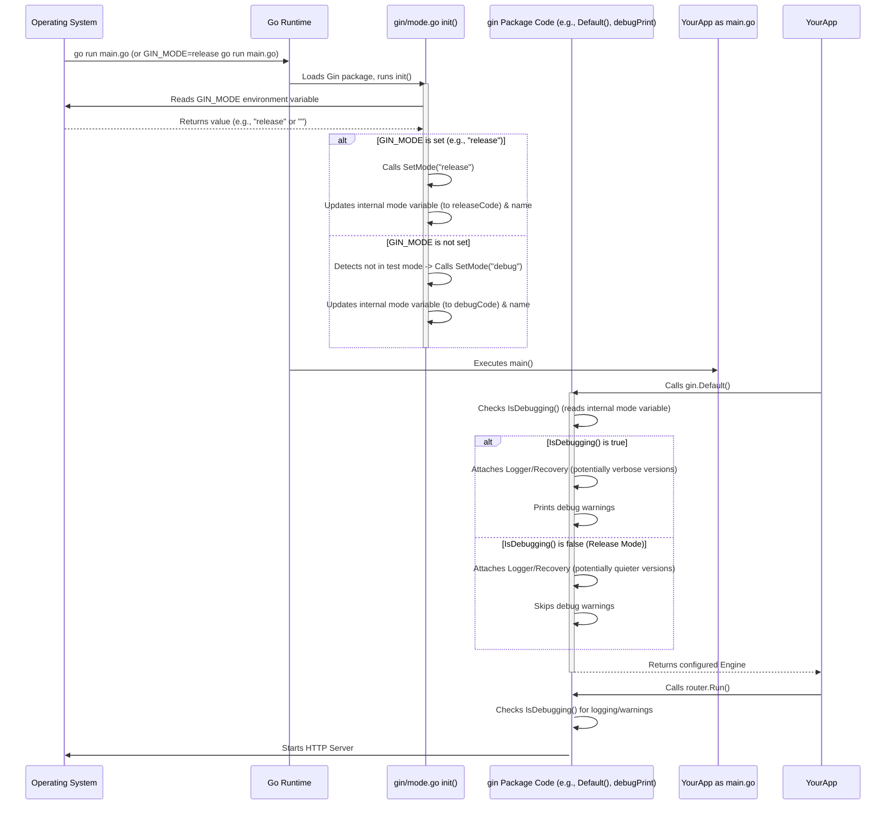

# Chapter 7: Configuration / Mode Management

Welcome to the final chapter covering the core concepts of Gin! We've journeyed through creating an [Engine](01_engine.md), defining [Routes](02_router___routing_tree.md), processing requests with [Handlers and Middleware](03_handlers___middleware_chain.md), using the [Context](04_context.md), getting data in via [Binding](05_binding.md), and sending data out with [Rendering](06_rendering.md).

Now, let's talk about configuring Gin's overall behavior, specifically its **Operating Mode**.

## Why Different Modes? The Game Difficulty Analogy

Think about playing a video game. You often have difficulty levels like "Easy," "Normal," and "Hard."

* **Easy Mode:** Might give you lots of hints, extra lives, and show helpful debugging information on screen. Great for learning!
* **Hard Mode:** Fewer hints, more challenges, and optimized for the best performance. Designed for experienced players aiming for high scores.

Gin's **Modes** work similarly for your web application:

* **Debug Mode:** Like "Easy Mode." It provides lots of helpful logging information (showing each request, which route was matched, etc.). If something crashes (panics), it might give more detailed error messages. This is perfect for when you are **developing** your application because you want as much information as possible to find and fix bugs.
* **Release Mode:** Like "Hard Mode." It's optimized for **production** (when real users are using your application). It turns off most of the noisy debug logging to improve performance and doesn't leak potentially sensitive error details.
* **Test Mode:** A special mode used primarily when running automated tests for your application.

Setting the right mode tells Gin how you intend to use the application right now, allowing it to adjust its behavior accordingly.

## What Do Modes Affect?

The primary impact of the mode setting is on:

1. **Default Middleware:** When you create an engine using `gin.Default()`, it automatically includes Logger and Recovery middleware. The Logger's output format and the Recovery middleware's behavior might be more verbose in Debug mode than in Release mode.
2. **Debug Logging:** Gin prints helpful debug messages to your console in Debug mode (like which routes are being registered, template loading details). These messages are silenced in Release mode.
3. **Performance:** Release mode is generally slightly faster because it skips the overhead of generating and printing debug logs.
4. **Error Messages:** Detailed panic messages might be suppressed or simplified in Release mode for security.

## How to Control the Mode

There are two main ways to set Gin's operating mode:

### 1. Environment Variable (`GIN_MODE`)

This is the most common way, especially for deploying applications. You set an environment variable named `GIN_MODE` *before* running your Go application.

* **For Debug Mode (Default):**

    ```bash
    export GIN_MODE=debug
    go run main.go
    # Or simply don't set it, debug is the default if unspecified
    # go run main.go
    ```

    The application will start in Debug mode.

* **For Release Mode:**

    ```bash
    export GIN_MODE=release
    go run main.go
    ```

    The application will start in Release mode (less console output, optimized).

* **For Test Mode:**

    ```bash
    export GIN_MODE=test
    go run main.go
    ```

    The application will start in Test mode.

**Explanation:** When your Gin application starts, it automatically checks for the `GIN_MODE` environment variable. If found, it sets the mode accordingly. If not found, it defaults to Debug mode (unless it detects it's running inside `go test`, in which case it defaults to Test mode).

This method is great because you can change the behavior of your application *without changing the code*, just by setting the environment variable differently in your development machine versus your production server.

### 2. Programmatically (`gin.SetMode()`)

You can also set the mode directly in your Go code *before* creating your Gin engine instance.

```go
package main

import (
 "log"
 "net/http"

 "github.com/gin-gonic/gin"
)

func main() {
 // --- Set the mode explicitly ---
 // Call this BEFORE gin.New() or gin.Default()
 gin.SetMode(gin.ReleaseMode) // Set to ReleaseMode
 // Other options: gin.DebugMode, gin.TestMode

 log.Printf("Running in %s mode", gin.Mode()) // Check the current mode

 // Create the engine AFTER setting the mode
 router := gin.Default() // Behavior of Default() depends on the mode

 router.GET("/ping", func(c *gin.Context) {
  c.String(http.StatusOK, "pong")
 })

 // In Release mode, gin.Default() still adds Logger/Recovery,
 // but they might log less verbosely than in Debug mode.
 // Also, Gin's own debug messages (e.g., route registration) won't print.

 router.Run(":8080")
}
```

**Explanation:**

* **`gin.SetMode(gin.ReleaseMode)`**: This function call explicitly tells Gin to operate in Release mode. You **must** call this *before* `gin.New()` or `gin.Default()` for it to have the intended effect on default middleware and initial debug messages.
* **`gin.Mode()`**: This function returns the current mode as a string ("debug", "release", or "test"). Useful for checking the mode.
* **`gin.IsDebugging()`**: A handy boolean function that returns `true` if the current mode is DebugMode, and `false` otherwise.

**When to use `SetMode()`?** Usually, setting via the environment variable `GIN_MODE` is preferred for flexibility. However, you might use `SetMode()` if you need to force a specific mode regardless of the environment or based on some other configuration logic within your application.

## Checking the Mode in Your Code

Sometimes, you might want your *own* application code to behave differently based on the Gin mode.

```go
package main

import (
 "log"
 "net/http"

 "github.com/gin-gonic/gin"
 // Assume GIN_MODE is not set (defaults to debug)
)

func main() {
 // gin.SetMode(gin.ReleaseMode) // Uncomment to try release mode

 log.Printf("Current Gin mode: %s", gin.Mode())

 router := gin.Default() // Includes Logger/Recovery

 router.GET("/status", func(c *gin.Context) {
  extraInfo := "Nothing special."

  // Check if running in debug mode
  if gin.IsDebugging() {
   extraInfo = "Showing extra debug details because IsDebugging() is true."
   log.Println("Debug-specific log message!")
  }

  c.JSON(http.StatusOK, gin.H{
   "status":  "OK",
   "mode":    gin.Mode(), // Include mode in response
   "details": extraInfo,
  })
 })

 router.Run(":8080")
}
```

**Explanation:**

* We use `gin.Mode()` to get the current mode string.
* We use `gin.IsDebugging()` inside our `/status` handler. If the application is running in debug mode, we add extra information to the response and print a specific log message. If you run this normally, `IsDebugging()` will be true. If you run it with `GIN_MODE=release go run main.go`, `IsDebugging()` will be false, and the output will change.

## Under the Hood: Mode Flags and Checks

Gin's mode management is relatively straightforward internally:

1. **Mode Variable:** Gin uses an internal, package-level variable (`ginMode` which is an `int32`) to store the current mode code (`debugCode`, `releaseCode`, `testCode`). It also stores the mode name string in an `atomic.Value` for efficient reading via `gin.Mode()`.
2. **Initialization (`init()`):** When the Gin package is loaded, an `init()` function runs. This function reads the `GIN_MODE` environment variable. If it's set, it calls `SetMode` with that value. If not set, it checks if the code is being run via `go test` (by looking for the `test.v` flag). If testing, it defaults to `TestMode`. Otherwise, it defaults to `DebugMode`.
3. **`SetMode(value string)`:** This function takes the mode string ("debug", "release", "test"), converts it to the corresponding internal integer code, and updates the internal `ginMode` variable and the atomic mode name string. It panics if an unknown mode string is provided.
4. **Checking the Mode:** Functions like `gin.IsDebugging()` simply check the current value of the internal `ginMode` integer variable. `gin.Mode()` reads the atomic value holding the mode name string.
5. **Conditional Behavior:** Various parts of Gin, especially the `debugPrint...` functions (`debug.go`) and the `gin.Default()` function (`gin.go`), call `IsDebugging()` to decide whether to perform certain actions (like printing debug logs or potentially configuring middleware differently).



### Relevant Code Files (Conceptual)

* **`mode.go`**:
  * Defines constants like `EnvGinMode`, `DebugMode`, `ReleaseMode`, `TestMode`.
  * Defines the internal `ginMode` variable and the atomic `modeName`.
  * Contains the `init()` function that checks the environment variable.
  * Contains `SetMode()`, `Mode()`, and helper constants/variables (`DefaultWriter`).
* **`debug.go`**:
  * Contains `IsDebugging()`.
  * Contains various `debugPrint...` functions that often start with `if IsDebugging() { ... }` to conditionally print logs.
* **`gin.go`**:
  * `Default()` function calls `debugPrintWARNINGDefault()` which itself checks `IsDebugging()`. While `Default()` always adds Logger and Recovery, their internal configuration or Gin's surrounding debug messages change based on the mode.

```go
// --- Simplified concept from mode.go ---
var ginMode int32 = debugCode // Default is debug
var modeName atomic.Value     // Stores string name: "debug", "release", "test"

const (
 debugCode = iota
 releaseCode
 testCode
)

func init() {
 mode := os.Getenv(EnvGinMode)
 SetMode(mode) // Set based on env or default
}

func SetMode(value string) {
 // ... logic to trim space, handle empty string, check test flags ...
 switch value {
 case DebugMode:
  atomic.StoreInt32(&ginMode, debugCode)
 case ReleaseMode:
  atomic.StoreInt32(&ginMode, releaseCode)
 case TestMode:
  atomic.StoreInt32(&ginMode, testCode)
 default:
  panic("invalid mode: " + value)
 }
 modeName.Store(value)
}

func Mode() string {
 return modeName.Load().(string)
}

// --- Simplified concept from debug.go ---
func IsDebugging() bool {
 // Check the internal integer code
 return atomic.LoadInt32(&ginMode) == debugCode
}

func debugPrint(format string, values ...any) {
 if !IsDebugging() { // Check the mode!
  return
 }
 // ... actual printing logic using DefaultWriter ...
}

// --- Simplified concept from gin.go ---
func Default(opts ...OptionFunc) *Engine {
 // Print warnings only in debug mode
 debugPrintWARNINGDefault()
 engine := New()
 // Logger() and Recovery() are added regardless,
 // but their behavior or Gin's surrounding output might differ.
 engine.Use(Logger(), Recovery())
 return engine.With(opts...)
}
```

## Conclusion

Configuration and Mode Management in Gin allow you to easily switch between development (verbose, hint-rich) and production (optimized, quiet) behaviors.

You've learned:

* Gin has three main modes: **Debug** (default, for development), **Release** (for production), and **Test**.
* Modes primarily affect default middleware behavior, debug logging verbosity, and performance.
* You can set the mode using the `GIN_MODE` **environment variable** (preferred) or programmatically with `gin.SetMode()` **before** creating the engine.
* You can check the current mode using `gin.Mode()` or `gin.IsDebugging()`.
* Setting `GIN_MODE=release` is crucial for running your Gin application in production.

This concludes our tour of the fundamental concepts of the Gin framework! You now have the building blocks to create robust and efficient web applications and APIs using Go and Gin. From here, you can explore more advanced topics like custom middleware, database integration, websockets, testing strategies, and deployment patterns. Happy coding!

---

Generated by [AI Codebase Knowledge Builder](https://github.com/The-Pocket/Tutorial-Codebase-Knowledge)
