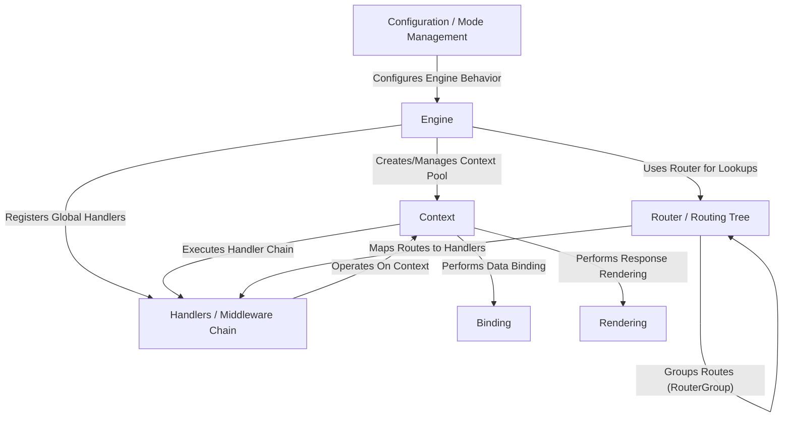

# Tutorial: gin

Gin is a popular and *high-performance* **web framework** for the Go programming language.
It's designed to help developers build **web applications** and **APIs** quickly and easily.
Gin provides features like efficient *request routing*, a *middleware* system for managing request lifecycles, easy *data binding* from requests into Go structs, and flexible *response rendering* for various formats (like JSON, HTML, XML).

**Source Repository:** [https://github.com/gin-gonic/gin](https://github.com/gin-gonic/gin)

## Chapters

1. [Engine](01_engine.md)
2. [Router / Routing Tree](02_router___routing_tree.md)
3. [Handlers / Middleware Chain](03_handlers___middleware_chain.md)
4. [Context](04_context.md)
5. [Binding](05_binding.md)
6. [Rendering](06_rendering.md)
7. [Configuration / Mode Management](07_configuration___mode_management.md)

---

Generated by [AI Codebase Knowledge Builder](https://github.com/The-Pocket/Tutorial-Codebase-Knowledge)
