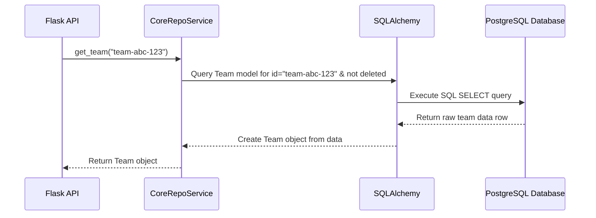

# Chapter 1: SQLAlchemy Data Models & Store

Welcome to the `middleware` project! This is the very first chapter of our tutorial series, designed to help you understand how the project works, piece by piece. Today, we're diving into the foundation of how our application handles its data.

Imagine our application needs to keep track of software development teams, pull requests, user information, and much more. Where does all this information go? How do we make sure it's organized and easy to access or update? That's where **SQLAlchemy Data Models & Store** come in.

Think of it like this:

* **Data Models:** These are like *blueprints* for different types of information. A blueprint for a "Team" might say it needs a name, a list of members, and an ID.
* **The Store (Repositories):** This is like the *filing system manager*. It knows how to use the blueprints to add new files (data), find existing ones, update them, or remove them from the filing cabinet (our database).
* **SQLAlchemy:** This is the special tool we use that lets our Python code talk to our database (which is PostgreSQL in this project) in an easy way. It understands our Python "blueprints" (Models) and helps the "filing manager" (Store) interact with the actual database tables.

In this chapter, we'll explore these concepts so you understand how `middleware` defines and manages its data.

## What are Data Models? (The Blueprints)

Data Models define the structure of the information we want to store. In `middleware`, these are Python classes that inherit from `db.Model` (provided by SQLAlchemy). Each class maps to a table in our PostgreSQL database.

Let's look at a simple example, the `Team` model:

```python
# File: backend/analytics_server/mhq/store/models/core/teams.py

import uuid
from sqlalchemy.dialects.postgresql import UUID, ARRAY
from mhq.store import db # Our SQLAlchemy object

class Team(db.Model):
    __tablename__ = "Team" # The actual table name in the database

    # Define the 'columns' or 'fields' for our Team data
    id = db.Column(UUID(as_uuid=True), primary_key=True, default=uuid.uuid4) # Unique ID
    org_id = db.Column(UUID(as_uuid=True), db.ForeignKey("Organization.id")) # Link to Organization
    name = db.Column(db.String) # Team name (text)
    member_ids = db.Column(ARRAY(UUID(as_uuid=True)), nullable=False) # List of member IDs
    # ... other columns like created_at, updated_at, manager_id ...
    is_deleted = db.Column(db.Boolean, default=False) # Is the team deleted?

    def __hash__(self):
        return hash(self.id)
```

**Explanation:**

* `class Team(db.Model):`: We define a `Team` class that's recognized by SQLAlchemy as a model.
* `__tablename__ = "Team"`: This explicitly tells SQLAlchemy that this model corresponds to the database table named "Team".
* `id = db.Column(...)`: This defines a column named `id`. `db.Column` specifies the data type (`UUID`), indicates it's the `primary_key` (a unique identifier for each team), and sets a default value generator (`uuid.uuid4`).
* `name = db.Column(db.String)`: Defines a `name` column that stores text (a string).
* `member_ids = db.Column(ARRAY(UUID(as_uuid=True)), ...)`: Defines a `member_ids` column that stores a list (Array) of UUIDs.
* `db.ForeignKey("Organization.id")`: This creates a link between the `Team` table and the `Organization` table, ensuring relational integrity.

These models act as the Python representation of our database tables.

## Connecting to the Database (Setting up the Workshop)

Before our application can use these models to read or write data, it needs to establish a connection to the PostgreSQL database. This is handled in the `mhq/store/__init__.py` file.

```python
# File: backend/analytics_server/mhq/store/__init__.py

from os import getenv
from flask_sqlalchemy import SQLAlchemy

db = SQLAlchemy() # Initialize the SQLAlchemy extension object

def configure_db_with_app(app):
    # Read database connection details from environment variables
    DB_HOST = getenv("DB_HOST")
    DB_PORT = getenv("DB_PORT")
    DB_USER = getenv("DB_USER")
    DB_PASS = getenv("DB_PASS")
    DB_NAME = getenv("DB_NAME")
    # ... other settings ...

    # Construct the connection string (like an address for the database)
    connection_uri = f"postgresql://{DB_USER}:{DB_PASS}@{DB_HOST}:{DB_PORT}/{DB_NAME}?..."

    # Configure SQLAlchemy within the Flask application
    app.config["SQLALCHEMY_DATABASE_URI"] = connection_uri
    # ... other configurations ...
    db.init_app(app) # Initialize SQLAlchemy with the app's config
```

**Explanation:**

* `db = SQLAlchemy()`: Creates the central SQLAlchemy object used throughout the application to interact with the database.
* `configure_db_with_app(app)`: This function reads database credentials (host, user, password, etc.) typically set via environment variables.
* `connection_uri`: It builds a special string that tells SQLAlchemy exactly how to connect to our PostgreSQL database.
* `app.config[...] = ...`: Sets configuration values for SQLAlchemy.
* `db.init_app(app)`: Links the `db` object with our main application (`app`), using the connection details we just configured.

Now, our application knows how to talk to the database.

## What is the Store/Repo? (The Filing System Manager)

While Models define *what* the data looks like, the **Store** (implemented as Repository classes in `mhq/store/repos/`) defines *how* we interact with that data. These repositories contain methods for common database operations: creating, reading, updating, and deleting (CRUD).

Think of `CoreRepoService` as the manager for core entities like Organizations, Teams, and Users, while `CodeRepoService` manages code-related data like Repositories and Pull Requests.

Let's look at a simple method in `CoreRepoService` to fetch a team by its ID:

```python
# File: backend/analytics_server/mhq/store/repos/core.py

from mhq.store import db, rollback_on_exc # Import db and the safety decorator
from mhq.store.models.core import Team # Import the Team model

class CoreRepoService:
    def __init__(self):
        self._db = db # Use the shared db object

    @rollback_on_exc # Safety net: Rollback changes if an error occurs
    def get_team(self, team_id: str) -> Team:
        # Use SQLAlchemy session to query the Team model
        return (
            self._db.session.query(Team) # Start a query for Team objects
            .filter(Team.id == team_id, Team.is_deleted.is_(False)) # Find by ID, ensure not deleted
            .one_or_none() # Expect one result or none, don't error if not found
        )

    # ... other methods like create_team, update_team, get_user ...
```

**Explanation:**

* `@rollback_on_exc`: This is a helpful decorator (defined in `mhq/store/__init__.py`). If any unexpected error happens while `get_team` is running database operations, this ensures any partial changes are automatically undone (rolled back), keeping the database consistent.
* `self._db.session.query(Team)`: This tells SQLAlchemy we want to query the database table corresponding to the `Team` model.
* `.filter(Team.id == team_id, ...)`: This adds conditions to our query, similar to a `WHERE` clause in SQL. We're looking for a `Team` whose `id` matches the `team_id` provided to the function and is not marked as deleted.
* `.one_or_none()`: This executes the query and expects at most one result. If a matching, non-deleted team is found, it returns the `Team` object. If not, it returns `None`.

These repository methods provide a clean and reusable way to access and manipulate our data without scattering database logic all over the codebase.

## How it Works Together: Fetching a Team

Let's trace the steps when another part of the application, maybe our [Flask Backend & API Structure](07_flask_backend___api_structure_.md), needs information about a specific team:

1. **Request:** The API layer receives a request asking for details of team with ID "team-abc-123".
2. **Call Repo:** The API handler calls the `get_team` method from an instance of `CoreRepoService`, passing "team-abc-123" as `team_id`.

    ```python
    core_repo = CoreRepoService()
    team_object = core_repo.get_team("team-abc-123")
    ```

3. **Query Building:** Inside `get_team`, SQLAlchemy uses the `Team` model (the blueprint) and the provided `team_id` to construct a database query.
4. **SQL Execution:** SQLAlchemy sends the appropriate SQL command to the PostgreSQL database (something like `SELECT * FROM "Team" WHERE id = 'team-abc-123' AND is_deleted = false;`).
5. **Database Response:** PostgreSQL finds the matching row(s) and sends the raw data back.
6. **Object Mapping:** SQLAlchemy receives the raw data and cleverly maps it back into a Python `Team` object, filling its attributes (`id`, `name`, `member_ids`, etc.).
7. **Return Object:** The `get_team` method returns the fully populated `Team` object (or `None` if not found) back to the API layer.
8. **API Response:** The API layer can now use the `team_object`'s attributes (e.g., `team_object.name`) to construct a response.

Here's a diagram illustrating this flow:



## A Glimpse at More Complex Models and Queries

Our application deals with more than just Teams. We have models for `PullRequest`, `OrgRepo` (Organization Repository), `Users`, `Settings`, and more, located in `mhq/store/models/`.

For example, the `PullRequest` model (`mhq/store/models/code/pull_requests.py`) has many fields:

```python
# File: backend/analytics_server/mhq/store/models/code/pull_requests.py (Simplified)
class PullRequest(db.Model):
    __tablename__ = "PullRequest"

    id = db.Column(UUID(as_uuid=True), primary_key=True)
    repo_id = db.Column(UUID(as_uuid=True), db.ForeignKey("OrgRepo.id")) # Link to Repo
    title = db.Column(db.String)
    number = db.Column(db.String) # PR number (e.g., "123")
    state = db.Column(ENUM(PullRequestState)) # State like OPEN, MERGED, CLOSED
    author = db.Column(db.String)
    created_at = db.Column(db.DateTime(timezone=True)) # When the PR was created
    # ... many other columns for metrics, data, meta ...
    data = db.Column(JSONB) # Store flexible JSON data
```

Notice the use of `db.ForeignKey` to link to `OrgRepo`, `ENUM` for predefined states, `db.DateTime` for timestamps, and `JSONB` for storing flexible JSON data directly in the database.

Correspondingly, the `CodeRepoService` (`mhq/store/repos/code.py`) has more complex methods, like fetching pull requests merged within a specific time range for certain repositories:

```python
# File: backend/analytics_server/mhq/store/repos/code.py (Simplified)
from mhq.store.models.code import PullRequest, PullRequestState
from mhq.utils.time import Interval

class CodeRepoService:
    # ... other methods ...

    @rollback_on_exc
    def get_prs_merged_in_interval(
        self,
        repo_ids: List[str],
        interval: Interval,
        # ... other optional filters ...
    ) -> List[PullRequest]:
        # Start query for PullRequest objects, avoid loading large 'data' field initially
        query = self._db.session.query(PullRequest).options(defer(PullRequest.data))

        # --- Filter Step 1: By Repository ---
        query = query.filter(PullRequest.repo_id.in_(repo_ids))

        # --- Filter Step 2: By Merged State and Time Interval ---
        query = query.filter(
            PullRequest.state_changed_at.between(interval.from_time, interval.to_time),
            PullRequest.state == PullRequestState.MERGED, # Only MERGED PRs
        )

        # --- Apply other filters if provided ---
        # query = self._filter_prs(query, pr_filter)
        # query = self._filter_base_branch_on_regex(query, base_branches)

        # --- Final Step: Order results and get all matching PRs ---
        query = query.order_by(PullRequest.state_changed_at.asc())
        return query.all() # Execute and return a list of PullRequest objects
```

This demonstrates how repository methods can chain multiple `.filter()` calls to build complex queries based on the model definitions, returning lists of Python objects representing the database rows. `defer(PullRequest.data)` is an optimization to avoid loading potentially large JSON data unless specifically needed later.

## Conclusion

We've covered the essentials of how `middleware` defines its data structures using **SQLAlchemy Models** (like `Team` and `PullRequest`) and how it interacts with the PostgreSQL database using the **Store Repositories** (like `CoreRepoService` and `CodeRepoService`).

* **Models** are the Python blueprints for our database tables.
* **SQLAlchemy** is the translator between Python objects and database interactions.
* **Repositories** provide organized methods (like `get_team` or `get_prs_merged_in_interval`) to perform data operations.

Understanding this data layer is crucial as it forms the backbone of the application's state.

Now that we know how internal data is managed, what about data coming from *outside*? In the next chapter, we'll explore how `middleware` integrates with external services like GitHub or Jira.

Next up: [Chapter 2: External API Integration (`mhq/exapi`)](02_external_api_integration___mhq_exapi___.md)

---

Generated by [AI Codebase Knowledge Builder](https://github.com/The-Pocket/Tutorial-Codebase-Knowledge)
