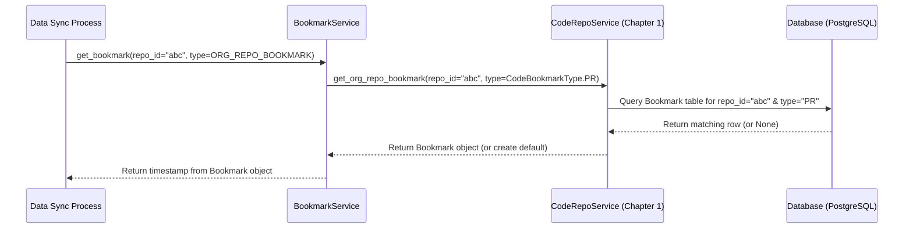

# Chapter 3: Bookmark Service

Welcome back! In [Chapter 2: External API Integration (`mhq/exapi`)](02_external_api_integration___mhq_exapi___.md), we learned how our `middleware` application acts like an ambassador, talking to external services like GitHub to fetch data. But imagine having thousands of Pull Requests (PRs) in a repository. It would be incredibly slow and inefficient to fetch *all* of them every single time we want to check for updates!

This is where the **Bookmark Service** comes in. Think of it like placing bookmarks in different books (our data sources, like GitHub repositories). When you finish reading for the day, you put a bookmark on the page where you left off. The next time you pick up the book, you open it right to the bookmark and continue reading from there, instead of starting from page one again.

The Bookmark Service does exactly this for our data synchronization process. It keeps track of the *last point in time* we successfully fetched data (like PRs, workflow runs, or incidents) for a specific repository or service.

**Use Case:** Let's say we want to fetch only the *new* Pull Requests from a specific GitHub repository since our last successful check.

## What is a Bookmark?

In our project, a "bookmark" isn't a physical thing, but rather a piece of data stored in our database. It usually represents a **timestamp**. This timestamp tells us: "For *this specific repository* (or service), we have already successfully fetched all the PR data (or workflow data, etc.) that happened *before* this time."

So, when we want to sync again, we ask the Bookmark Service: "What's the bookmark timestamp for PRs in repository 'X'?" It might give us back a time like "2023-10-26T10:00:00Z".

## The Bookmark Service: The Librarian of Timestamps

The `BookmarkService` (found in `mhq/service/bookmark/bookmark.py`) is like the librarian who manages all these bookmarks. It knows how to:

1. **Find a Bookmark:** Given a specific repository (or service) and the type of data we're interested in (e.g., PRs, Workflows), it can look up the corresponding bookmark timestamp in our database.
2. **Create a Default Bookmark:** If we've never synced data for a repository before (i.e., there's no bookmark), the service can create a default starting point, often set to a certain number of days in the past (e.g., fetch data from the last 30 days).
3. **Update a Bookmark:** After we successfully fetch *new* data up to the current time, we tell the Bookmark Service to update the bookmark for that repository to the *new* current time.

## How to Use the Bookmark Service

Let's revisit our use case: fetching new PRs for a GitHub repository. Here's how a data synchronization process (which we'll cover more in [Chapter 4: Data Sync & ETL (`mhq/service/*/sync`)](04_data_sync___etl___mhq_service___sync___.md)) would use the Bookmark Service:

### **Step 1: Get the Last Sync Time (Bookmark)**

Before asking GitHub for data, the sync process asks the `BookmarkService` for the last known bookmark timestamp for PRs in this specific repository.

```python
# Simplified Example in a hypothetical Sync function

from mhq.service.bookmark.bookmark import get_bookmark_service
from mhq.service.bookmark.bookmark_types import BookmarkType

# Assume we know the repository's ID in our database
repo_id = "some-repo-uuid-123"
provider_name = "github" # Or "gitlab", etc.

# Get the bookmark service instance
bookmark_service = get_bookmark_service()

# Ask for the PR bookmark for this repo
# BookmarkType.ORG_REPO_BOOKMARK is used for PRs in this context
last_sync_time = bookmark_service.get_bookmark(
    entity_id=repo_id,
    bookmark_type=BookmarkType.ORG_REPO_BOOKMARK,
    provider=provider_name, # Provider might be needed for some bookmark types
    # Optional: default_sync_days can be set if no bookmark exists
)

print(f"Last sync was at: {last_sync_time}")
# Example Output: Last sync was at: 2023-10-26 10:00:00+00:00
```

**Explanation:**

* We import `get_bookmark_service` to get an instance of our librarian.
* We import `BookmarkType` to specify *what kind* of bookmark we need (in this case, `ORG_REPO_BOOKMARK` signifies the main bookmark for a code repository, often used for PRs).
* We call `get_bookmark`, providing the `repo_id` (the unique ID of the repository *in our system*) and the `bookmark_type`.
* The service returns a `datetime` object representing the timestamp of the last successful sync. If no bookmark existed, it would likely return a timestamp from the past (e.g., 30 days ago).

### **Step 2: Fetch New Data Using the Bookmark**

Now, the sync process uses this `last_sync_time` when talking to the external API (like GitHub, using the tools from [Chapter 2: External API Integration (`mhq/exapi`)](02_external_api_integration___mhq_exapi___.md)). It tells GitHub: "Please give me all the PRs that were created or updated *since* `last_sync_time`."

```python
# Simplified Pseudocode - How the timestamp is used

# Get the GitHub 'ambassador' from Chapter 2
github_ambassador = GithubApiService(access_token="...")

# Ask GitHub for PRs updated *since* the bookmark time
new_prs_data = github_ambassador.get_pull_requests(
    repo_name="my-repo",
    since=last_sync_time # <- The key part!
)

print(f"Fetched {len(new_prs_data)} new or updated PRs.")
```

**Explanation:**

* The critical part is using the `last_sync_time` obtained from the Bookmark Service as a filter (`since=last_sync_time`) in the request to the external API. This ensures we only get the relevant new data.

### **Step 3: Update the Bookmark**

After successfully fetching the new data and storing it in our database (using tools from [Chapter 1: SQLAlchemy Data Models & Store](01_sqlalchemy_data_models___store_.md)), the sync process needs to tell the `BookmarkService` to update the bookmark to the current time. This marks the successful completion of the sync up to this moment.

```python
# Simplified Example - Updating the bookmark

from mhq.utils.time import time_now # Helper to get the current time

# ... (fetch and save new data successfully) ...

# Get the current time to set as the new bookmark
new_bookmark_time = time_now()

# Tell the bookmark service to update the PR bookmark for this repo
bookmark_service.update_bookmark(
    entity_id=repo_id,
    bookmark_type=BookmarkType.ORG_REPO_BOOKMARK,
    provider=provider_name,
    bookmark_timestamp=new_bookmark_time
)

print(f"Bookmark updated to: {new_bookmark_time}")
# Example Output: Bookmark updated to: 2023-10-26 11:30:00+00:00
```

**Explanation:**

* We get the current time using `time_now()`.
* We call `update_bookmark` on the service, providing the same `repo_id` and `bookmark_type`, along with the `new_bookmark_time`.
* The `BookmarkService` will now store this new timestamp in the database, ready for the *next* time the sync runs.

## Under the Hood: How Bookmarks are Managed

How does the `BookmarkService` actually find and update these timestamps?

1. **Request:** The sync process calls `get_bookmark` or `update_bookmark`.
2. **Service Logic:** The `BookmarkService` receives the request (e.g., `get_bookmark` for `repo_id="abc"` and type `ORG_REPO_BOOKMARK`).
3. **Identify Storage:** It knows that `ORG_REPO_BOOKMARK` type bookmarks are handled by the `CodeRepoService` (the "filing manager" for code-related data from [Chapter 1: SQLAlchemy Data Models & Store](01_sqlalchemy_data_models___store_.md)).
4. **Delegate to RepoService:** It calls a specific method on the `CodeRepoService`, like `get_org_repo_bookmark(repo_id="abc", bookmark_type=...)`.
5. **Database Interaction:** The `CodeRepoService` uses SQLAlchemy (our database tool from Chapter 1) to query the `Bookmark` table in our database, looking for a row matching the `repo_id` and `type`.
6. **Return Value:**
    * If getting a bookmark, the stored timestamp (or a default if none found) is returned up the chain.
    * If updating, the `CodeRepoService` tells SQLAlchemy to update the specific row in the `Bookmark` table with the new timestamp.

Here's a diagram showing the flow for getting a bookmark:



### A Peek at the Code (`mhq/service/bookmark/bookmark.py`)

Let's look at simplified versions of the key methods inside `BookmarkService`:

```python
# File: backend/analytics_server/mhq/service/bookmark/bookmark.py (Simplified)

from datetime import datetime, timedelta
from mhq.service.bookmark.bookmark_types import BookmarkType
# Import the "filing managers" (RepoServices) from Chapter 1
from mhq.store.repos.code import CodeRepoService
from mhq.store.repos.workflows import WorkflowRepoService
from mhq.store.repos.incidents import IncidentsRepoService
# Import the database models (blueprints) from Chapter 1
from mhq.store.models.code import Bookmark, CodeBookmarkType
from mhq.utils.time import time_now

class BookmarkService:
    DEFAULT_SYNC_DAYS = 31 # Default lookback if no bookmark exists

    # The service needs access to the different RepoServices (filing managers)
    def __init__(
        self,
        code_repo_service: CodeRepoService,
        workflow_repo_service: WorkflowRepoService,
        incident_repo_service: IncidentsRepoService,
    ):
        self._code_repo_service = code_repo_service
        self._workflow_repo_service = workflow_repo_service
        self._incident_repo_service = incident_repo_service

    # Handles getting any type of bookmark
    def get_bookmark(
        self, entity_id: str, bookmark_type: BookmarkType, provider: str, ...
    ) -> datetime:

        # --- Case 1: We need a bookmark for Pull Requests (Org Repo) ---
        if bookmark_type == BookmarkType.ORG_REPO_BOOKMARK:
            # Delegate to a specific internal method for this type
            bookmark_model = self._get_org_repo_bookmark(entity_id, self.DEFAULT_SYNC_DAYS)
            # Return the timestamp string converted to a datetime object
            return datetime.fromisoformat(bookmark_model.bookmark)

        # --- Case 2: We need a bookmark for Workflow Runs ---
        if bookmark_type == BookmarkType.REPO_WORKFLOW_BOOKMARK:
            # Delegate to a different internal method
            bookmark_model = self._get_workflow_bookmark(entity_id, self.DEFAULT_SYNC_DAYS)
            return datetime.fromisoformat(bookmark_model.bookmark)

        # ... other cases for Incidents, etc. ...

        raise ValueError(f"Unsupported BookmarkType: {bookmark_type}.")

    # Handles updating any type of bookmark
    def update_bookmark(
        self, entity_id: str, bookmark_type: BookmarkType, provider: str, bookmark_timestamp: datetime, ...
    ):
        # --- Case 1: Update PR bookmark ---
        if bookmark_type == BookmarkType.ORG_REPO_BOOKMARK:
            return self._update_org_repo_bookmark(entity_id, bookmark_timestamp)

        # --- Case 2: Update Workflow bookmark ---
        if bookmark_type == BookmarkType.REPO_WORKFLOW_BOOKMARK:
            return self._update_workflow_bookmark(entity_id, bookmark_timestamp)

        # ... other cases ...

        raise ValueError(f"Unsupported BookmarkType: {bookmark_type}.")

    # --- Internal Helper for getting PR bookmarks ---
    def _get_org_repo_bookmark(self, repo_id: str, default_sync_days: int) -> Bookmark:
        # Ask the CodeRepoService (Chapter 1) to find the bookmark in the DB
        bookmark = self._code_repo_service.get_org_repo_bookmark(
            repo_id, CodeBookmarkType.PR # CodeBookmarkType.PR is the specific DB type
        )
        # If not found, create a default one (e.g., 31 days ago)
        if not bookmark:
            default_bookmark_time = time_now() - timedelta(days=default_sync_days)
            bookmark = Bookmark( # Using the Bookmark model from Chapter 1
                repo_id=repo_id,
                type=CodeBookmarkType.PR.value,
                bookmark=default_bookmark_time.isoformat(), # Store time as string
            )
        return bookmark # Return the Bookmark database model instance

    # --- Internal Helper for updating PR bookmarks ---
    def _update_org_repo_bookmark(self, repo_id: str, bookmark_time_stamp: datetime):
        # First, get the existing bookmark (or default if it was missing)
        bookmark_model = self._get_org_repo_bookmark(repo_id, self.DEFAULT_SYNC_DAYS)
        # Update its timestamp field
        bookmark_model.bookmark = bookmark_time_stamp.isoformat() # Store as string
        bookmark_model.updated_at = time_now() # Update modification time
        # Ask the CodeRepoService to save the changes to the database
        self._code_repo_service.update_org_repo_bookmark(bookmark_model)

# Function to easily create an instance of the BookmarkService
def get_bookmark_service():
    # Creates instances of the RepoServices needed by BookmarkService
    return BookmarkService(
        CodeRepoService(), WorkflowRepoService(), IncidentsRepoService()
    )

```

**Explanation:**

* The `BookmarkService` relies on the `RepoService` classes (like `CodeRepoService`, `WorkflowRepoService` from [Chapter 1: SQLAlchemy Data Models & Store](01_sqlalchemy_data_models___store_.md)) to do the actual database work.
* It uses `BookmarkType` (defined in `mhq/service/bookmark/bookmark_types.py`) to differentiate between requests for different kinds of data (PRs, workflows, incidents).
* Internal methods like `_get_org_repo_bookmark` handle finding the specific bookmark record in the database (using the corresponding `RepoService`) or creating a default one if it doesn't exist. It uses the actual database model (e.g., `Bookmark` from `mhq/store/models/code/repository.py`).
* Internal methods like `_update_org_repo_bookmark` update the timestamp on the model instance and then ask the `RepoService` to save (merge) these changes back into the database.
* The timestamps are often stored as ISO format strings in the database (e.g., `bookmark_model.bookmark = bookmark_time_stamp.isoformat()`).

## Conclusion

The **Bookmark Service** is a crucial helper for making our data synchronization efficient. By remembering the "last page read" (the last sync timestamp) for different data types and repositories, it prevents us from wastefully re-fetching old data.

* It provides methods to **get** the last sync timestamp for a given entity (like a repo) and data type (like PRs).
* It provides methods to **update** that timestamp after a successful sync.
* It relies on the repository services ([Chapter 1: SQLAlchemy Data Models & Store](01_sqlalchemy_data_models___store_.md)) to interact with the database where bookmark timestamps are stored.

Now that we know how to fetch external data ([Chapter 2: External API Integration (`mhq/exapi`)](02_external_api_integration___mhq_exapi___.md)) and how to keep track of *when* we last fetched it (this chapter), we're ready to see how the actual data synchronization process puts these pieces together.

Next up: [Chapter 4: Data Sync & ETL (`mhq/service/*/sync`)](04_data_sync___etl___mhq_service___sync___.md)

---

Generated by [AI Codebase Knowledge Builder](https://github.com/The-Pocket/Tutorial-Codebase-Knowledge)
