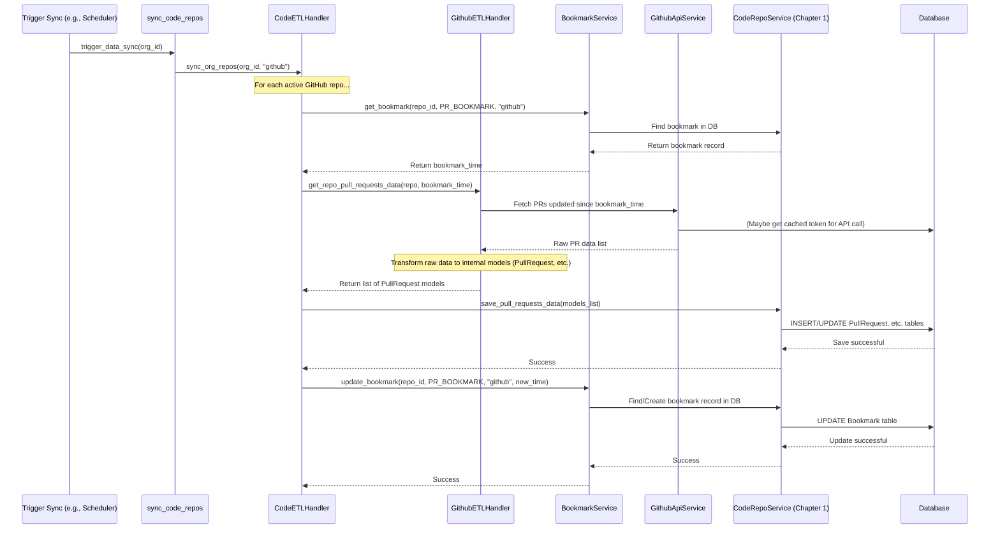

# Chapter 4: Data Sync & ETL (`mhq/service/*/sync`)

Welcome back! In [Chapter 3: Bookmark Service](03_bookmark_service_.md), we learned how our application cleverly uses bookmarks to remember the last time it fetched data, avoiding re-fetching everything. But how does the actual process of fetching, processing, and storing this data happen?

Imagine our application needs to show the latest stats about Pull Requests (PRs) for your team's GitHub repository. The data lives on GitHub, but our application needs it in its own database ([Chapter 1: SQLAlchemy Data Models & Store](01_sqlalchemy_data_models___store_.md)) to analyze and display it. How do we get the *new* data from GitHub and update our internal records?

This is the job of the **Data Sync & ETL** process, primarily located in directories like `mhq/service/code/sync`, `mhq/service/workflows/sync`, and `mhq/service/incidents/sync`.

Think of it as a **scheduled delivery service** for data. It periodically goes out to external sources (like GitHub or GitLab), picks up new packages (new PRs, workflow runs, etc.), unpacks and relabels them to fit our internal system, and then stores them neatly in our warehouse (the database).

## What is ETL? (Extract, Transform, Load)

ETL is a standard term for a common data process:

1. **Extract:** Get the data from its original source (e.g., fetching new PRs from the GitHub API).
2. **Transform:** Convert the data from the source's format into the format our application needs (e.g., changing a GitHub PR object into our internal `PullRequest` model). This might also involve calculating new information based on the extracted data.
3. **Load:** Save the transformed data into our application's database.

Our Data Sync system uses this ETL pattern to keep our internal data relatively up-to-date with the external world.

## Meet the Delivery Crews: ETL Handlers

For each type of data (like code repositories, CI/CD workflows, incidents) and each external provider (like GitHub, GitLab), we have a specialized "delivery crew" called an **ETL Handler**.

* `mhq/service/code/sync/etl_github_handler.py`: Knows how to handle ETL for *code* data (like PRs) specifically from *GitHub*.
* `mhq/service/code/sync/etl_gitlab_handler.py`: Knows how to handle ETL for *code* data from *GitLab*.
* Similar handlers exist for workflows (`mhq/service/workflows/sync/`) and incidents (`mhq/service/incidents/sync/`).

These handlers contain the specific logic for:

* Talking to the correct external API (using tools from [Chapter 2: External API Integration (`mhq/exapi`)](02_external_api_integration___mhq_exapi___.md)).
* Understanding the data format provided by that specific source.
* Transforming that data into our internal [SQLAlchemy Data Models & Store](01_sqlalchemy_data_models___store_.md).

## The Sync Process: Putting It All Together

The Data Sync process orchestrates these ETL handlers and the [Bookmark Service](03_bookmark_service_.md) to perform the updates. Let's walk through how it syncs Pull Requests for a specific GitHub repository.

**The Goal:** Fetch only the PRs from GitHub that have been created or updated since our last check, transform them into our internal `PullRequest` format, and save them to our database.

**The Steps (Conceptual):**

1. **Check the Bookmark:** Ask the [Bookmark Service](03_bookmark_service_.md) for the "last synced time" for PRs in this specific repository (e.g., `repo-xyz`). Let's say it returns `2023-11-01T10:00:00Z`.
2. **Extract (Fetch New Data):** Use the appropriate [External API Integration (`mhq/exapi`)](02_external_api_integration___mhq_exapi___.md) service (e.g., `GithubApiService`) to ask GitHub: "Give me all PRs for `repo-xyz` that were updated *after* `2023-11-01T10:00:00Z`."
3. **Transform (Convert Data):** For each PR received from GitHub, the corresponding ETL Handler (e.g., `GithubETLHandler`) converts the GitHub-formatted data into our internal `PullRequest` model ([Chapter 1: SQLAlchemy Data Models & Store](01_sqlalchemy_data_models___store_.md)), possibly calculating metrics or filling in extra details.
4. **Load (Save Data):** The ETL Handler uses the repository services (e.g., `CodeRepoService` from [Chapter 1: SQLAlchemy Data Models & Store](01_sqlalchemy_data_models___store_.md)) to save the newly transformed `PullRequest` objects (along with related data like commits or review events) into our database. This might involve creating new records or updating existing ones.
5. **Update the Bookmark:** If everything was successful, tell the [Bookmark Service](03_bookmark_service_.md) to update the bookmark for PRs in `repo-xyz` to the *current* time (or the timestamp of the latest processed PR).

This cycle ensures that the next time the sync runs, it only picks up changes that happened *since* this run.

## How It Looks in Code (Simplified)

The overall sync process for an organization is often triggered by a simple function.

```python
# File: backend/analytics_server/mhq/service/sync_data.py (Simplified)
from mhq.service.code import sync_code_repos # Imports the code sync function
from mhq.service.workflows import sync_org_workflows # Imports workflow sync
# ... other sync function imports ...
from mhq.utils.log import LOG

# Define the sequence of sync tasks
sync_sequence = [
    sync_code_repos,
    sync_org_workflows,
    # ... other sync tasks ...
]

# Main function to trigger all syncs for an organization
def trigger_data_sync(org_id: str):
    LOG.info(f"Starting data sync for org {org_id}")
    # Loop through each sync function in the sequence
    for sync_func in sync_sequence:
        try:
            # Call the specific sync function (e.g., sync_code_repos)
            sync_func(org_id)
            LOG.info(f"Sync for {sync_func.__name__} completed.")
        except Exception as e:
            # Log errors but continue with the next sync function
            LOG.error(f"Error in {sync_func.__name__}: {str(e)}")
            continue
    LOG.info(f"Data sync for org {org_id} finished.")
```

**Explanation:**

* `sync_sequence`: A list defining the order in which different types of data should be synced (e.g., code first, then workflows).
* `trigger_data_sync(org_id)`: This is the main entry point. It takes an organization ID.
* It iterates through the `sync_sequence` and calls each function (like `sync_code_repos(org_id)`).
* It includes basic error handling to log failures but allow other sync tasks to proceed.

Now, let's look inside `sync_code_repos`:

```python
# File: backend/analytics_server/mhq/service/code/sync/etl_handler.py (Simplified)
# ... imports for services, models, etc. ...
from mhq.service.bookmark import get_bookmark_service, BookmarkType
from mhq.store.repos.code import CodeRepoService
from mhq.service.code.sync.etl_code_factory import CodeETLFactory

# Represents the combined handler for the entire code ETL process
class CodeETLHandler:
    def __init__(self, code_repo_service, etl_service, bookmark_service, ...):
        self.code_repo_service = code_repo_service # To save data (Chapter 1)
        self.etl_service = etl_service            # Specific provider handler (e.g., GithubETLHandler)
        self.bookmark_service = bookmark_service  # To get/set bookmarks (Chapter 3)
        # ... other services ...

    # Main method to sync PRs for a specific repository
    def _sync_repo_pull_requests_data(self, org_repo: OrgRepo) -> None:
        try:
            # 1. Get Bookmark
            bookmark_time = self.bookmark_service.get_bookmark(
                str(org_repo.id), BookmarkType.ORG_REPO_BOOKMARK, org_repo.provider, ...
            )

            # 2. Extract + Transform + Load (Delegated)
            # Ask the specialized handler (e.g., GithubETLHandler) to do the work
            (pull_requests, commits, events) = self.etl_service.get_repo_pull_requests_data(
                org_repo, bookmark_time  # Pass the repo and the bookmark time
            )
            # The etl_service handles fetching from GitHub/GitLab, transforming,
            # and preparing the data models.

            # Persist the transformed data using RepoService (Chapter 1)
            self.code_repo_service.save_pull_requests_data(
                pull_requests, commits, events
            )

            # 5. Update Bookmark
            if pull_requests: # Only update if we processed something
                latest_pr_time = max(pr.updated_at for pr in pull_requests)
                self.bookmark_service.update_bookmark(
                    str(org_repo.id), BookmarkType.ORG_REPO_BOOKMARK, org_repo.provider, latest_pr_time
                )
            # ... handle case where nothing new was found ...

        except Exception as e:
            LOG.error(f"Error syncing PRs for repo {org_repo.name}: {str(e)}")
            raise e # Signal failure


# Function called by trigger_data_sync
def sync_code_repos(org_id: str):
    # ... setup: find providers (GitHub/GitLab), get factory ...
    code_repo_service = CodeRepoService()
    etl_factory = CodeETLFactory(org_id) # Factory to create specific handlers
    bookmark_service = get_bookmark_service()

    # Loop through each provider (e.g., "github", "gitlab")
    for provider in code_providers:
        try:
            # Get the specific ETL Handler (e.g., GithubETLHandler instance)
            provider_etl_handler = etl_factory(provider)

            # Create the main handler, giving it the tools it needs
            code_etl_handler = CodeETLHandler(
                code_repo_service, provider_etl_handler, bookmark_service, ...
            )

            # Tell the handler to sync repos for this provider
            # This internally calls _sync_repo_pull_requests_data for each repo
            code_etl_handler.sync_org_repos(org_id, provider)

        except Exception as e:
            LOG.error(f"Error syncing for provider {provider}: {str(e)}")
            continue
```

**Explanation:**

* `sync_code_repos` sets up the necessary services (like `CodeRepoService`, `BookmarkService`).
* It uses a `CodeETLFactory` to get the correct specialized handler (`provider_etl_handler`) for the specific provider (GitHub or GitLab).
* It creates a main `CodeETLHandler` which orchestrates the process.
* The `_sync_repo_pull_requests_data` method inside `CodeETLHandler` performs the 5 steps conceptually described earlier: get bookmark, delegate ETL to `provider_etl_handler`, save data via `code_repo_service`, update bookmark.

Let's peek inside a specialized handler like `GithubETLHandler`:

```python
# File: backend/analytics_server/mhq/service/code/sync/etl_github_handler.py (Simplified)
# ... imports ...
from mhq.exapi.github import GithubApiService # Chapter 2 service
from mhq.store.models.code import PullRequest, PullRequestCommit, PullRequestEvent # Chapter 1 models

class GithubETLHandler(CodeProviderETLHandler): # Implements the standard interface
    def __init__(self, org_id, github_api_service: GithubApiService, code_repo_service, ...):
        self.org_id = org_id
        self._api = github_api_service # Stores the GitHub ambassador (Chapter 2)
        self.code_repo_service = code_repo_service # Stores the DB saver (Chapter 1)
        # ... other services needed ...

    # Method called by CodeETLHandler._sync_repo_pull_requests_data
    def get_repo_pull_requests_data(self, org_repo: OrgRepo, bookmark: datetime):
        # 1. Extract: Talk to GitHub API via GithubApiService
        # Get the underlying GitHub library object for the specific repo
        github_repo_obj = self._api.get_repo(org_repo.org_name, org_repo.name)
        # Fetch paginated list of PRs (using the _api service from Chapter 2)
        # The API call would internally filter based on 'updated_since' bookmark
        github_prs_paginated = self._api.get_pull_requests(github_repo_obj, updated_since=bookmark) # Simplified call

        # ... logic to iterate through pages and filter PRs based on bookmark exactly ...
        filtered_raw_prs = [...] # List of raw PR data from GitHub

        # 2. Transform + Prepare Load Data
        pull_requests: List[PullRequest] = []
        pr_commits: List[PullRequestCommit] = []
        pr_events: List[PullRequestEvent] = []

        for raw_github_pr in filtered_raw_prs:
            # Convert raw GitHub PR data into our internal models
            pr_model = self._to_pr_model(raw_github_pr, org_repo.id)
            # Fetch and convert related data (reviews, commits)
            event_models = self._to_pr_events(raw_github_pr, pr_model)
            commit_models = self._to_pr_commits(raw_github_pr, pr_model)
            # Potentially calculate metrics and add to pr_model

            pull_requests.append(pr_model)
            pr_events.extend(event_models)
            pr_commits.extend(commit_models)

        # 3. Return transformed data (to be loaded by CodeETLHandler)
        return pull_requests, pr_commits, pr_events

    # --- Helper methods for Transformation ---
    def _to_pr_model(self, raw_github_pr, repo_id) -> PullRequest:
        # ... logic to map fields from raw_github_pr to PullRequest model ...
        pr_model = PullRequest(
            id=uuid.uuid4(), # Generate our internal ID
            repo_id=repo_id,
            number=str(raw_github_pr.get("number")),
            title=raw_github_pr.get("title"),
            state=self._get_state(raw_github_pr), # Map state
            author=raw_github_pr.get("user", {}).get("login"),
            created_at=parse_datetime(raw_github_pr.get("created_at")),
            # ... map other fields ...
            data=raw_github_pr # Store the original raw data too
        )
        return pr_model

    def _to_pr_events(self, raw_github_pr, pr_model) -> List[PullRequestEvent]:
        # ... fetch reviews using self._api, convert to PullRequestEvent models ...
        return [...]

    def _to_pr_commits(self, raw_github_pr, pr_model) -> List[PullRequestCommit]:
        # ... fetch commits using self._api, convert to PullRequestCommit models ...
        return [...]

    def _get_state(self, raw_github_pr):
        # ... logic to determine our internal state (OPEN, MERGED, CLOSED) ...
        pass
```

**Explanation:**

* `GithubETLHandler` holds an instance of `GithubApiService` (`self._api`) to talk to GitHub.
* `get_repo_pull_requests_data` implements the core ETL logic for GitHub PRs.
  * **Extract:** Uses `self._api` methods (like `get_pull_requests`) to fetch raw data, filtering by the `bookmark` time.
  * **Transform:** Iterates through the fetched raw data. Uses helper methods like `_to_pr_model`, `_to_pr_events`, `_to_pr_commits` to convert the raw GitHub dictionary/object into instances of our internal database models (`PullRequest`, `PullRequestEvent`, `PullRequestCommit` from [Chapter 1: SQLAlchemy Data Models & Store](01_sqlalchemy_data_models___store_.md)).
  * **Load (Preparation):** It gathers all the transformed model objects into lists.
* It returns these lists of internal model objects back to `CodeETLHandler`, which then uses the `CodeRepoService` to actually perform the database save operation (the Load step).

## Under the Hood: The Sync Flow Diagram

Here's how the pieces interact when syncing PRs for one GitHub repository:



This diagram shows the collaboration: `sync_code_repos` starts the process, `CodeETLHandler` orchestrates per repo, `BookmarkService` provides the time window, `GithubETLHandler` interacts with the `GithubApiService` (Chapter 2) to Extract, Transforms the data, `CodeRepoService` (Chapter 1) Loads it into the DB, and finally the `BookmarkService` updates the timestamp.

## Conclusion

The Data Sync & ETL system (`mhq/service/*/sync`) is the engine that keeps our application's data fresh. It combines several concepts we've learned:

* It uses the [Bookmark Service](03_bookmark_service_.md) to know *what* new data to fetch.
* It uses [External API Integration (`mhq/exapi`)](02_external_api_integration___mhq_exapi___.md) to **Extract** data from sources like GitHub/GitLab.
* It uses specialized **ETL Handlers** (like `GithubETLHandler`) to **Transform** the external data into our internal [SQLAlchemy Data Models & Store](01_sqlalchemy_data_models___store_.md).
* It uses the Store/Repositories from Chapter 1 to **Load** the transformed data into our database.

This scheduled process ensures that the information presented by the application reflects the reality of the external services, without constantly querying them for *all* historical data.

Now that we understand how data gets *into* the system, how do we manage general settings and configurations for the application itself?

Next up: [Chapter 5: Configuration Settings (`mhq/service/settings`)](05_configuration_settings___mhq_service_settings___.md)

---

Generated by [AI Codebase Knowledge Builder](https://github.com/The-Pocket/Tutorial-Codebase-Knowledge)
