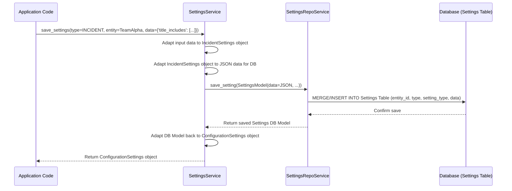

# Chapter 5: Configuration Settings (`mhq/service/settings`)

Welcome back! In [Chapter 4: Data Sync & ETL (`mhq/service/*/sync`)](04_data_sync___etl___mhq_service___sync___.md), we saw how the application pulls in data from external sources like GitHub and stores it. Now, let's think about how we manage the application's *own* preferences and configurations.

Imagine you want the application to highlight specific types of incidents, maybe only those with "production" or "critical" in their titles. Or perhaps you want to exclude certain Pull Requests (maybe those created by a bot) from metrics calculations. Where do these kinds of rules and preferences get stored and managed?

This is where the **Configuration Settings (`mhq/service/settings`)** system comes in. Think of it as the application's **preferences panel**. It provides a structured way to define, store, and retrieve various settings that control how different parts of the application behave. These settings can be applied globally (at the organization level) or more specifically (e.g., just for one team).

**Our Use Case:** We want to configure filters for incidents for a specific team, so only incidents whose titles contain certain keywords (like "Error" or "Failure") are shown or processed.

## What are Configuration Settings?

This system manages how the application is configured for different users, teams, or organizations. Here are the key ideas:

1. **Setting Types (`SettingType`):** This defines *what kind* of setting we are dealing with. Examples include:
    * `INCIDENT_SETTING`: For configuring incident filters (like our use case).
    * `EXCLUDED_PRS_SETTING`: For listing PRs to ignore in calculations.
    * `DEFAULT_SYNC_DAYS_SETTING`: How far back in time should initial data syncs go?
    * *... and potentially many others.*
    Each `SettingType` corresponds to a specific piece of configuration.

2. **Entities (`EntityType`):** Settings usually apply to *something*. This could be an entire Organization (`EntityType.ORG`) or a specific Team (`EntityType.TEAM`). This allows for different settings for different groups.

3. **Setting Data:** This is the actual value of the setting. For `INCIDENT_SETTING`, it might be a list of keywords (`["Error", "Failure"]`). For `EXCLUDED_PRS_SETTING`, it might be a list of PR identifiers. This data is stored flexibly (as JSON) in the database but is represented by structured Python objects (Data Classes) in the code for easier use.

4. **Default vs. Specific:** For every `SettingType`, there's a default value. For example, the default incident filter might be an empty list (no filtering). However, you can save a *specific* setting for an entity (like Team X) that overrides the default. If Team X has saved `["Error", "Failure"]` as its `INCIDENT_SETTING`, it uses that; otherwise, it falls back to the default (empty list).

5. **`SettingsService`:** This is the main "manager" class you interact with to get or save settings. You tell it the `setting_type`, the `entity_type` (Org or Team), and the `entity_id` (the specific Org or Team ID), and it handles the rest.

## How Settings are Stored

* **In Code (Structured):** When working with settings *in the code*, we use specific Python dataclasses defined in `mhq/service/settings/models.py`. For example, `IncidentSettings` might look like this:

    ```python
    # File: backend/analytics_server/mhq/service/settings/models.py (Simplified Excerpt)
    from dataclasses import dataclass
    from typing import List

    # Base class for all setting data models
    @dataclass
    class BaseSetting:
        pass

    # Specific data structure for Incident Settings
    @dataclass
    class IncidentSettings(BaseSetting):
        title_filters: List[str] # Holds the list of keywords

    # Specific data structure for Excluded PRs
    @dataclass
    class ExcludedPRsSetting(BaseSetting):
        excluded_pr_ids: List[str] # Holds the list of PR IDs
    ```

    This gives us type safety and code completion when working with settings data.

* **In Database (Generic):** In the database ([Chapter 1: SQLAlchemy Data Models & Store](01_sqlalchemy_data_models___store_.md)), all settings are stored in a single table called `Settings`. This table has a generic structure:

    ```python
    # File: backend/analytics_server/mhq/store/models/settings/configuration_settings.py (Simplified Excerpt)
    from mhq.store import db
    from sqlalchemy.dialects.postgresql import UUID, ENUM, JSONB

    class SettingType(Enum): # Defined elsewhere, lists all setting types
        INCIDENT_SETTING = "INCIDENT_SETTING"
        EXCLUDED_PRS_SETTING = "EXCLUDED_PRS_SETTING"
        # ... other types ...

    class EntityType(Enum): # Defined elsewhere
        ORG = "ORG"
        TEAM = "TEAM"
        # ... other types ...

    class Settings(db.Model):
        __tablename__ = "Settings"

        entity_id = db.Column(UUID(as_uuid=True), primary_key=True) # Which team/org?
        entity_type = db.Column(ENUM(EntityType), primary_key=True) # Is it a team or org?
        setting_type = db.Column(ENUM(SettingType), primary_key=True) # What kind of setting?
        data = db.Column(JSONB, default="{}") # The actual setting value (flexible JSON)
        # ... other columns like updated_by, updated_at ...
    ```

  * The combination of `entity_id`, `entity_type`, and `setting_type` uniquely identifies a specific setting record.
  * The `data` column stores the actual settings (like our list of keywords) as JSON. The `SettingsService` is responsible for converting between the structured Python dataclasses (like `IncidentSettings`) and this JSON format when reading from or writing to the database.

## Using the Settings Service

Let's solve our use case: configuring incident title filters for Team "alpha".

### **1. Getting the Current Setting**

First, we need to see what the current setting is for Team "alpha". We use the `get_settings_service()` helper to get an instance of `SettingsService`.

```python
# Somewhere in our application code...
from mhq.service.settings import get_settings_service
from mhq.store.models.settings import SettingType, EntityType

# Assume we know the ID for Team Alpha
team_alpha_id = "team-uuid-alpha-123"

# Get the settings manager
settings_service = get_settings_service()

# Ask for the INCIDENT_SETTING for TEAM "alpha"
# We could also use `get_or_set_default_settings` which creates a default
# record if one doesn't exist. `get_settings` returns None if not found.
team_settings_config = settings_service.get_settings(
    setting_type=SettingType.INCIDENT_SETTING,
    entity_type=EntityType.TEAM,
    entity_id=team_alpha_id,
)

if team_settings_config:
    # Access the specific settings dataclass (will be IncidentSettings)
    incident_filters = team_settings_config.specific_settings
    print(f"Current filters for Team Alpha: {incident_filters.title_filters}")
    # Example Output (if previously set): Current filters for Team Alpha: ['Error', 'Failure']
    # Example Output (if default): Current filters for Team Alpha: []
else:
    print("No specific Incident Settings found for Team Alpha, using defaults.")
    # We could then fetch the default using get_default_setting
    default_setting = settings_service.get_default_setting(SettingType.INCIDENT_SETTING)
    print(f"Default filters: {default_setting.title_filters}")
    # Example Output: Default filters: []

```

**Explanation:**

* We import the necessary items, including `SettingType` and `EntityType`.
* We get the `settings_service` instance.
* We call `get_settings`, specifying we want the `INCIDENT_SETTING` for a `TEAM` with the ID `team_alpha_id`.
* The service returns a `ConfigurationSettings` object (or `None`). This object contains general info (who updated it, when) and, crucially, the `specific_settings` attribute, which holds the actual structured data (an `IncidentSettings` instance in this case).
* We can then access the `title_filters` list from the `specific_settings`.

### **2. Saving a New Setting**

Now, let's update the filters for Team Alpha to `["Urgent", "FIX NOW"]`.

```python
# Continuing the example...
from mhq.service.settings import get_settings_service
from mhq.store.models.settings import SettingType, EntityType
# Assume current_user is the User object performing the action (optional)
# from mhq.store.models.core.users import Users
# current_user: Users = get_user_from_request()

team_alpha_id = "team-uuid-alpha-123"
settings_service = get_settings_service()

# Define the new data for the setting
new_filter_data = {
    "title_includes": ["Urgent", "FIX NOW"] # Matches API expectation
}

# Save the INCIDENT_SETTING for TEAM "alpha" with the new data
# The `setter` argument is optional, records who made the change.
updated_settings_config = settings_service.save_settings(
    setting_type=SettingType.INCIDENT_SETTING,
    entity_type=EntityType.TEAM,
    entity_id=team_alpha_id,
    setting_data=new_filter_data,
    # setter=current_user # Optional: Who is saving this?
)

# The returned object reflects the saved state
updated_incident_filters = updated_settings_config.specific_settings
print(f"Saved filters for Team Alpha: {updated_incident_filters.title_filters}")
# Example Output: Saved filters for Team Alpha: ['Urgent', 'FIX NOW']
```

**Explanation:**

* We define the `new_filter_data` as a dictionary. This format usually matches what the API expects.
* We call `save_settings`, providing the `setting_type`, `entity_type`, `entity_id`, and the `setting_data`.
* The `SettingsService` takes this dictionary, validates it, converts it into the internal `IncidentSettings` structure, and then saves it to the `Settings` database table (either creating a new row or updating an existing one).
* It returns the updated `ConfigurationSettings` object containing the newly saved data.

## How it Works Under the Hood (Saving a Setting)

When `settings_service.save_settings(...)` is called:

1. **Input:** The `SettingsService` receives the type, entity info, and the raw `setting_data` dictionary.
2. **Data Adaptation (Input -> Dataclass):** It uses helper methods (like `_handle_config_setting_from_json_data`) to validate the input dictionary and convert it into the corresponding structured dataclass (e.g., `IncidentSettings(title_filters=['Urgent', 'FIX NOW'])`). This ensures the data has the correct format before saving.
3. **Data Adaptation (Dataclass -> DB JSON):** It then uses other helper methods (like `_handle_config_setting_to_db_setting`) to convert the structured dataclass back into a dictionary suitable for storing in the database's JSON `data` column (e.g., `{'title_filters': ['Urgent', 'FIX NOW']}`).
4. **Prepare DB Model:** It prepares an instance of the `Settings` SQLAlchemy model ([Chapter 1: SQLAlchemy Data Models & Store](01_sqlalchemy_data_models___store_.md)), filling in `entity_id`, `entity_type`, `setting_type`, and the adapted JSON `data`.
5. **Call Repo:** It passes this `Settings` model object to the `SettingsRepoService` (from `mhq/store/repos/settings.py`), calling its `save_setting` method.
6. **Database Interaction:** The `SettingsRepoService` uses SQLAlchemy's `session.merge()` command. This SQL command tells the database: "If a row with this primary key (`entity_id`, `entity_type`, `setting_type`) exists, update it with this new data. If it doesn't exist, insert this new row."
7. **Return Saved Data:** The `SettingsRepoService` confirms the save and potentially fetches the saved/updated row. This `Settings` object is returned back to the `SettingsService`.
8. **Adapt & Return:** The `SettingsService` adapts the database `Settings` object back into the `ConfigurationSettings` wrapper (containing the structured `specific_settings` dataclass) and returns it to the original caller.

Here's a diagram showing the flow:



### A Look Inside `SettingsService`

The `SettingsService` acts as the central coordinator and translator.

```python
# File: backend/analytics_server/mhq/service/settings/configuration_settings.py (Simplified)
from mhq.store.repos.settings import SettingsRepoService
from mhq.store.models.settings import Settings, SettingType, EntityType
from mhq.service.settings.models import ConfigurationSettings, IncidentSettings # etc.
from mhq.service.settings.default_settings_data import get_default_setting_data

class SettingsService:
    def __init__(self, _settings_repo: SettingsRepoService):
        self._settings_repo = _settings_repo # Needs the repo service to talk to DB

    # --- Main function to get settings ---
    def get_settings(
        self, setting_type: SettingType, entity_type: EntityType, entity_id: str
    ) -> Optional[ConfigurationSettings]:

        # Ask the repository service to find the setting in the DB
        setting_db_model = self._settings_repo.get_setting(
            entity_id=entity_id,
            entity_type=entity_type,
            setting_type=setting_type,
        )
        if not setting_db_model:
            return None # Not found

        # Convert the generic DB model to the structured ConfigurationSettings
        return self._adapt_config_setting_from_db_setting(setting_db_model)

    # --- Main function to save settings ---
    def save_settings(
        self, setting_type: SettingType, entity_type: EntityType, entity_id: str,
        setting_data: Dict = None, setter: Users = None, # User who saved
    ) -> ConfigurationSettings:

        # If no data provided, use the default for this setting type
        if setting_data:
            # Convert input dict -> specific dataclass -> db dict format
            data_for_db = self._adapt_specific_setting_data_from_json(
                setting_type, setting_data
            )
        else:
            data_for_db = get_default_setting_data(setting_type)

        # Check if a setting already exists (to keep created_at time)
        existing_setting = self.get_settings(setting_type, entity_type, entity_id)

        # Create the generic DB model instance
        setting_db_model = Settings(
            entity_id=entity_id,
            entity_type=entity_type,
            setting_type=setting_type,
            data=data_for_db, # The JSON data to save
            updated_by=setter.id if setter else None,
            created_at=existing_setting.created_at if existing_setting else time_now(),
            # ... set updated_at, is_deleted ...
        )

        # Ask the repository service to save this DB model
        saved_db_model = self._settings_repo.save_setting(setting_db_model)

        # Convert the saved DB model back to the structured return type
        saved_config_setting = self._adapt_config_setting_from_db_setting(saved_db_model)

        # Optional: Handle side effects if needed (e.g., resetting bookmarks)
        # self._handle_settings_update_side_effect(...)

        return saved_config_setting

    # --- Helper: Convert DB Model -> Structured Config ---
    def _adapt_config_setting_from_db_setting(self, setting: Settings) -> ConfigurationSettings:
        # Figure out which *specific* dataclass to use based on setting.setting_type
        specific_setting = self._handle_config_setting_from_db_setting(
            setting.setting_type, setting.data # setting.data is the raw JSON from DB
        )
        # Wrap it in the ConfigurationSettings object
        return ConfigurationSettings(
            entity_id=setting.entity_id,
            # ... copy other fields ...
            specific_settings=specific_setting, # The specific structured data
        )

    # --- Helper: Figure out specific dataclass based on type ---
    def _handle_config_setting_from_db_setting(self, setting_type: SettingType, db_data):
        if setting_type == SettingType.INCIDENT_SETTING:
            # Convert the DB JSON data into an IncidentSettings instance
            return self._adapt_specific_incident_setting_from_setting_data(db_data)
        if setting_type == SettingType.EXCLUDED_PRS_SETTING:
            # Convert the DB JSON data into an ExcludedPRsSetting instance
            return self._adapt_excluded_prs_setting_from_setting_data(db_data)
        # ... other setting types ...
        raise Exception(f"Invalid Setting Type: {setting_type}")

    # --- Example Adapter: DB JSON -> IncidentSettings Dataclass ---
    def _adapt_specific_incident_setting_from_setting_data(self, data: Dict[str, any]):
        return IncidentSettings(title_filters=data.get("title_filters", []))

    # --- Helper: Convert Input API JSON Dict -> DB Dict (via specific dataclass) ---
    def _adapt_specific_setting_data_from_json(self, setting_type: SettingType, setting_data: dict):
        # This converts API dict -> specific dataclass
        specific_setting = self._handle_config_setting_from_json_data(
            setting_type, setting_data
        )
        # This converts specific dataclass -> dict format for DB JSON
        return self._handle_config_setting_to_db_setting(setting_type, specific_setting)

    # ... other adapter methods for converting data formats ...

# Helper to get an instance of the service
def get_settings_service():
    return SettingsService(SettingsRepoService()) # Inject the repo dependency
```

**Explanation:**

* The `SettingsService` relies on `SettingsRepoService` for database operations.
* `get_settings` fetches from the repo and uses `_adapt_config_setting_from_db_setting` to turn the generic database row into a useful `ConfigurationSettings` object with the correct `specific_settings` dataclass inside.
* `save_settings` handles defaults, adapts the input `setting_data` into the correct format (`_adapt_specific_setting_data_from_json`), creates the `Settings` database model, calls the repo to save it, and then adapts the result back for the caller.
* Various internal helper methods (`_adapt_...`, `_handle_...`) perform the crucial task of translating between the generic database JSON format and the specific, structured Python dataclasses used in the code.

## Adding New Setting Types Easily

The project includes a helpful developer script: `backend/dev_scripts/make_new_setting.py`. If you need to add a completely new type of setting (e.g., "WORKFLOW_FAILURE_ALERT_EMAILS_SETTING"), running this script will ask you for the new setting name and its fields (e.g., `emails: List[str]`). It will then automatically:

1. Add the new type to the `SettingType` Enum.
2. Create a new dataclass (e.g., `WorkflowFailureAlertEmailsSetting`) in `mhq/service/settings/models.py`.
3. Add default data generation in `default_settings_data.py`.
4. Add the necessary adapter methods in `SettingsService`.
5. Update the API response adapter.

This scaffolding saves a lot of boilerplate code when extending the settings system.

## Conclusion

The Configuration Settings system (`mhq/service/settings`) provides a flexible and robust way to manage application preferences.

* It allows defining different **`SettingType`s** for various configurations.
* Settings can be applied per **`EntityType`** (Org or Team).
* It handles **defaults** and allows **specific overrides**.
* The **`SettingsService`** manages getting and saving settings, translating between structured code models and the generic database storage.
* The `Settings` database table stores all settings generically using a JSON `data` column.
* A helper script simplifies adding new setting types.

This system acts as the control panel for tailoring the application's behavior. Now that we understand data models, external APIs, bookmarks, data sync, and settings, let's look at how these pieces are orchestrated together at a higher level in the application's core logic.

Next up: [Chapter 6: Service Layer](06_service_layer_.md)

---

Generated by [AI Codebase Knowledge Builder](https://github.com/The-Pocket/Tutorial-Codebase-Knowledge)
