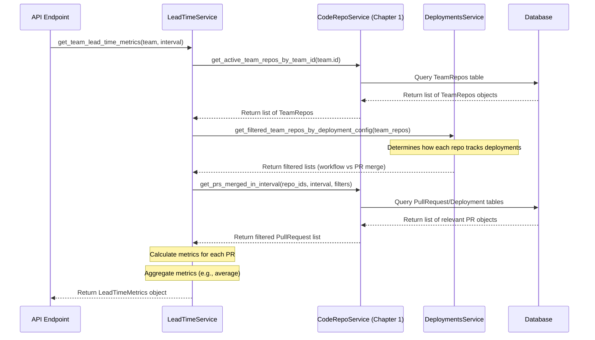

# Chapter 6: Service Layer

Welcome back! In [Chapter 5: Configuration Settings (`mhq/service/settings`)](05_configuration_settings___mhq_service_settings___.md), we saw how the application manages its own preferences and rules using the `SettingsService`. Now, where does the main application logic live? How does the application actually *do* things like calculate complex metrics or coordinate different pieces of data?

Imagine our application as a busy control room. We have seen:

* The filing cabinets and managers who know how to interact with them ([Chapter 1: SQLAlchemy Data Models & Store](01_sqlalchemy_data_models___store_.md)).
* The ambassadors who talk to the outside world ([Chapter 2: External API Integration (`mhq/exapi`)](02_external_api_integration___mhq_exapi___.md)).
* The librarians keeping track of what's been read ([Chapter 3: Bookmark Service](03_bookmark_service_.md)).
* The delivery crews bringing in new data ([Chapter 4: Data Sync & ETL (`mhq/service/*/sync`)](04_data_sync___etl___mhq_service___sync___.md)).
* The control panel for preferences ([Chapter 5: Configuration Settings (`mhq/service/settings`)](05_configuration_settings___mhq_service_settings___.md)).

But who tells everyone what to do? Who takes a request, like "Calculate the average 'Lead Time' for Team Alpha," and coordinates all the other parts to get the answer?

That's the job of the **Service Layer**. Think of services as the **shift managers** in the control room. They contain the core business logic of the application. When an API endpoint (which we'll see in [Chapter 7: Flask Backend & API Structure](07_flask_backend___api_structure_.md)) receives a request, it often delegates the actual work to a specific service. Services orchestrate tasks like getting data from the database (via Repo Services), applying business rules, performing calculations (like DORA metrics), maybe talking to external APIs (via ExAPI Services), and returning the final result.

**Use Case:** Calculate the DORA "Lead Time for Changes" metric for a specific team over the last month. This involves finding the team's repositories, fetching relevant Pull Requests (PRs) merged in that period, potentially checking deployment information, calculating the time taken for each PR from commit to deployment, and then averaging these times.

## What is a "Service"? (The Shift Managers)

In our project, a "Service" is typically a Python class found within the `mhq/service/` directory (but outside of the `sync` and `settings` sub-directories we've already seen). Each service focuses on a specific area of the application's functionality.

Examples:

* `LeadTimeService` (`mhq/service/code/lead_time.py`): Knows how to calculate Lead Time metrics.
* `RepositoryService` (`mhq/service/code/repository_service.py`): Manages the association between teams and code repositories.
* `IncidentService` (`mhq/service/incidents/incidents.py`): Handles logic related to incidents and their metrics (like Mean Time to Recovery).
* `DeploymentAnalyticsService` (`mhq/service/deployments/analytics.py`): Calculates deployment-related metrics like Deployment Frequency.

These services act as orchestrators. They typically *don't* perform raw database operations or direct external API calls themselves. Instead, they *use* other components:

* They use **RepoServices** (from [Chapter 1: SQLAlchemy Data Models & Store](01_sqlalchemy_data_models___store_.md)) to fetch data from or save data to our database.
* They might use the **SettingsService** (from [Chapter 5: Configuration Settings (`mhq/service/settings`)](05_configuration_settings___mhq_service_settings___.md)) to check for configuration rules.
* They might interact with each other (e.g., `LeadTimeService` might use information from `DeploymentsService`).

The key idea is **separation of concerns**. The Service Layer contains the "how-to" instructions (business logic) for specific tasks, keeping the API layer clean (focused on handling web requests) and the data layer clean (focused on database interactions).

## Why Have a Service Layer?

* **Organization:** Keeps complex logic organized by feature (Lead Time, Incidents, etc.).
* **Reusability:** If calculating Lead Time is needed by both a web API and a background reporting task, both can use the same `LeadTimeService`.
* **Maintainability:** Easier to find and modify business logic when it's located in dedicated services.
* **Testability:** Services can often be tested independently of the web framework or database by providing mock versions of their dependencies (like RepoServices).
* **Clean APIs:** API endpoints (see [Chapter 7: Flask Backend & API Structure](07_flask_backend___api_structure_.md)) stay simple; they mostly just parse the request, call the appropriate service method, and format the response.

## Using the Service Layer: Calculating Lead Time

Let's see how we'd use the `LeadTimeService` to solve our use case: calculating Lead Time for Team Alpha. Somewhere in our application (most likely an API endpoint handler), we would do the following:

1. Get an instance of the `LeadTimeService`.
2. Get the `Team` object for Team Alpha (maybe using `CoreRepoService` from Chapter 1).
3. Define the time `Interval` (e.g., the last 30 days).
4. Call the appropriate method on the service.

```python
# Simplified Example (e.g., inside an API endpoint)

from mhq.service.code.lead_time import get_lead_time_service
from mhq.store.repos.core import CoreRepoService # Chapter 1
from mhq.utils.time import Interval, time_now, days_ago

# Assume we have the team ID from the request
team_id = "team-uuid-alpha-123"

# 1. Get the actual Team object from the database
core_repo = CoreRepoService()
team_alpha = core_repo.get_team(team_id)

# 2. Define the time interval (last 30 days)
end_time = time_now()
start_time = days_ago(30)
interval = Interval(from_time=start_time, to_time=end_time)

# 3. Get the Lead Time service manager
lead_time_service = get_lead_time_service()

# 4. Call the service method to calculate the metrics
if team_alpha:
    lead_time_metrics = lead_time_service.get_team_lead_time_metrics(
        team=team_alpha,
        interval=interval,
        # Optional: pr_filter could be passed here if needed
    )
    # The 'lead_time_metrics' object now holds the calculated results
    print(f"Team Alpha Lead Time (Avg): {lead_time_metrics.get_total_lead_time()} seconds")
    # Example Output: Team Alpha Lead Time (Avg): 86400.5 seconds
else:
    print(f"Team {team_id} not found.")

```

**Explanation:**

* We use `CoreRepoService` ([Chapter 1: SQLAlchemy Data Models & Store](01_sqlalchemy_data_models___store_.md)) to fetch the `Team` object based on its ID.
* We create an `Interval` object defining our desired time range.
* We use the helper function `get_lead_time_service()` to get an instance of our `LeadTimeService` manager.
* We call the `get_team_lead_time_metrics` method, passing the `team` object and the `interval`.
* The service does all the hard work behind the scenes and returns a `LeadTimeMetrics` object containing the calculated average lead time and its components. Our calling code doesn't need to know *how* it was calculated, just that it gets the result.

## How it Works Under the Hood (Calculating Lead Time)

When `lead_time_service.get_team_lead_time_metrics(team, interval)` is called, the `LeadTimeService` acts as the orchestrator:

1. **Receive Request:** The service receives the `team` object and the `interval`.
2. **Identify Repos:** It asks the `CodeRepoService` ([Chapter 1: SQLAlchemy Data Models & Store](01_sqlalchemy_data_models___store_.md)): "Which repositories does this team actively use?"
3. **Check Deployment Config:** It asks the `DeploymentsService` (another service, possibly using `TeamRepos` info from Chapter 1 or settings from [Chapter 5: Configuration Settings (`mhq/service/settings`)](05_configuration_settings___mhq_service_settings___.md)): "For these repositories, how is deployment tracked? Via workflow runs or based on PR merges?"
4. **Fetch Relevant PRs:** Based on the deployment tracking method, it asks the `CodeRepoService` again: "Fetch all Pull Requests for these specific repositories that were merged within the given `interval` and match criteria relevant for lead time calculation (e.g., they were part of a deployment)."
5. **Calculate Individual Metrics:** The `LeadTimeService` iterates through the list of relevant `PullRequest` objects returned by the `CodeRepoService`. For each PR, it looks at its timestamps (like `created_at`, `merged_at`, `first_commit_at`, associated `deployment_time` if available) and calculates the required DORA sub-metrics (e.g., commit-to-open time, merge time, merge-to-deploy time).
6. **Aggregate Results:** It takes all the individual PR metrics calculated in the previous step and computes the final aggregated metric (e.g., the weighted average Lead Time for Changes) for the entire team over the interval.
7. **Return Result:** It packages these aggregated numbers into a `LeadTimeMetrics` object and returns it.

Here's a simplified diagram showing the collaboration:



## Diving Deeper into `LeadTimeService` Code

Let's look at some simplified snippets from `mhq/service/code/lead_time.py`.

**Class Definition and Dependencies:**

The service class takes instances of other services/repositories it needs to collaborate with during its initialization.

```python
# File: backend/analytics_server/mhq/service/code/lead_time.py (Simplified)

from mhq.store.repos.code import CodeRepoService # Needs DB access (Chapter 1)
from mhq.service.deployments.deployment_service import DeploymentsService # Needs deployment info
from mhq.store.models.core import Team
from mhq.utils.time import Interval
from mhq.service.code.models.lead_time import LeadTimeMetrics

class LeadTimeService:
    # Constructor: Store the needed collaborators
    def __init__(
        self,
        code_repo_service: CodeRepoService,
        deployments_service: DeploymentsService,
    ):
        self._code_repo_service = code_repo_service
        self._deployments_service = deployments_service

    # ... other methods ...
```

**Explanation:**

* The `LeadTimeService` depends on `CodeRepoService` (to get repository and PR data from the DB) and `DeploymentsService` (to understand how deployments work for the team). These dependencies are "injected" when an instance of `LeadTimeService` is created (often by the `get_lead_time_service()` helper function).

**Main Method (`get_team_lead_time_metrics`):**

This method orchestrates the high-level steps.

```python
# File: backend/analytics_server/mhq/service/code/lead_time.py (Simplified Method)

    def get_team_lead_time_metrics(
        self,
        team: Team,
        interval: Interval,
        # pr_filter: Dict[str, PRFilter] = None, # Optional filters
    ) -> LeadTimeMetrics:

        # 1. Find the team's repositories using CodeRepoService
        team_repos = self._code_repo_service.get_active_team_repos_by_team_id(team.id)

        # 2. Delegate to a helper to get metrics for these repos
        # This helper handles fetching PRs and calculating per-PR metrics
        list_of_pr_metrics = self._get_team_repos_lead_time_metrics(
            team_repos, interval #, pr_filter
        )

        # 3. Aggregate the individual PR metrics into a final team average
        final_metrics = self._get_weighted_avg_lead_time_metrics(list_of_pr_metrics)

        return final_metrics
```

**Explanation:**

* It first uses the injected `_code_repo_service` to get the list of repositories associated with the team.
* It then calls internal helper methods (`_get_team_repos_lead_time_metrics` and `_get_weighted_avg_lead_time_metrics`) to do the more detailed work. This keeps the main method relatively clean and focused on orchestration.

**Helper Method (`_get_team_repos_lead_time_metrics`):**

This helper potentially distinguishes between different deployment types and fetches the relevant PRs.

```python
# File: backend/analytics_server/mhq/service/code/lead_time.py (Simplified Helper)

    def _get_team_repos_lead_time_metrics(
        self,
        team_repos: List[TeamRepos],
        interval: Interval,
        # pr_filter: ...,
    ) -> List[LeadTimeMetrics]: # Returns a list of metrics, one per relevant PR

        # 1. Figure out which repos use workflows vs. PR merges for deployments
        (repos_using_workflow, repos_using_pr_merge) = (
            self._deployments_service.get_filtered_team_repos_by_deployment_config(
                team_repos
            )
        )

        # 2. Get metrics for each type separately
        metrics_workflow = self._get_lead_time_metrics_for_repos_using_workflow_deployments(
            repos_using_workflow, interval #, pr_filter
        )
        metrics_pr_merge = self._get_lead_time_metrics_for_repos_using_pr_deployments(
            repos_using_pr_merge, interval #, pr_filter
        )

        # 3. Combine the results
        return metrics_workflow + metrics_pr_merge
```

**Explanation:**

* Uses the `_deployments_service` to sort repositories based on how they track deployments.
* Calls further specialized helper methods to handle the logic specific to each deployment tracking type.

**Calculating Metrics per PR (`_get_lead_time_metrics_for_pr`):**

This helper performs the actual calculation based on data available in a `PullRequest` object.

```python
# File: backend/analytics_server/mhq/service/code/lead_time.py (Simplified Calculation)

    def _get_lead_time_metrics_for_pr(self, pr: PullRequest) -> LeadTimeMetrics:
        # Create a LeadTimeMetrics object using data from the PullRequest model
        # The PullRequest model (Chapter 1) already has some calculated fields
        # like 'merge_time', 'merge_to_deploy', etc., populated during sync (Chapter 4)
        return LeadTimeMetrics(
            first_commit_to_open=pr.first_commit_to_open if pr.first_commit_to_open else 0,
            first_response_time=pr.first_response_time if pr.first_response_time else 0,
            rework_time=pr.rework_time if pr.rework_time else 0,
            merge_time=pr.merge_time if pr.merge_time else 0,
            merge_to_deploy=pr.merge_to_deploy if pr.merge_to_deploy else 0,
            pr_count=1, # Represents one PR
            merged_at=pr.state_changed_at, # Merged timestamp
            pr_id=pr.id # Reference to the PR
        )
```

**Explanation:**

* This simple method takes a `PullRequest` object (which was fetched from the database by `CodeRepoService`).
* It extracts the relevant pre-calculated time durations (like `merge_time`, `merge_to_deploy`) directly from the `PullRequest` object's attributes. These attributes are often populated during the [Data Sync & ETL (`mhq/service/*/sync`)](04_data_sync___etl___mhq_service___sync___.md) process.
* It creates and returns a `LeadTimeMetrics` object representing the metrics for *this single* PR.

The `_get_weighted_avg_lead_time_metrics` method (not shown in detail) would then take a list of these individual `LeadTimeMetrics` objects and calculate the average values.

## Other Services

The project contains other services that follow similar patterns, like:

* `RepositoryService` (`mhq/service/code/repository_service.py`): Handles linking teams to repositories, updating repository details, and ensuring related configurations (like incident services linked to repos) are kept consistent. It uses `CodeRepoService` and `IncidentsRepoService`.
* `IncidentService` (`mhq/service/incidents/incidents.py`): Calculates incident metrics like Mean Time To Recovery (MTTR) and Change Failure Rate (CFR). It uses `IncidentsRepoService` and potentially `SettingsService` to apply filters based on configuration.

They all act as coordinators, implementing specific business logic by leveraging the data access layers (Repo Services) and configuration layers (Settings Service).

## Conclusion

The **Service Layer** (`mhq/service/*` excluding sync/settings) is the heart of the application's business logic.

* It contains **Services** (like `LeadTimeService`, `IncidentService`) which act as **managers** or **orchestrators**.
* Services implement specific business rules and calculations (like DORA metrics).
* They coordinate actions by using other components like **RepoServices** ([Chapter 1: SQLAlchemy Data Models & Store](01_sqlalchemy_data_models___store_.md)) for data access and **SettingsService** ([Chapter 5: Configuration Settings (`mhq/service/settings`)](05_configuration_settings___mhq_service_settings___.md)) for configuration.
* This separation keeps the application organized, reusable, and maintainable.

Now that we understand how the core logic is structured in the Service Layer, how do users actually interact with the application? How are web requests handled and routed to these services?

Next up: [Chapter 7: Flask Backend & API Structure](07_flask_backend___api_structure_.md)

---

Generated by [AI Codebase Knowledge Builder](https://github.com/The-Pocket/Tutorial-Codebase-Knowledge)
