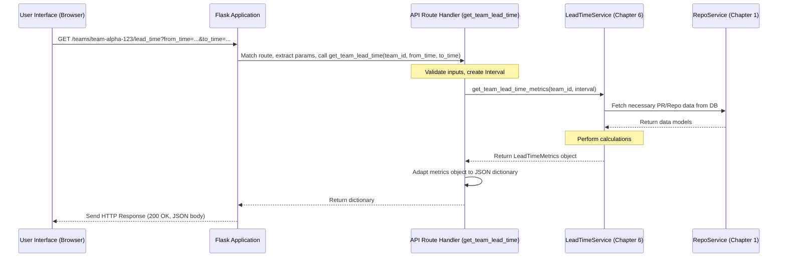

# Chapter 7: Flask Backend & API Structure

Welcome back! In [Chapter 6: Service Layer](06_service_layer_.md), we explored the "shift managers" of our application – the services that handle the core business logic, like calculating complex metrics. But how does the outside world, like the website you see in your browser (the frontend), actually *ask* these services to do their work?

Imagine you click a button on the website to see the "Lead Time" for Team Alpha. Your browser needs a way to tell the backend server: "Hey, I need the Lead Time metrics for Team Alpha for the last month!" This communication happens through a specific interface, the **API** (Application Programming Interface), which is built using the **Flask Backend**.

Think of the Flask Backend as the **main reception desk and switchboard** for our application's control room. When a call (a request) comes in from the outside (like the frontend website), the reception desk (Flask) looks up the extension number (the web address or URL) in its directory. It then routes the call to the correct department (a specific API endpoint handler). This handler might ask a few questions (parse the request details) and then forwards the request to the appropriate shift manager ([Service Layer](06_service_layer_.md)) to get the actual work done. Finally, it packages the answer (the response) and sends it back to the caller.

**Use Case:** How does the website ask the backend to calculate and return the "Lead Time for Changes" metric for Team Alpha for a specific time period?

## What is Flask? (The Building Structure)

**Flask** is a Python web framework. Think of it as the scaffolding or the basic structure for our backend building. It provides the tools and conventions needed to handle web requests, manage web addresses (URLs), and send back web responses easily. It's lightweight and flexible, allowing us to build our backend the way we need to.

The main entry point for our Flask application is typically defined in a file like `app.py`.

```python
# File: backend/analytics_server/app.py (Simplified)
from flask import Flask
from mhq.store import configure_db_with_app # From Chapter 1
# Import "Blueprints" which contain groups of related API endpoints
from mhq.api.pull_requests import app as pull_requests_api
from mhq.api.teams import app as teams_api
# ... import other blueprints (incidents_api, settings_api, etc.)

# Create the main Flask application instance
app = Flask(__name__)

# --- Configuration ---
# Tell Flask how to connect to the database (using function from Chapter 1)
configure_db_with_app(app)

# --- Registering API Endpoints ---
# Tell Flask about the different groups of API endpoints we have defined
app.register_blueprint(pull_requests_api)
app.register_blueprint(teams_api)
# ... register other blueprints ...

# --- Run the Application (if this file is executed directly) ---
if __name__ == "__main__":
    app.run(port=5000) # Start the web server
```

**Explanation:**

* `app = Flask(__name__)`: This line creates the core Flask application object, our main switchboard.
* `configure_db_with_app(app)`: Sets up the database connection using the function we saw in [Chapter 1: SQLAlchemy Data Models & Store](01_sqlalchemy_data_models___store_.md).
* `app.register_blueprint(...)`: This is like telling the main switchboard about different departments (Blueprints). Each blueprint contains related phone extensions (API endpoints). For example, `pull_requests_api` handles all requests related to pull requests.
* `app.run()`: Starts the actual web server, making our backend listen for incoming requests from the network.

## What is an API Endpoint (Route)? (The Extension Numbers)

An **API Endpoint** or **Route** is a specific web address (URL path) that the backend listens to. When a request arrives at one of these addresses, Flask knows which specific Python function (called a "view function" or "handler") should be executed.

In Flask, we define routes using a decorator: `@app.route(...)` or `@blueprint.route(...)`.

Let's look at the route for our use case: getting Lead Time for a team. This route likely lives in `mhq/api/pull_requests.py` (since Lead Time is often associated with PRs).

```python
# File: backend/analytics_server/mhq/api/pull_requests.py (Simplified)
from flask import Blueprint
from datetime import datetime
from voluptuous import Required, Schema, Coerce, All # For validating inputs
from mhq.api.request_utils import queryschema # Our custom decorator
from mhq.service.code.lead_time import get_lead_time_service # Ch 6 Service
from mhq.api.resources.code_resouces import adapt_lead_time_metrics # Response helper

# Create a Blueprint for PR-related endpoints
app = Blueprint("pull_requests", __name__)

# Define the route for getting team lead time
@app.route("/teams/<team_id>/lead_time", methods={"GET"})
@queryschema( # Use our decorator to validate query parameters
    Schema({
        Required("from_time"): All(str, Coerce(datetime.fromisoformat)),
        Required("to_time"): All(str, Coerce(datetime.fromisoformat)),
        # Optional("pr_filter"): ... (Allow optional filters)
    }),
)
def get_team_lead_time(team_id: str, from_time: datetime, to_time: datetime):
    # 1. Validate inputs (team_id exists?) - often done in queryschema or separate validators
    # ... validation logic using QueryValidator ...

    # 2. Define the time interval
    interval = Interval(from_time=from_time, to_time=to_time)

    # 3. Get the appropriate service (from Chapter 6)
    lead_time_service = get_lead_time_service()

    # 4. Call the service method to do the actual work
    # (Team object might be fetched by validator or here using CoreRepoService)
    # team = get_team(team_id)
    metrics = lead_time_service.get_team_lead_time_metrics(
        team_id, # Or team object
        interval,
        # pr_filter (if provided)
    )

    # 5. Adapt the result from the service into a JSON-friendly format
    response_data = adapt_lead_time_metrics(metrics)

    # 6. Return the data (Flask automatically converts dict to JSON response)
    return response_data
```

**Explanation:**

* `app = Blueprint("pull_requests", __name__)`: Creates a blueprint specifically for organizing routes related to pull requests and related metrics.
* `@app.route("/teams/<team_id>/lead_time", methods={"GET"})`: This decorator tells Flask:
  * Listen for requests at the URL path `/teams/some-team-id/lead_time`.
  * The `<team_id>` part is a variable; Flask will capture whatever is in that part of the URL and pass it as an argument (`team_id`) to our function.
  * Only handle `GET` requests (requests that are typically used just for fetching data).
* `@queryschema(...)`: This is a custom decorator used in this project (defined in `mhq/api/request_utils.py`). It automatically:
  * Looks at the query parameters in the URL (like `?from_time=...&to_time=...`).
  * Validates them against the defined `Schema` (ensuring `from_time` and `to_time` are provided and are valid dates).
  * Makes the validated parameters available as arguments (`from_time`, `to_time`) to our function.
* `def get_team_lead_time(...)`: This is the **view function** that Flask calls when a request matches the route.
* Inside the function:
    1. It receives the `team_id` from the URL path and validated `from_time`, `to_time` from the query parameters.
    2. It likely performs further validation (e.g., checking if `team_id` is valid).
    3. It creates the `Interval` object needed by the service.
    4. It gets an instance of the `LeadTimeService` from [Chapter 6: Service Layer](06_service_layer_.md).
    5. It calls the service's `get_team_lead_time_metrics` method, passing the necessary information. **This is where the real work happens.**
    6. It takes the result (`metrics` object) from the service and uses a helper function (`adapt_lead_time_metrics`) to convert it into a simple dictionary format that can be easily turned into JSON.
    7. It returns the dictionary. Flask automatically converts this dictionary into a JSON response with the correct headers for the frontend.

## Requests and Responses (The Phone Call)

The interaction follows a standard web pattern:

1. **Request:** The frontend (or any other client) sends an HTTP request to a specific URL endpoint (e.g., `GET /teams/team-alpha-123/lead_time?from_time=2023-10-01T00:00:00Z&to_time=2023-10-31T23:59:59Z`).
2. **Processing:** Flask receives the request, finds the matching route (`/teams/<team_id>/lead_time`), extracts parameters (`team_id`, `from_time`, `to_time`), and calls the `get_team_lead_time` function. This function then calls the [Service Layer](06_service_layer_.md).
3. **Response:** The `get_team_lead_time` function gets the result, adapts it, and returns it. Flask packages this into an HTTP response (usually with a status code like `200 OK` and the data in JSON format, e.g., `{"average_lead_time": 86400.5, "pr_count": 10, ...}`) and sends it back to the frontend.

## What are Blueprints? (Departments in the Building)

As applications grow, putting all routes in one file becomes messy. Flask's **Blueprints** allow us to group related routes into separate files.

* `mhq/api/pull_requests.py`: Contains routes related to PRs, lead time, etc. (using `app = Blueprint("pull_requests", ...)`).
* `mhq/api/teams.py`: Contains routes for creating, updating, fetching teams (using `app = Blueprint("teams", ...)`).
* `mhq/api/settings.py`: Contains routes for managing settings (using `app = Blueprint("settings", ...)`).
* ... and so on.

In the main `app.py`, we saw `app.register_blueprint(pull_requests_api)`. This tells the main Flask application about all the routes defined within the `pull_requests` blueprint. It's like connecting the department's phone lines to the main building switchboard.

## Under the Hood: Handling a Request

Let's trace the journey of a request for team lead time:

1. **Browser Request:** Your browser sends a `GET` request to `/teams/team-alpha-123/lead_time?from_time=...&to_time=...`.
2. **Flask Entry:** The Flask application (`app` in `app.py`) receives the request.
3. **Routing:** Flask looks at the URL path `/teams/team-alpha-123/lead_time`. It checks its registered routes (including those from blueprints) and finds a match: the `@app.route("/teams/<team_id>/lead_time", ...)` decorator in `mhq/api/pull_requests.py`.
4. **Parameter Extraction:** Flask extracts `team_id="team-alpha-123"` from the path.
5. **Decorator Execution (@queryschema):** Our custom `@queryschema` decorator runs. It parses the query parameters `?from_time=...&to_time=...`, validates them using the `Schema`, and prepares them as arguments `from_time` and `to_time`.
6. **View Function Call:** Flask calls the `get_team_lead_time` function, passing the extracted `team_id`, `from_time`, and `to_time` as arguments.
7. **Service Layer Interaction:** The `get_team_lead_time` function calls the `LeadTimeService` (from [Chapter 6: Service Layer](06_service_layer_.md)), which in turn might call `CodeRepoService` ([Chapter 1: SQLAlchemy Data Models & Store](01_sqlalchemy_data_models___store_.md)) to fetch data from the database.
8. **Response Adaptation:** The service returns the calculated metrics. The `adapt_lead_time_metrics` helper function formats this into a Python dictionary.
9. **Flask Response:** The `get_team_lead_time` function returns the dictionary. Flask converts it to JSON format, adds appropriate HTTP headers (like `Content-Type: application/json`), and sets the status code (usually `200 OK`).
10. **Browser Receives:** Flask sends the complete HTTP response back to your browser, which can then display the results.

Here’s a simplified sequence diagram:



## Conclusion

The **Flask Backend & API Structure** serves as the application's primary interface for handling incoming requests.

* **Flask** provides the web server foundation.
* **APIs** define a contract for how external clients (like the frontend) can interact with the backend.
* **Endpoints (Routes)** map specific URL paths and HTTP methods to Python **view functions**.
* **View functions** handle incoming requests, parse parameters (often using validation helpers like `@queryschema`), delegate the core logic to the **[Service Layer](06_service_layer_.md)**, adapt the results, and return responses (usually as JSON).
* **Blueprints** help organize routes into logical groups.

This structure acts as the crucial link between the user-facing part of the application and the powerful data processing and business logic engines we've explored in previous chapters.

Now that we understand how the backend exposes its functionality through an API, let's finally take a look at the other side – the user interface that actually calls this API to display information to the user.

Next up: [Chapter 8: React Frontend (`web-server/src`)](08_react_frontend___web_server_src___.md)

---

Generated by [AI Codebase Knowledge Builder](https://github.com/The-Pocket/Tutorial-Codebase-Knowledge)
