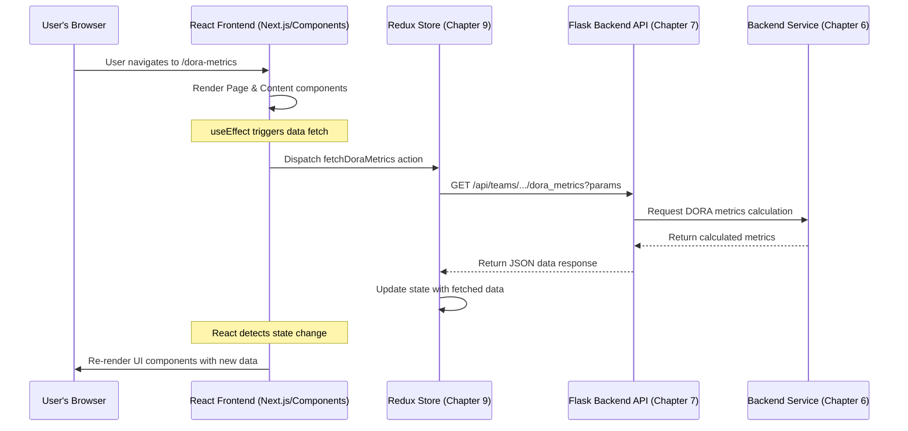

# Chapter 8: React Frontend (`web-server/src`)

Welcome back! In [Chapter 7: Flask Backend & API Structure](07_flask_backend___api_structure_.md), we learned how the backend works like a reception desk, taking requests and routing them to the correct "shift managers" (services) using an API. But how does the user actually *make* those requests? How do they see the results?

That's the job of the **React Frontend**, located in the `web-server/src` directory. Think of the frontend as the **dashboard and control panel** of our entire application. It's what you, the user, see and interact with in your web browser. It takes the data provided by the backend API and presents it visually using charts, tables, and text. It also provides buttons, forms, and menus for you to interact with the application.

**Our Use Case:** A user wants to view the latest DORA metrics for their team. They open their web browser, navigate to the application's DORA metrics page, select their team and a date range, and see the metrics displayed in charts and summary cards.

## What is the Frontend Made Of? (React & Next.js)

Our frontend is built primarily using two powerful tools:

1. **React:** A popular JavaScript library for building user interfaces. React lets us create reusable building blocks called "Components" to make complex UIs manageable. Think of it like using LEGO bricks to build different structures. Each brick (Component) has a specific purpose and appearance.
2. **Next.js:** A framework built *on top* of React. Next.js adds features that make building web applications easier, like:
    * **Routing:** Automatically creates web page addresses (URLs) based on files in the `pages` directory.
    * **Server-Side Rendering (SSR) & Static Site Generation (SSG):** Optimizations to make the website load faster and improve SEO (though we primarily use it for client-side rendering after initial load).
    * **API Routes (optional):** Allows creating backend API endpoints within the Next.js project itself (though our main API is the Flask backend).

Together, React and Next.js provide the foundation for our interactive user interface.

## The Building Blocks of the Frontend

The `web-server/src` directory contains several important sub-directories:

1. **`components/` - The LEGO Bricks:**
    * **What:** This folder holds small, reusable UI pieces. Think of buttons, charts, tables (`PRTable`), loading indicators (`Loader`), custom text elements (`Line`), layout boxes (`FlexBox`), and specific UI elements like the `TeamSelector`.
    * **Why:** Reusability! Instead of writing the code for a button every time we need one, we use the `Button` component. This makes the code cleaner and ensures consistency.
    * **Example:** `src/components/TeamSelector/TeamSelector.tsx` provides the dropdowns for selecting teams and date ranges. `src/components/PRTable/PullRequestsTable.tsx` displays pull request data in a table.

2. **`content/` - Assembling Features:**
    * **What:** This folder contains larger UI sections that often correspond to a major feature on a specific page. They assemble multiple smaller `components` to build a cohesive part of the UI.
    * **Why:** It structures the content for specific pages, like the main body of the DORA metrics dashboard.
    * **Example:** `src/content/DoraMetrics/DoraMetricsBody.tsx` arranges the various charts and summary cards (`DoraScoreV2`, `ChangeTimeCard`, etc.) that make up the main view of the DORA metrics page.

3. **`pages/` - The Actual Web Pages:**
    * **What:** This is a special Next.js directory. Each file (or folder with an `index.tsx` file) inside `pages/` automatically becomes a route (URL path) in the application.
    * **Why:** Defines the different pages users can navigate to. The structure here dictates the website's URL structure.
    * **Example:**
        * `pages/dora-metrics/index.tsx` maps to the `/dora-metrics` URL.
        * `pages/teams/index.tsx` maps to the `/teams` URL.
        * `pages/integrations.tsx` maps to the `/integrations` URL.
        * `pages/_app.tsx`: This is a special file that acts as the main container for *all* pages. It sets up global things like theme providers, Redux state ([Chapter 9: Redux State Management (`web-server/src/slices` & `store`)](09_redux_state_management___web_server_src_slices_____store___.md)), and error handling.

4. **`layouts/` - Consistent Structure:**
    * **What:** Defines the overall structure of pages, like placing the sidebar and header.
    * **Why:** Ensures a consistent look and feel across different pages.
    * **Example:** `src/layouts/ExtendedSidebarLayout/index.tsx` provides the common structure with the navigation sidebar used by most pages.

5. **`store/` & `slices/` - Managing Data:**
    * **What:** These folders are crucial for managing the application's data state using Redux Toolkit. We'll dive deep into this in the next chapter.
    * **Why:** Keeps track of data fetched from the API, user selections (like the current team), and other application states in an organized way.
    * **Next Chapter:** [Chapter 9: Redux State Management (`web-server/src/slices` & `store`)](09_redux_state_management___web_server_src_slices_____store___.md)

## How It Works: Viewing DORA Metrics

Let's walk through our use case: viewing DORA metrics.

1. **Navigation:** The user types `http://localhost:8080/dora-metrics` (or clicks a link) in their browser.
2. **Routing (Next.js):** Next.js sees the `/dora-metrics` path and knows it needs to render the component defined in `pages/dora-metrics/index.tsx`.
3. **Page Component (`Page`):** The `Page` function in `pages/dora-metrics/index.tsx` is executed.
    * It often includes logic to ensure the user is authenticated (`<Authenticated>`).
    * It gets the page layout (e.g., `ExtendedSidebarLayout` which includes the sidebar).
    * It renders the main content component for this page, which is `<DoraMetricsBody />` (from `src/content/DoraMetrics/DoraMetricsBody.tsx`).
4. **Content Component (`DoraMetricsBody`):**
    * This component is responsible for the main DORA metrics display.
    * **Data Fetching:** It typically uses a React hook (`useEffect`) to trigger an action (defined in `src/slices/dora_metrics.ts`) when the selected team or date range changes. This action will:
        * Make an API call to the Flask backend ([Chapter 7: Flask Backend & API Structure](07_flask_backend___api_structure_.md)) at an endpoint like `/api/teams/{team_id}/dora_metrics?fromDate=...&toDate=...`.
        * Store the fetched data in the Redux store ([Chapter 9: Redux State Management (`web-server/src/slices` & `store`)](09_redux_state_management___web_server_src_slices_____store___.md)).
    * **Data Display:** It reads the DORA metrics data from the Redux store using `useSelector`.
    * **Using Components:** It passes the fetched data as properties (props) to smaller, reusable `components` like `<ChangeTimeCard />`, `<WeeklyDeliveryVolumeCard />`, `<DoraScoreV2 />`, etc., which are responsible for rendering specific charts or summaries.
5. **Reusable Components (`ChangeTimeCard`, etc.):** These components receive data (props) and render the corresponding UI elements (charts, text, numbers). They don't usually fetch data themselves but just display what they are given.
6. **Rendering:** React takes all these components, figures out what needs to be displayed or updated, and efficiently renders the final HTML that the browser shows to the user.

## Under the Hood: Requesting and Displaying Data

When the frontend needs data (like DORA metrics):

1. **Trigger:** An action (like selecting a team or loading the page) triggers a data fetch request.
2. **API Call:** The frontend code (often managed by Redux actions/thunks, see Chapter 9) uses a library like `axios` to send an HTTP request to the [Flask Backend & API Structure](07_flask_backend___api_structure_.md) (e.g., `GET /api/teams/.../dora_metrics`).
3. **Backend Processing:** The Flask backend receives the request, routes it to the correct handler, calls the appropriate [Service Layer](06_service_layer_.md) function (e.g., `DoraMetricsService`), which fetches data from the database ([SQLAlchemy Data Models & Store](01_sqlalchemy_data_models___store_.md)), calculates metrics, and prepares the response.
4. **API Response:** The Flask backend sends the data back to the frontend, usually in JSON format.
5. **State Update:** The frontend receives the JSON data. The Redux logic updates the application's state (the "store") with this new data.
6. **Re-render:** React detects that the data in the Redux store (which relevant components are subscribed to) has changed. It automatically re-renders the parts of the UI that depend on this data (like the charts and cards on the DORA metrics page), displaying the updated information.

Here's a simplified diagram of the flow:



## Code Examples (Simplified)

Let's look at simplified versions of the files involved.

**1. The Page (`pages/dora-metrics/index.tsx`)**

This file defines the `/dora-metrics` route and sets up the basic page structure.

```typescript
// File: web-server/pages/dora-metrics/index.tsx (Simplified)
import ExtendedSidebarLayout from 'src/layouts/ExtendedSidebarLayout';
import { Authenticated } from '@/components/Authenticated';
import { DoraMetricsBody } from '@/content/DoraMetrics/DoraMetricsBody';
import { PageWrapper } from '@/content/PullRequests/PageWrapper';
import { useAuth } from '@/hooks/useAuth';
import { useSelector } from '@/store';
import { PageLayout } from '@/types/resources';

// The main component for this page
function Page() {
  // Maybe check if integrations are set up
  const { integrationList } = useAuth();
  // Check loading state from Redux (Chapter 9)
  const isLoading = useSelector(/* ... selector for loading state ... */);

  return (
    // PageWrapper provides title, TeamSelector, etc.
    <PageWrapper title="DORA metrics" isLoading={isLoading}>
      {/* Render the main content if ready, otherwise a loader */}
      {integrationList.length > 0 ? <DoraMetricsBody /> : <Loader />}
    </PageWrapper>
  );
}

// Apply the standard layout (sidebar, header) to this page
Page.getLayout = (page: PageLayout) => (
  <Authenticated> {/* Ensure user is logged in */}
    <ExtendedSidebarLayout>{page}</ExtendedSidebarLayout>
  </Authenticated>
);

export default Page; // Makes this component the default export for the route
```

**Explanation:**

* It imports necessary components like the layout (`ExtendedSidebarLayout`), the main content (`DoraMetricsBody`), and helpers (`Authenticated`, `PageWrapper`).
* The `Page` function defines what's rendered *inside* the layout.
* `PageWrapper` is a reusable component that likely includes the page title bar and the `TeamSelector` component for choosing teams/dates.
* It conditionally renders `DoraMetricsBody` or a `Loader` based on whether integrations are ready.
* `Page.getLayout` wraps the `Page` component with authentication checks and the standard sidebar layout.

**2. Content Section (`src/content/DoraMetrics/DoraMetricsBody.tsx`)**

This component orchestrates the display of DORA metrics.

```typescript
// File: web-server/src/content/DoraMetrics/DoraMetricsBody.tsx (Simplified)
import { useEffect } from 'react';
import { Grid, Divider } from '@mui/material';
import { DoraScoreV2 } from '@/components/DoraScoreV2';
import { FlexBox } from '@/components/FlexBox';
import { useAuth } from '@/hooks/useAuth';
import { useSingleTeamConfig } from '@/hooks/useStateTeamConfig';
import { fetchTeamDoraMetrics } from '@/slices/dora_metrics'; // Chapter 9 action
import { useDispatch, useSelector } from '@/store'; // Chapter 9 hooks

// Import specific metric card components
import { ChangeFailureRateCard } from './DoraCards/ChangeFailureRateCard';
import { ChangeTimeCard } from './DoraCards/ChangeTimeCard';
// ... other card imports

export const DoraMetricsBody = () => {
  const dispatch = useDispatch(); // Hook to send actions (Chapter 9)
  const { orgId } = useAuth();
  const { singleTeamId, dates } = useSingleTeamConfig(); // Get selected team/dates

  // --- Data Fetching Trigger ---
  useEffect(() => {
    // When teamId or dates change, fetch new metrics
    if (orgId && singleTeamId) {
      dispatch(fetchTeamDoraMetrics({ // Send action defined in Chapter 9
        orgId,
        teamId: singleTeamId,
        fromDate: dates.start,
        toDate: dates.end
      }));
    }
  }, [dispatch, orgId, singleTeamId, dates]);

  // --- Data Reading (from Redux Store - Chapter 9) ---
  // const stats = useSelector(state => state.doraMetrics.metrics_summary);
  // const isLoading = useSelector(...)

  // --- Rendering ---
  // if (isLoading) return <MiniLoader />;
  // if (!stats) return <EmptyState ... />;

  return (
    <FlexBox col gap2>
      {/* Top summary score component */}
      <DoraScoreV2 /* Pass aggregated stats */ />
      <Divider />
      {/* Grid layout for individual metric cards */}
      <Grid container spacing={4}>
        <Grid item xs={12} md={6}>
          <ChangeTimeCard /* Pass relevant stats */ />
        </Grid>
        <Grid item xs={12} md={6}>
          <WeeklyDeliveryVolumeCard /* Pass relevant stats */ />
        </Grid>
        {/* ... other Grid items for other cards ... */}
      </Grid>
    </FlexBox>
  );
};

```

**Explanation:**

* It uses the `useEffect` hook to trigger data fetching. When dependencies (`dispatch`, `orgId`, `singleTeamId`, `dates`) change, the effect runs.
* Inside the effect, it calls `dispatch(fetchTeamDoraMetrics(...))`. This function (an "action thunk" from Chapter 9) handles the actual API call and puts the result into the Redux store.
* (Commented out) It would typically use `useSelector` (Chapter 9) to read the loading status and the fetched data from the Redux store.
* It renders various reusable components (`DoraScoreV2`, `ChangeTimeCard`, etc.), passing the necessary data down to them as props.

**3. Reusable Component (`src/components/DoraScoreV2.tsx`)**

This is an example of a smaller, reusable component that just displays data it receives.

```typescript
// File: web-server/src/components/DoraScoreV2.tsx (Simplified)
import { FC } from 'react';
import { FlexBox } from './FlexBox';
import { Line } from './Text';

// Define the expected properties (data) for this component
interface DoraScoreProps {
  leadTimeForChangesScore?: string; // e.g., "ELITE", "HIGH"
  deploymentFrequencyScore?: string;
  // ... other scores
  avg?: string; // Overall average score
}

// The reusable component function
export const DoraScoreV2: FC<DoraScoreProps> = ({
  leadTimeForChangesScore,
  deploymentFrequencyScore,
  avg
}) => {
  // Just renders the data it receives via props
  return (
    <FlexBox gap={1} p={2} /* layout styling */ >
      <FlexBox col alignItems="center">
        <Line huge bold> {avg || '--'} </Line>
        <Line small secondary>Overall Score</Line>
      </FlexBox>
      <Divider orientation="vertical" flexItem />
      <FlexBox col>
        <Line>Lead Time: {leadTimeForChangesScore || 'N/A'}</Line>
        <Line>Deploy Freq: {deploymentFrequencyScore || 'N/A'}</Line>
        {/* ... render other scores ... */}
      </FlexBox>
    </FlexBox>
  );
};
```

**Explanation:**

* It defines an `interface DoraScoreProps` to specify what data (props) it expects to receive.
* The component function `DoraScoreV2` takes these props as input (e.g., `{ avg, leadTimeForChangesScore, ... }`).
* It uses simple layout components (`FlexBox`) and text components (`Line`) to display the scores passed in via props. It doesn't contain complex logic or data fetching itself.

## Conclusion

The **React Frontend (`web-server/src`)** is the visual and interactive part of the `middleware` application.

* Built with **React** (for UI components) and **Next.js** (for routing and structure).
* Organized into reusable **Components** (`src/components`), feature-specific **Content Sections** (`src/content`), and **Pages** (`pages/`) that map to URLs.
* It fetches data from the [Flask Backend & API Structure](07_flask_backend___api_structure_.md).
* It uses a state management system (Redux) to handle application data and state changes efficiently.

Understanding the frontend structure helps in knowing where to find the UI code for specific features and how they interact with the backend API to bring data to life for the user. The next step is to understand how the frontend manages all the data it fetches and the user's interactions.

Next up: [Chapter 9: Redux State Management (`web-server/src/slices` & `store`)](09_redux_state_management___web_server_src_slices_____store___.md)

---

Generated by [AI Codebase Knowledge Builder](https://github.com/The-Pocket/Tutorial-Codebase-Knowledge)
