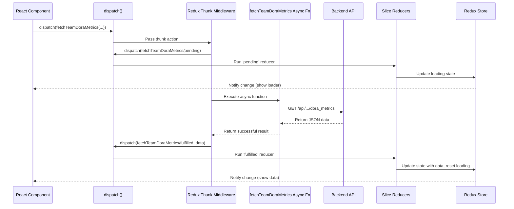

# Chapter 9: Redux State Management (`web-server/src/slices` & `store`)

Welcome back! In [Chapter 8: React Frontend (`web-server/src`)](08_react_frontend___web_server_src___.md), we saw how the user interface is built with React components like LEGO bricks. We learned how components like `DoraMetricsBody` fetch data and display it using smaller components like `ChangeTimeCard`. But how does the frontend *keep track* of all this data? How does the `TeamSelector` component tell the `DoraMetricsBody` component which team was selected? How does the application remember the metrics data after it's fetched from the API?

Imagine the frontend application is like a busy workshop. Lots of different workers (components) need access to the same tools and information (data). If every worker kept their own copy, things would get messy and inconsistent quickly. How do we ensure everyone is working with the same, up-to-date information?

This is where **Redux State Management** comes in. Think of it as the central **status board and inventory system** for our frontend workshop. It provides a single, reliable place to store all the important information (application state) and defines strict rules for how that information can be updated. This makes the flow of data predictable and easier to manage, especially in complex applications.

In this project, we use **Redux Toolkit**, which is the recommended modern way to use Redux, making it much simpler.

**Use Case:** Remember our DORA metrics example?

1. The user selects "Team Alpha" and the "Last 30 Days" date range using the `TeamSelector` component.
2. The `DoraMetricsBody` component needs to know about this selection to fetch the correct data.
3. After fetching, the data needs to be stored somewhere so the `ChangeTimeCard`, `DoraScoreV2`, etc., components can display it.
4. If the user navigates away and comes back, the selected team and data should ideally still be there (or easily refetched).

Redux helps manage all this seamlessly.

## Key Concepts of Redux Toolkit

Let's break down the core ideas of Redux Toolkit as used in our frontend (`web-server/src`):

1. **Store:** (`store/index.ts`)
    * **What:** The *single source of truth* for your entire application's state. Imagine it as the one big status board in the workshop. All important data lives here.
    * **How:** Created using `configureStore` from Redux Toolkit.

2. **Slices:** (`slices/*.ts`, e.g., `slices/app.ts`, `slices/dora_metrics.ts`)
    * **What:** A "slice" manages a specific section (or "slice") of the application state. Think of it as dividing the big status board into dedicated areas: one for "App Settings" (`app` slice), one for "Team Info" (`team` slice), one for "DORA Metrics Data" (`dora_metrics` slice), etc.
    * **How:** Created using `createSlice` from Redux Toolkit. Each slice defines its initial state, the name of the slice, and its reducers.

3. **Reducers:** (Defined inside `createSlice`)
    * **What:** Pure functions that specify *how* the state in a slice should change. They take the current state and an "action" object and return the *new* state. Think of them as the strict rules posted on each section of the status board: "If you receive an 'Update Team' request, here's exactly how to change the Team section." They *never* change the original state directly, they always produce a new one.
    * **How:** Defined within the `reducers` field of `createSlice`. Redux Toolkit cleverly lets you write code that *looks* like it's modifying the state directly (using Immer library), but it handles creating the new state behind the scenes.

4. **Actions:** (Automatically created by `createSlice`)
    * **What:** Plain JavaScript objects that describe *what happened* in the application. They are the *only* way to trigger a state change. Think of them as official request forms you submit to update the status board. An action must have a `type` property (like `app/setSingleTeam`) and often carries some data (`payload`).
    * **How:** When you define a reducer like `setSingleTeam` inside `createSlice`, Redux Toolkit automatically creates an "action creator" function (`appSlice.actions.setSingleTeam`) that you can call to generate the action object `{ type: 'app/setSingleTeam', payload: ... }`.

5. **Dispatch:** (Used in components via `useDispatch` hook)
    * **What:** The function you use to send (or "dispatch") an action to the Redux store. Think of it as the official mailbox for submitting your update request forms (actions).
    * **How:** React components get access to the `dispatch` function using the `useDispatch` hook provided by `react-redux`. `dispatch(appSlice.actions.setSingleTeam(newTeam))` sends the action to the store.

6. **Selectors:** (Used in components via `useSelector` hook)
    * **What:** Functions that allow components to read specific pieces of data *from* the Redux store state. Think of them as looking up information on the central status board.
    * **How:** React components use the `useSelector` hook from `react-redux` to subscribe to parts of the store state. `const selectedTeam = useSelector(state => state.app.singleTeam)` reads the `singleTeam` value from the `app` slice of the state. If that value changes in the store, the component automatically re-renders.

7. **Async Thunks:** (Defined using `createAsyncThunk`, often in slice files)
    * **What:** For handling asynchronous operations like API calls. Fetching data takes time; you need a way to dispatch an action saying "fetching started," then make the API call, and finally dispatch another action with the result ("fetching succeeded") or an error ("fetching failed"). Thunks handle this pattern.
    * **How:** Created using `createAsyncThunk`. When dispatched, it typically dispatches `pending`, `fulfilled`, or `rejected` actions automatically, which you can handle in your slice using `extraReducers`.

## Solving the Use Case with Redux

Let's see how Redux connects the pieces for our DORA metrics scenario:

**1. Selecting a Team & Date Range:**

* The `TeamSelector` component (likely inside `PageWrapper`) has dropdowns. When the user selects "Team Alpha" (let's say its ID is `team-alpha-123`), the component gets the `dispatch` function using the `useDispatch` hook.
* It then calls `dispatch` with an action creator from the `app` slice:

```typescript
// Simplified code in TeamSelector or PageWrapper component
import { useDispatch } from '@/store';
import { appSlice } from '@/slices/app'; // Import the slice

// ... inside the component ...
const dispatch = useDispatch();

const handleTeamChange = (selectedTeam: Team) => {
  // Dispatch the action to update the 'singleTeam' in the 'app' slice
  dispatch(appSlice.actions.setSingleTeam([selectedTeam]));
};

const handleDateChange = (newDateRange: SerializableDateRange, mode: QuickRangeOptions) => {
  // Dispatch the action to update 'dateRange' and 'dateMode' in the 'app' slice
  dispatch(appSlice.actions.setDateRange({ dateRange: newDateRange, dateMode: mode }));
};
```

**Explanation:**

* `useDispatch()` gets the function to send actions to the store.
* `appSlice.actions.setSingleTeam([selectedTeam])` calls the action creator function, which generates an action object like `{ type: 'app/setSingleTeam', payload: [{ id: 'team-alpha-123', name: 'Team Alpha', ... }] }`.
* `dispatch(...)` sends this action to the Redux store. The reducer defined for `setSingleTeam` inside `appSlice` will handle this action and update the `singleTeam` part of the state in the store. Similar logic applies to `setDateRange`.

**2. Reading the Selection in `DoraMetricsBody`:**

* The `DoraMetricsBody` component needs to know the currently selected team and dates to fetch data. It uses the `useSelector` hook to read this information directly from the Redux store.

```typescript
// Simplified code in DoraMetricsBody component
import { useSelector } from '@/store'; // Import the hook
import { useStateDateConfig, useSingleTeamConfig } from '@/hooks/useStateTeamConfig'; // Custom hooks using useSelector

// ... inside the component ...

// These custom hooks use useSelector internally to get data from the 'app' slice
const { singleTeamId, team } = useSingleTeamConfig();
const { dates } = useStateDateConfig();

console.log('Selected Team ID:', singleTeamId); // e.g., 'team-alpha-123'
console.log('Selected Dates:', dates); // e.g., { start: DateObject, end: DateObject }
```

**Explanation:**

* The custom hooks `useSingleTeamConfig` and `useStateDateConfig` (from `src/hooks/useStateTeamConfig.tsx`) wrap the logic for using `useSelector` to pull specific data (`singleTeam`, `dateRange`, `dateMode`) from the `app` slice of the Redux state.
* Whenever the `singleTeam` or `dateRange` in the Redux store changes (because an action was dispatched), `useSelector` detects this, and the `DoraMetricsBody` component automatically re-renders with the new values.

**3. Fetching DORA Metrics (Using a Thunk):**

* The `DoraMetricsBody` component uses a `useEffect` hook that runs whenever `singleTeamId` or `dates` change (as read from the store via `useSelector`). Inside this effect, it dispatches an *async thunk* called `fetchTeamDoraMetrics`.

```typescript
// Simplified code in DoraMetricsBody component
import { useEffect } from 'react';
import { useDispatch, useSelector } from '@/store';
import { fetchTeamDoraMetrics } from '@/slices/dora_metrics'; // Import the async thunk
import { useAuth } from '@/hooks/useAuth';
import { useSingleTeamConfig, useStateDateConfig, useBranchesForPrFilters } from '@/hooks/useStateTeamConfig';

// ... inside the component ...
const dispatch = useDispatch();
const { orgId } = useAuth(); // Get current organization ID
const { singleTeamId } = useSingleTeamConfig();
const { dates } = useStateDateConfig();
const branchParams = useBranchesForPrFilters(); // Get branch filters

useEffect(() => {
  // If we have the necessary IDs and dates...
  if (orgId && singleTeamId && dates.start && dates.end) {
    // Dispatch the async thunk to fetch data
    dispatch(fetchTeamDoraMetrics({
      orgId,
      teamId: singleTeamId,
      fromDate: dates.start,
      toDate: dates.end,
      ...branchParams // Pass branch filters
    }));
  }
}, [dispatch, orgId, singleTeamId, dates, branchParams]); // Re-run if these change

// Read loading state and data from the dora_metrics slice
const isLoading = useSelector(state => state.doraMetrics.requests?.metrics_summary === 'request');
const metricsSummary = useSelector(state => state.doraMetrics.metrics_summary);
```

**Explanation:**

* `fetchTeamDoraMetrics` is an async thunk defined in `src/slices/dora_metrics.ts` using `createAsyncThunk`.
* Dispatching the thunk triggers the async logic within it (making the API call to the [Flask Backend & API Structure](07_flask_backend___api_structure_.md)).
* The thunk automatically dispatches actions based on the API call's progress:
  * `dora_metrics/fetchTeamDoraMetrics/pending`: Dispatched immediately. The slice reducer can set a loading state.
  * `dora_metrics/fetchTeamDoraMetrics/fulfilled`: Dispatched if the API call succeeds. The payload contains the fetched data. The slice reducer updates the state with this data and resets the loading state.
  * `dora_metrics/fetchTeamDoraMetrics/rejected`: Dispatched if the API call fails. The payload contains error info. The slice reducer can store the error and reset the loading state.
* The component also uses `useSelector` to read the loading status (`isLoading`) and the fetched data (`metricsSummary`) from the `dora_metrics` slice, so it can display a loader or the results accordingly.

## Internal Implementation: A Look Under the Hood

How does Redux manage this flow?

1. **Dispatch:** A component calls `dispatch(someActionCreator(payload))`.
2. **Store:** The Redux store receives the action object `{ type: 'sliceName/reducerName', payload: ... }`.
3. **Root Reducer:** The store passes the action and the *entire current state* to the root reducer (`rootReducer` in `store/rootReducer.ts`).
4. **Slice Reducer:** The root reducer passes the action and the relevant *slice* of the state to the appropriate slice reducer (e.g., the `app` reducer in `appSlice` handles the `app/setSingleTeam` action).
5. **State Update:** The slice reducer calculates the *new state* for that slice based on the action and returns it. (Remember, Redux Toolkit uses Immer so this looks like a direct modification but isn't).
6. **New State Tree:** The root reducer combines the new state from the changed slice with the unchanged states from other slices to form the *new complete state tree*.
7. **Store Update:** The store saves this new state tree as its current state.
8. **Notification:** The store notifies all subscribed components (those using `useSelector`) that the state has changed.
9. **Re-render:** Components whose selected data has changed will re-render with the new data.

**Async Thunk Flow:**

1. **Dispatch:** Component calls `dispatch(fetchTeamDoraMetrics(...))`.
2. **Thunk Execution:** Redux Toolkit middleware intercepts this dispatch because `fetchTeamDoraMetrics` is a thunk.
3. **Pending Action:** The middleware dispatches the `pending` action (`dora_metrics/fetchTeamDoraMetrics/pending`). The `doraMetrics` slice reducer handles this (e.g., sets `state.requests.metrics_summary = 'request'`). Components might show a loader.
4. **Async Logic:** The thunk's async function runs (e.g., calls `handleApi` to make the actual HTTP request to the backend).
5. **API Response:** The API call completes (successfully or with an error).
6. **Fulfilled/Rejected Action:** Based on the outcome, the middleware dispatches either the `fulfilled` action (with the API data as payload) or the `rejected` action (with the error as payload).
7. **State Update:** The corresponding reducer in the `doraMetrics` slice's `extraReducers` handles the `fulfilled` or `rejected` action, updating the state with the data or error, and resetting the loading status.
8. **Notification & Re-render:** The store notifies subscribed components, which re-render to show the data or an error message.

Here's a simplified diagram for the async thunk flow:



### Code Snippets Deep Dive

**1. Configuring the Store (`store/index.ts`)**

This file sets up the main Redux store, enables persistence (saving some state like `app` settings to browser's local storage), and configures middleware.

```typescript
// File: web-server/src/store/index.ts (Simplified)
import { configureStore } from '@reduxjs/toolkit';
import { persistReducer, persistStore } from 'redux-persist';
import storage from 'redux-persist/lib/storage'; // Defaults to localStorage
import { rootReducer } from './rootReducer'; // Combines all slice reducers

// Configuration for persisting state
const persistConfig = {
  key: 'root', // Key for localStorage
  version: 1,
  storage,
  whitelist: ['app'] // ONLY persist the 'app' slice state
};

const persistedReducer = persistReducer(persistConfig, rootReducer);

// Create the store
export const store = configureStore({
  reducer: persistedReducer, // Use the persisted reducer
  middleware: (getDefaultMiddleware) =>
    getDefaultMiddleware({
      // Ignore noisy persistence actions in dev tools
      serializableCheck: {
        ignoredActions: ['persist/PERSIST', /* other persist actions */ ],
      },
    }),
  devTools: true, // Enable Redux DevTools extension
});

export const persistor = persistStore(store); // Export persistor for PersistGate

// Define types for hooks
export type RootState = ReturnType<typeof store.getState>;
export type AppDispatch = typeof store.dispatch;

// Export typed hooks
export { useSelector, useDispatch } from 'react-redux'; // Re-exporting typed versions
```

**Explanation:**

* `rootReducer` (from `store/rootReducer.ts`) combines all the individual reducers from our different slices (`app`, `auth`, `doraMetrics`, etc.).
* `persistConfig` tells `redux-persist` to save the `app` slice's state to the browser's `localStorage`, so things like the selected team persist across page refreshes.
* `configureStore` creates the Redux store instance, connecting the reducers and middleware.

**2. Defining a Slice (`slices/app.ts`)**

This shows how a slice manages its own state, reducers, and actions.

```typescript
// File: web-server/src/slices/app.ts (Simplified)
import { createSlice, PayloadAction } from '@reduxjs/toolkit';
import { Team } from '@/types/api/teams';
import { QuickRangeOptions } from '@/components/DateRangePicker/utils';

export type SerializableDateRange = [string, string];

// Define the shape of this slice's state
type State = {
  singleTeam: Team[];
  dateRange: SerializableDateRange;
  dateMode: QuickRangeOptions;
  // ... other app settings
};

// Define the initial state for this slice
const initialState: State = {
  singleTeam: [],
  dateRange: [ /* default start date */, /* default end date */ ],
  dateMode: 'LAST_30_DAYS',
  // ... other initial values
};

// Create the slice
export const appSlice = createSlice({
  name: 'app', // Name used in action types (e.g., 'app/setSingleTeam')
  initialState,
  reducers: {
    // Reducer for setting the selected team
    setSingleTeam(state: State, action: PayloadAction<Team[]>) {
      // Redux Toolkit uses Immer: "mutate" state directly here
      state.singleTeam = action.payload;
    },
    // Reducer for setting the date range
    setDateRange(state: State, action: PayloadAction<{ dateRange: SerializableDateRange; dateMode: QuickRangeOptions }>) {
      state.dateRange = action.payload.dateRange;
      state.dateMode = action.payload.dateMode;
    },
    // ... other reducers for this slice
  },
});

// Action creators are generated automatically: appSlice.actions.setSingleTeam
// The reducer function is available: appSlice.reducer
```

**Explanation:**

* `createSlice` does most of the work:
  * Takes a `name` for the slice.
  * Takes the `initialState`.
  * Takes an object of `reducers`. Each key (`setSingleTeam`) becomes the name of an action creator, and the function is the reducer logic for that action.
* Redux Toolkit generates action creators (`appSlice.actions.setSingleTeam`) and the slice reducer (`appSlice.reducer`) automatically.

**3. Defining an Async Thunk (`slices/dora_metrics.ts`)**

This shows how to define an async thunk for API calls and handle its lifecycle actions.

```typescript
// File: web-server/src/slices/dora_metrics.ts (Simplified)
import { createSlice, createAsyncThunk } from '@reduxjs/toolkit';
import { handleApi } from '@/api-helpers/axios-api-instance';
import { TeamDoraMetricsApiResponseType } from '@/types/resources';
import { addFetchCasesToReducer } from '@/utils/redux'; // Helper function
import { FetchState } from '@/constants/ui-states';

// Define the shape of this slice's state
type State = {
  metrics_summary: TeamDoraMetricsApiResponseType | null;
  requests: { metrics_summary?: FetchState }; // Track loading state
  errors: { metrics_summary?: any }; // Track errors
  // ... other state for this slice
};

const initialState: State = {
  metrics_summary: null,
  requests: {},
  errors: {},
  // ... other initial values
};

// Define the async thunk for fetching DORA metrics
export const fetchTeamDoraMetrics = createAsyncThunk(
  'dora_metrics/fetchTeamDoraMetrics', // Action type prefix
  async (params: { teamId: ID; orgId: ID; fromDate: Date; toDate: Date; /* ... */ }) => {
    // Use our API helper to make the request
    const response = await handleApi<TeamDoraMetricsApiResponseType>(
      `internal/team/${params.teamId}/dora_metrics`,
      { params: { /* Pass necessary params like orgId, dates */ } }
    );
    return response; // This becomes the payload of the 'fulfilled' action
  }
);

// Create the slice
export const doraMetricsSlice = createSlice({
  name: 'dora_metrics',
  initialState,
  reducers: {
    // Regular reducers can go here if needed
  },
  extraReducers: (builder) => {
    // Handle the actions dispatched by the async thunk
    addFetchCasesToReducer(builder, fetchTeamDoraMetrics, 'metrics_summary',
      (state, action) => {
        // This reducer runs specifically for the 'fulfilled' action
        state.metrics_summary = action.payload; // Update state with fetched data
      }
    );
    // addFetchCasesToReducer also handles 'pending' and 'rejected' by default
    // to update state.requests.metrics_summary and state.errors.metrics_summary
  },
});
```

**Explanation:**

* `createAsyncThunk` takes an action type prefix and an async function (the "payload creator").
* The async function performs the API call and returns the result (or throws an error).
* The `extraReducers` field in `createSlice` is used to handle actions defined elsewhere, including the `pending`, `fulfilled`, and `rejected` actions dispatched by `fetchTeamDoraMetrics`.
* The helper `addFetchCasesToReducer` simplifies adding the standard `pending`/`fulfilled`/`rejected` handlers to update loading states (`state.requests`) and error states (`state.errors`), and runs the provided function only on `fulfilled`.

## Conclusion

**Redux Toolkit** provides a powerful and predictable way to manage the state of our React frontend.

* It uses a central **Store** as the single source of truth.
* **Slices** organize the state logically.
* **Reducers** define how state changes in response to **Actions**.
* Components **Dispatch** actions to trigger updates and use **Selectors** to read state.
* **Async Thunks** handle asynchronous operations like API calls cleanly.

This makes complex data flows manageable, ensures consistency across the UI, and simplifies debugging by making state changes explicit and traceable.

We've now seen how the backend ([Flask Backend & API Structure](07_flask_backend___api_structure_.md)) and frontend ([React Frontend (`web-server/src`)](08_react_frontend___web_server_src___.md)) work, and how the frontend manages its state. How do we bring all these different parts (backend server, frontend server, database) together for development and deployment?

Next up: [Chapter 10: Docker Orchestration & Dev Setup](10_docker_orchestration___dev_setup_.md)

---

Generated by [AI Codebase Knowledge Builder](https://github.com/The-Pocket/Tutorial-Codebase-Knowledge)
