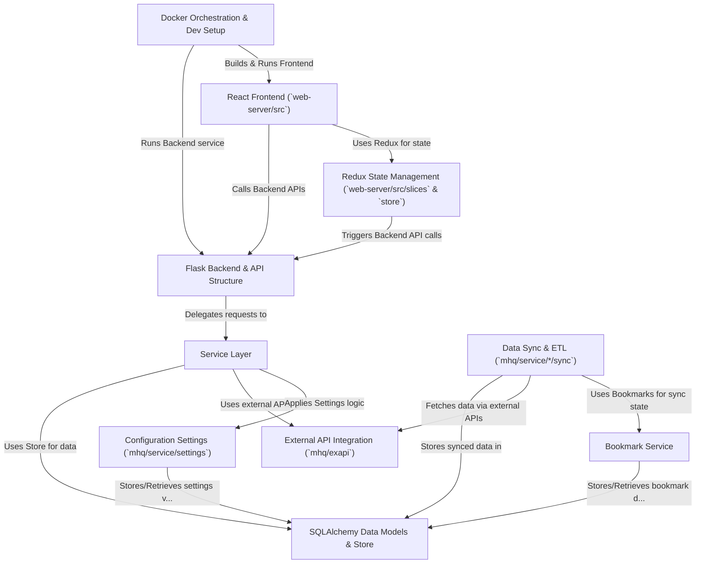

# Tutorial: middleware

**Middleware** is an open-source tool that helps engineering teams measure and improve their performance using **DORA metrics**.
It integrates with code hosting platforms like *GitHub* and *GitLab*, automatically collects data like *Pull Requests* and *Deployments*, calculates key metrics (like *Lead Time* and *Deployment Frequency*), and presents these insights through a web interface.
This helps teams understand their software delivery speed and stability.

**Source Repository:** [https://github.com/middlewarehq/middleware](https://github.com/middlewarehq/middleware)

## Chapters

1. [SQLAlchemy Data Models & Store](01_sqlalchemy_data_models___store_.md)
2. [External API Integration (`mhq/exapi`)](02_external_api_integration___mhq_exapi___.md)
3. [Bookmark Service](03_bookmark_service_.md)
4. [Data Sync & ETL (`mhq/service/*/sync`)](04_data_sync___etl___mhq_service___sync___.md)
5. [Configuration Settings (`mhq/service/settings`)](05_configuration_settings___mhq_service_settings___.md)
6. [Service Layer](06_service_layer_.md)
7. [Flask Backend & API Structure](07_flask_backend___api_structure_.md)
8. [React Frontend (`web-server/src`)](08_react_frontend___web_server_src___.md)
9. [Redux State Management (`web-server/src/slices` & `store`)](09_redux_state_management___web_server_src_slices_____store___.md)
10. [Docker Orchestration & Dev Setup](10_docker_orchestration___dev_setup_.md)

---

Generated by [AI Codebase Knowledge Builder](https://github.com/The-Pocket/Tutorial-Codebase-Knowledge)
